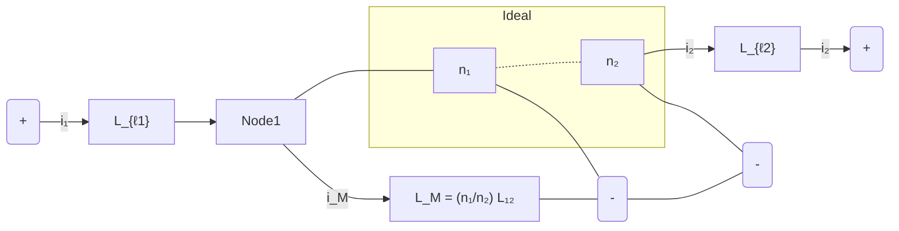
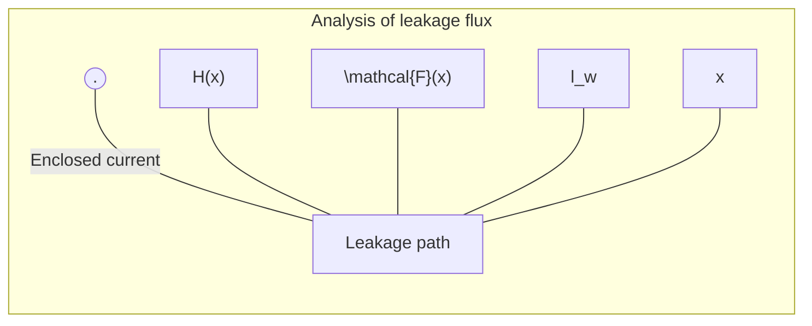
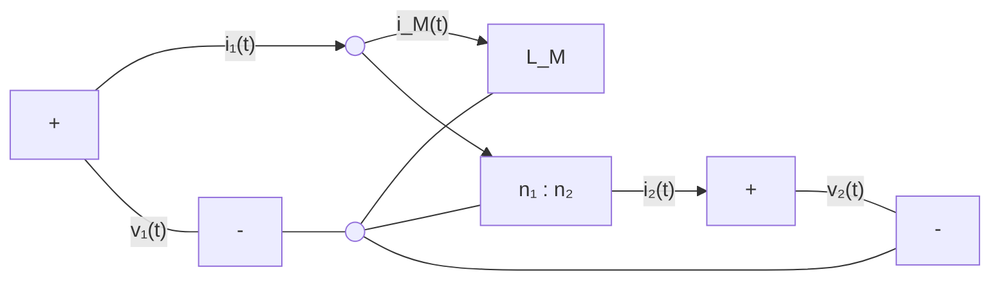
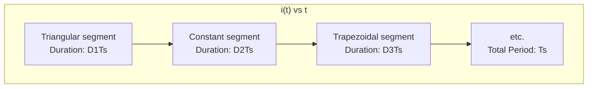
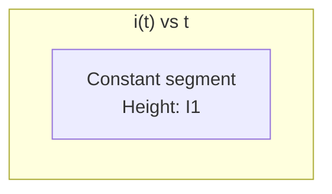

# Part III

## Magnetics

10


# Basic Magnetics Theory

Magnetics are an integral part of every switching converter. Often, the design of the magnetic devices cannot be isolated from the converter design. The power electronics engineer must not only model and design the converter, but must model and design the magnetics as well. Modeling and designing of magnetics for switching converters is the topic of Part III of this book.

In this chapter, basic magnetics theory is reviewed, including magnetic circuits, inductor modeling, and transformer modeling [85–89]. Loss mechanisms in magnetic devices are described. Winding eddy currents and the proximity effect, a significant loss mechanism in high-current high-frequency windings, are explained in detail [90–95]. Inductor design is introduced in Chap. 11, and transformer design is covered in Chap. 12.

## 10.1 Review of Basic Magnetics

### 10.1.1 Basic Relationships

The basic magnetic quantities are illustrated in Fig. 10.1. Also illustrated are the analogous, and perhaps more familiar, electrical quantities. The magnetomotive force $\mathscr{F}$, or scalar potential, between two points $x_1$ and $x_2$ is given by the integral of the magnetic field **H** along a path connecting the points:

$$ \mathscr{F} = \int_{x_1}^{x_2} \mathbf{H} \cdot d\boldsymbol{\ell} \tag{10.1} $$

where $d\boldsymbol{\ell}$ is a vector length element pointing in the direction of the path. The dot product yields the component of **H** in the direction of the path. If the magnetic field is of uniform strength $H$ passing through an element of length $\ell$ as illustrated, then Eq. (10.1) reduces to

$$ \mathscr{F} = H\ell \tag{10.2} $$

This is analogous to the electric field of uniform strength $E$, which induces a voltage $V = E\ell$ between two points separated by distance $\ell$.

© Springer Nature Switzerland AG 2020
409
R. W. Erickson, D. Maksimović, *Fundamentals of Power Electronics*,
https://doi.org/10.1007/978-3-030-43881-4_10

410 10 Basic Magnetics Theory

*Magnetic quantities* &emsp;&emsp;&emsp;&emsp;&emsp;&emsp;&emsp;&emsp; *Electrical quantities*


**Fig. 10.1** Comparison of magnetic field *H*, MMF $\mathcal{F}$, flux $\Phi$, and flux density *B*, with the analogous electrical quantities *E*, *V*, *I*, and *J*

Figure 10.1 also illustrates a total magnetic flux $\Phi$ passing through a surface *S* having area $A_c$. The total flux $\Phi$ is equal to the integral of the normal component of the flux density *B* over the surface

$$ \Phi = \int_{\text{surface } S} \mathbf{B} \cdot d\mathbf{A} \qquad (10.3) $$

where $d\mathbf{A}$ is a vector area element having direction normal to the surface. For a uniform flux density of magnitude *B* as illustrated, the integral reduces to

$$ \Phi = BA_c \qquad (10.4) $$

Flux density **B** is analogous to the electrical current density **J**, and flux $\Phi$ is analogous to the electric current *I*. If a uniform current density of magnitude *J* passes through a surface of area $A_c$, then the total current is $I = JA_c$.

Faraday’s law relates the voltage induced in a winding to the total flux passing through the interior of the winding. Figure 10.2 illustrates flux $\Phi(t)$ passing through the interior of a loop of

**Fig. 10.2** The voltage $v(t)$ induced in a loop of wire is related by Faraday’s law to the derivative of the total flux $\Phi(t)$ passing through the interior of the loop


10.1 Review of Basic Magnetics 411

Fig. 10.3 Illustration of Lenz’s law in a shorted loop of wire. The flux $\Phi(t)$ induces current $i(t)$, which in turn generates flux $\Phi'(t)$ that tends to oppose changes in $\Phi(t)$


wire. The loop encloses cross-sectional area $A_c$. According to Faraday’s law, the flux induces a voltage $v(t)$ in the wire, given by

$$v(t) = \frac{d\Phi(t)}{dt} \tag{10.5}$$

where the polarities of $v(t)$ and $\Phi(t)$ are defined according to the right-hand rule, as in Fig. 10.2. For a uniform flux distribution, we can express $v(t)$ in terms of the flux density $B(t)$ by substitution of Eq. (10.4):

$$v(t) = A_c \frac{dB(t)}{dt} \tag{10.6}$$

Thus, the voltage induced in a winding is related to the flux $\Phi$ and flux density $B$ passing through the interior of the winding.

Lenz’s law states that the voltage $v(t)$ induced by the changing flux $\Phi(t)$ in Fig. 10.2 is of the polarity that tends to drive a current through the loop to counteract the flux change. For example, consider the shorted loop of Fig. 10.3. The changing flux $\Phi(t)$ passing through the interior of the loop induces a voltage $v(t)$ around the loop. This voltage, divided by the impedance of the loop conductor, leads to a current $i(t)$ as illustrated. The current $i(t)$ induces a flux $\Phi'(t)$, which tends to oppose the changes in $\Phi(t)$. Lenz’s law is invoked later in this chapter, to provide a qualitative understanding of eddy current phenomena.

Ampere’s law relates the current in a winding to the magnetomotive force $\mathcal{F}$ and magnetic field $H$. The net MMF around a closed path of length $\ell_m$ is equal to the total current passing through the interior of the path. For example, Fig. 10.4 illustrates a magnetic core, in which a wire carrying current $i(t)$ passes through the window in the center of the core. Let us consider the closed path illustrated, which follows the magnetic field lines around the interior of the core. Ampere’s law states that

$$\oint_{closed\ path} H \cdot d\ell = \text{total current passing through interior of path} \tag{10.7}$$

Fig. 10.4 The net MMF around a closed path is related by Ampere’s law to the total current passing through the interior of the path


412 10 Basic Magnetics Theory

(a)


<table>
</table>

(b)


<table>
  <caption>Fig. 10.5 (b) B–H characteristics of a typical magnetic core material</caption>
  <thead>
    <tr>
      <th>H (Normalized)</th>
      <th>B (Ascending Branch)</th>
      <th>B (Descending Branch)</th>
    </tr>
  </thead>
  <tbody>
    <tr>
      <td>-1.0</td>
      <td>-0.8</td>
      <td>-0.8</td>
    </tr>
    <tr>
      <td>-0.8</td>
      <td>-0.8</td>
      <td>-0.7</td>
    </tr>
    <tr>
      <td>-0.6</td>
      <td>-0.7</td>
      <td>-0.5</td>
    </tr>
    <tr>
      <td>-0.4</td>
      <td>-0.5</td>
      <td>-0.3</td>
    </tr>
    <tr>
      <td>-0.2</td>
      <td>-0.3</td>
      <td>-0.1</td>
    </tr>
    <tr>
      <td>0.0</td>
      <td>-0.1</td>
      <td>0.1</td>
    </tr>
    <tr>
      <td>0.2</td>
      <td>0.1</td>
      <td>0.3</td>
    </tr>
    <tr>
      <td>0.4</td>
      <td>0.3</td>
      <td>0.5</td>
    </tr>
    <tr>
      <td>0.6</td>
      <td>0.5</td>
      <td>0.7</td>
    </tr>
    <tr>
      <td>0.8</td>
      <td>0.7</td>
      <td>0.8</td>
    </tr>
    <tr>
      <td>1.0</td>
      <td>0.8</td>
      <td>0.8</td>
    </tr>
  </tbody>
</table>


**Fig. 10.5** B–H characteristics: (a) of free space or air, (b) of a typical magnetic core material

The total current passing through the interior of the path is equal to the total current passing through the window in the center of the core, or $i(t)$. If the magnetic field is uniform and of magnitude $H(t)$, then the integral is $H(t)\ell_m$. So for the example of Fig. 10.4, Eq. (10.7) reduces to

$$\mathcal{F}(t) = H(t)\ell_m = i(t) \tag{10.8}$$

Thus, the magnetic field strength $H(t)$ is related to the winding current $i(t)$. We can view winding currents as sources of MMF. Equation (10.8) states that the MMF around the core, $\mathcal{F}(t) = H(t)\ell_m$, is equal to the winding current MMF $i(t)$. The total MMF around the closed loop, accounting for both MMFs, is zero.

The relationship between $B$ and $H$, or equivalently between $\Phi$ and $\mathcal{F}$, is determined by the core material characteristics. Figure 10.5a illustrates the characteristics of free space, or air:

$$B = \mu_0 H \tag{10.9}$$

The quantity $\mu_0$ is the permeability of free space, and is equal to $4\pi \cdot 10^{-7}$ Henries per meter in MKS units. Figure 10.5b illustrates the B–H characteristic of a typical iron alloy under high-level sinusoidal steady-state excitation. The characteristic is highly nonlinear, and exhibits both hysteresis and saturation. The exact shape of the characteristic is dependent on the excitation, and is difficult to predict for arbitrary waveforms.

For purposes of analysis, the core material characteristic of Fig. 10.5b is usually modeled by the linear or piecewise-linear characteristics of Fig. 10.6. In Fig. 10.6a, hysteresis and saturation are ignored. The B–H characteristic is then given by

$$B = \mu H$$
$$\mu = \mu_r \mu_0 \tag{10.10}$$

The core material permeability $\mu$ can be expressed as the product of the relative permeability $\mu_r$ and of $\mu_0$. Typical values of $\mu_r$ lie in the range $10^3$ to $10^5$.

The piecewise-linear model of Fig. 10.6b accounts for saturation but not hysteresis. The core material saturates when the magnitude of the flux density $B$ exceeds the saturation flux density $B_{sat}$. For $|B| < B_{sat}$, the characteristic follows Eq. (10.10). When $|B| > B_{sat}$, the model predicts that the core reverts to free space, with a characteristic having a much smaller

10.1 Review of Basic Magnetics 413

<table>
  <caption>Fig. 10.6 Approximation of the B-H characteristics of a magnetic core material: (a) by neglecting both hysteresis and saturation</caption>
  <thead>
    <tr>
      <th>H (Magnetic field strength)</th>
      <th>B (Magnetic flux density)</th>
    </tr>
  </thead>
  <tbody>
    <tr>
      <td>-H</td>
      <td>-&mu;H</td>
    </tr>
    <tr>
      <td>0</td>
      <td>0</td>
    </tr>
    <tr>
      <td>H</td>
      <td>&mu;H</td>
    </tr>
  </tbody>
  <tfoot>
    <tr>
      <td colspan="2">Note: The slope of the line is &mu; = &mu;<sub>r</sub> &mu;<sub>0</sub></td>
    </tr>
  </tfoot>
</table>

                           

<table>
  <caption>Fig. 10.6 Approximation of the B–H characteristics of a magnetic core material: (b) by neglecting hysteresis</caption>
  <thead>
    <tr>
      <th>Magnetic field strength (H)</th>
      <th>Magnetic flux density (B)</th>
      <th>Slope</th>
    </tr>
  </thead>
  <tbody>
    <tr>
      <td>H &lt; -B<sub>sat</sub>/μ</td>
      <td>-B<sub>sat</sub></td>
      <td>0</td>
    </tr>
    <tr>
      <td>-B<sub>sat</sub>/μ</td>
      <td>-B<sub>sat</sub></td>
      <td>μ</td>
    </tr>
    <tr>
      <td>0</td>
      <td>0</td>
      <td>μ</td>
    </tr>
    <tr>
      <td>B<sub>sat</sub>/μ</td>
      <td>B<sub>sat</sub></td>
      <td>μ</td>
    </tr>
    <tr>
      <td>H &gt; B<sub>sat</sub>/μ</td>
      <td>B<sub>sat</sub></td>
      <td>0</td>
    </tr>
  </tbody>
</table>


**Fig. 10.6** Approximation of the *B–H* characteristics of a magnetic core material: (a) by neglecting both hysteresis and saturation, (b) by neglecting hysteresis

slope approximately equal to $\mu_0$. Square-loop materials exhibit this type of abrupt-saturation characteristic, and additionally have a very large relative permeability $\mu_r$. Soft materials exhibit a less abrupt saturation characteristic, in which $\mu$ gradually decreases as *H* is increased. Typical values of $B_{sat}$ are 1 to 2 Tesla for iron laminations and silicon steel, 0.5 to 1 Tesla for powdered iron and molypermalloy materials, and 0.25 to 0.5 Tesla for ferrite materials.

Unit systems for magnetic quantities are summarized in Table 10.1. The MKS system is used throughout this book. The unrationalized CGS system also continues to find some use. Conversions between these systems are listed.

**Table 10.1** Units for magnetic quantities


<table>
  <thead>
    <tr>
        <th>Quantity</th>
        <th>MKS</th>
        <th>Unrationalized CGS</th>
        <th>Conversions</th>
    </tr>
  </thead>
  <tbody>
    <tr>
        <td>Core material equation</td>
        <td>$B = \mu_0\mu_r H$</td>
        <td>$B = \mu_r H$</td>
        <td> </td>
    </tr>
    <tr>
        <td>$B$</td>
        <td>Tesla</td>
        <td>Gauss</td>
        <td>$1\text{ T} = 10^4\text{G}$</td>
    </tr>
    <tr>
        <td>$H$</td>
        <td>Ampere/meter</td>
        <td>Oersted</td>
        <td>$1\text{ A/m} = 4\pi \cdot 10^{-3}\text{ Oe}$</td>
    </tr>
    <tr>
        <td>$\Phi$</td>
        <td>Weber</td>
        <td>Maxwell</td>
        <td>$1\text{ Wb} = 10^8\text{Mx}$<br/>$1\text{ T} = 1\text{ Wb/m}^2$</td>
    </tr>
  </tbody>
</table>

Figure 10.7 summarizes the relationships between the basic electrical and magnetic quantities of a magnetic device. The winding voltage $v(t)$ is related to the core flux and flux density via Faraday’s law. The winding current $i(t)$ is related to the magnetic field strength via Ampere’s law. The core material characteristics relate *B* and *H*.

We can now determine the electrical terminal characteristics of the simple inductor of Fig. 10.8a. A winding of *n* turns is placed on a core having permeability $\mu$. Faraday’s law states that the flux $\Phi(t)$ inside the core induces a voltage $v_{turn}(t)$ in each turn of the winding, given by

$$v_{turn}(t) = \frac{d\Phi(t)}{dt} \qquad (10.11)$$

Since the same flux $\Phi(t)$ passes through each turn of the winding, the total winding voltage is

414 10 Basic Magnetics Theory

**Fig. 10.7** Summary of the steps in determination of the terminal electrical $i–v$ characteristics of a magnetic element


**Fig. 10.8** Inductor example: **(a)** inductor geometry, **(b)** application of Ampere’s law


$$v(t) = nv_{turn}(t) = n \frac{d\Phi(t)}{dt} \tag{10.12}$$

Equation (10.12) can be expressed in terms of the average flux density $B(t)$ by substitution of Eq. (10.4):

$$v(t) = nA_c \frac{dB(t)}{dt} \tag{10.13}$$

where the average flux density $B(t)$ is $\Phi(t)/A_c$.

The use of Ampere’s law is illustrated in Fig. 10.8b. A closed path is chosen which follows an average magnetic field line around the interior of the core. The length of this path is called the *mean magnetic path length* $\ell_m$. If the magnetic field strength $H(t)$ is uniform, then Ampere’s law states that $H\ell_m$ is equal to the total current passing through the interior of the path, that is, the net current passing through the window in the center of the core. Since there are $n$ turns of wire passing through the window, each carrying current $i(t)$, the net current passing through the window is $ni(t)$. Hence, Ampere’s law states that

$$H(t)\ell_m = ni(t) \tag{10.14}$$

10.1 Review of Basic Magnetics 415

Let us model the core material characteristics by neglecting hysteresis but accounting for saturation, as follows:

$$ B = \begin{cases} B_{sat} & \text{for } H \ge B_{sat}/\mu \\ \mu H & \text{for } |H| < B_{sat}/\mu \\ -B_{sat} & \text{for } H \le -B_{sat}/\mu \end{cases} \tag{10.15} $$

The $B–H$ characteristic saturated slope $\mu_0$ is much smaller than $\mu$, and is ignored here. A characteristic similar to Fig. 10.6b is obtained. The current magnitude $I_{sat}$ at the onset of saturation can be found by substitution of $H = B_{sat}/\mu$ into Eq. (10.14). The result is

$$ I_{sat} = \frac{B_{sat} \ell_m}{\mu n} \tag{10.16} $$

We can now eliminate $B$ and $H$ from Eqs. (10.13) to (10.15), and solve for the electrical terminal characteristics. For $|I| < I_{sat}$, $B = \mu H$. Equation (10.13) then becomes

$$ v(t) = \mu n A_c \frac{dH(t)}{dt} \tag{10.17} $$

Substitution of Eq. (10.14) into Eq. (10.17) to eliminate $H(t)$ then leads to

$$ v(t) = \frac{\mu n^2 A_c}{\ell_m} \frac{di(t)}{dt} \tag{10.18} $$

which is of the form

$$ v(t) = L \frac{di(t)}{dt} \tag{10.19} $$

with

$$ L = \frac{\mu n^2 A_c}{\ell_m} \tag{10.20} $$

So the device behaves as an inductor for $|I| < I_{sat}$. When $|I| > I_{sat}$, then the flux density $B(t) = B_{sat}$ is constant. Faraday’s law states that the terminal voltage is then

$$ v(t) = n A_c \frac{dB_{sat}}{dt} = 0 \tag{10.21} $$

When the core saturates, the magnetic device behavior approaches a short circuit. The device behaves as an inductor only when the winding current magnitude is less than $I_{sat}$. Practical inductors exhibit some small residual inductance due to their nonzero saturated permeabilities; nonetheless, in saturation the inductor impedance is greatly reduced, and large inductor currents may result.

## 10.1.2 Magnetic Circuits

Figure 10.9a illustrates uniform flux and magnetic field inside an element having permeability $\mu$, length $\ell$, and cross-sectional area $A_c$. The MMF between the two ends of the element is

$$ \mathscr{F} = H \ell \tag{10.22} $$

416 10 Basic Magnetics Theory


**Fig. 10.9** An element containing magnetic flux (a), and its equivalent magnetic circuit (b)

Since $H = B/\mu$ and $B = \Phi/A_c$, we can express $\mathcal{F}$ as

$$\mathcal{F} = \frac{\ell}{\mu A_c} \Phi \tag{10.23}$$

This equation is of the form

$$\mathcal{F} = \Phi \mathcal{R} \tag{10.24}$$

with

$$\mathcal{R} = \frac{\ell}{\mu A_c} \tag{10.25}$$

Equation (10.24) resembles Ohm’s law. This equation states that the magnetic flux through an element is proportional to the MMF across the element. The constant of proportionality, or the reluctance $\mathcal{R}$, is analogous to the resistance $R$ of an electrical conductor. Indeed, we can construct a lumped-element magnetic circuit model that corresponds to Eq. (10.24), as in Fig. 10.9b. In this magnetic circuit model, voltage and current are replaced by MMF and flux, while the element characteristic, Eq. (10.24), is represented by the analog of a resistor, having reluctance $\mathcal{R}$.

Complicated magnetic structures, composed of multiple windings and multiple heterogeneous elements such as cores and air gaps, can be represented using equivalent magnetic circuits. These magnetic circuits can then be solved using conventional circuit analysis, to determine the various fluxes, MMFs, and terminal voltages and currents. Kirchhoff’s laws apply to magnetic circuits, and follow directly from Maxwell’s equations. The analog of Kirchhoff’s current law holds because the divergence of **B** is zero, and hence magnetic flux lines are continuous and cannot end. Therefore, any flux line that enters a node must leave the node. As illustrated in Fig. 10.10, the total flux entering a node must be zero. The analog of Kirchhoff’s voltage law follows from Ampere’s law, Eq. (10.7). The left-hand-side integral in Eq. (10.7) is the sum of the MMFs across the reluctances around the closed path. The right-hand-side of Eq. (10.7) states that currents in windings are sources of MMF. An $n$-turn winding carrying current $i(t)$ can be modeled as an MMF source, analogous to a voltage source, of value $ni(t)$. When these MMF sources are included, the total MMF around a closed path is zero.

Consider the inductor with air gap of Fig. 10.11a. A closed path following the magnetic field lines is illustrated. This path passes through the core, of permeability $\mu$ and length $\ell_c$, and across the air gap, of permeability $\mu_0$ and length $\ell_g$. The cross-sectional areas of the core and air gap are approximately equal. Application of Ampere’s law for this path leads to

$$\mathcal{F}_c + \mathcal{F}_g = ni \tag{10.26}$$

10.1 Review of Basic Magnetics 417

```mermaid
graph LR
    subgraph a [ (a) Node ]
        direction LR
        In1(( )) -- "Φ₁" --> Node1((Node))
        Node1 -- "Φ₃" --> Out1(( ))
        Node1 -- "Φ₂" --> Down1(( ))
    end
    subgraph b [ (b) Node ]
        direction LR
        In2(( )) -- "Φ₁" --> Node2((Node))
        Node2 -- "Φ₃" --> Out2(( ))
        Node2 -- "Φ₂" --> Down2(( ))
        Node2 --- Eq["Φ₁ = Φ₂ + Φ₃"]
    end
```

**Fig. 10.10** Kirchhoff’s current law, applied to magnetic circuits: the net flux entering a node must be zero. (a) physical element, in which three legs of a core meet at a node; (b) magnetic circuit model


**Fig. 10.11** Inductor with air gap example: (a) physical geometry; (b) magnetic circuit model

where $\mathcal{F}_c$ and $\mathcal{F}_g$ are the MMFs across the core and air gap, respectively. The core and air gap characteristics can be modeled by reluctances as in Fig. 10.9 and Eq. (10.25); the core reluctance $\mathcal{R}_c$ and air gap reluctance $\mathcal{R}_g$ are given by

$$ \mathcal{R}_c = \frac{\ell_c}{\mu A_c} $$
$$ \mathcal{R}_g = \frac{\ell_g}{\mu_0 A_c} \tag{10.27} $$

A magnetic circuit corresponding to Eqs. (10.26) and (10.27) is given in Fig. 10.11b. The winding is a source of MMF, of value $ni$. The core and air gap reluctances are effectively in series. The solution of the magnetic circuit is

$$ ni = \Phi(\mathcal{R}_c + \mathcal{R}_g) \tag{10.28} $$

The flux $\Phi(t)$ passes through the winding, and so we can use Faraday’s law to write

$$ v(t) = n \frac{d\Phi(t)}{dt} \tag{10.29} $$

Use of Eq. (10.28) to eliminate $\Phi(t)$ yields

418 10 Basic Magnetics Theory

**Fig. 10.12** Effect of air gap on the magnetic circuit $\Phi$ vs. $ni$ characteristics. The air gap increases the current $I_{sat}$ at the onset of core saturation


<table>
  <caption>Fig. 10.12 Effect of air gap on the magnetic circuit &Phi; vs. ni characteristics. The air gap increases the current I<sub>sat</sub> at the onset of core saturation</caption>
  <thead>
    <tr>
      <th>Characteristic Case</th>
      <th>Slope (d&Phi;/dni)</th>
      <th>Negative Saturation Point (ni, &Phi;)</th>
      <th>Origin (ni, &Phi;)</th>
      <th>Positive Saturation Point (ni, &Phi;)</th>
    </tr>
  </thead>
  <tbody>
    <tr>
      <td>No air gap</td>
      <td>1 / &Rscr;<sub>c</sub></td>
      <td>-nI<sub>sat1</sub>, -B<sub>sat</sub>A<sub>c</sub></td>
      <td>0, 0</td>
      <td>nI<sub>sat1</sub>, B<sub>sat</sub>A<sub>c</sub></td>
    </tr>
    <tr>
      <td>With air gap</td>
      <td>1 / (&Rscr;<sub>c</sub> + &Rscr;<sub>g</sub>)</td>
      <td>-nI<sub>sat2</sub>, -B<sub>sat</sub>A<sub>c</sub></td>
      <td>0, 0</td>
      <td>nI<sub>sat2</sub>, B<sub>sat</sub>A<sub>c</sub></td>
    </tr>
  </tbody>
</table>


$$v(t) = \frac{n^2}{\mathcal{R}_c + \mathcal{R}_g} \frac{di(t)}{dt} \tag{10.30}$$

Therefore, the inductance $L$ is

$$L = \frac{n^2}{\mathcal{R}_c + \mathcal{R}_g} \tag{10.31}$$

The air gap increases the total reluctance of the magnetic circuit, and decreases the inductance.

Air gaps are employed in practical inductors for two reasons. With no air gap ($\mathcal{R}_g = 0$), the inductance is directly proportional to the core permeability $\mu$. This quantity is dependent on temperature and operating point, and is difficult to control. Hence, it may be difficult to construct an inductor having a well-controlled value of $L$. Addition of an air gap having a reluctance $\mathcal{R}_g$ greater than $\mathcal{R}_c$ causes the value of $L$ in Eq. (10.31) to be insensitive to variations in $\mu$.

Addition of an air gap also allows the inductor to operate at higher values of winding current $i(t)$ without saturation. The total flux $\Phi$ is plotted vs. the winding MMF $ni$ in Fig. 10.12. Since $\Phi$ is proportional to $B$, and when the core is not saturated $ni$ is proportional to the magnetic field strength $H$ in the core, Fig. 10.12 has the same shape as the core $B$–$H$ characteristic. When the core is not saturated, $\Phi$ is related to $ni$ according to the linear relationship of Eq. (10.28). When the core saturates, $\Phi$ is equal to

$$\Phi_{sat} = B_{sat}A_c \tag{10.32}$$

The winding current $I_{sat}$ at the onset of saturation is found by substitution of Eq. (10.32) into (10.28):

$$I_{sat} = \frac{B_{sat}A_c}{n}(\mathcal{R}_c + \mathcal{R}_g) \tag{10.33}$$

The $\Phi$-$ni$ characteristics are plotted in Fig. 10.12 for two cases: (a) air gap present, and (b) no air gap ($\mathcal{R}_g = 0$). It can be seen that $I_{sat}$ is increased by addition of an air gap. Thus, the air gap allows increase of the saturation current, at the expense of decreased inductance.

## 10.2 Transformer Modeling

Consider next the two-winding transformer of Fig. 10.13. The core has cross-sectional area $A_c$, mean magnetic path length $\ell_m$, and permeability $\mu$. An equivalent magnetic circuit is given in Fig. 10.14. The core reluctance is

10.2 Transformer Modeling 419

**Fig. 10.13** A two-winding transformer


**Fig. 10.14** Magnetic circuit that models the two-winding transformer of Fig. 10.13


$$ \mathscr{R} = \frac{\ell_m}{\mu A_c} \tag{10.34} $$

Since there are two windings in this example, it is necessary to determine the relative polarities of the MMF generators. Ampere’s law states that

$$ \mathscr{F}_c = n_1 i_1 + n_2 i_2 \tag{10.35} $$

The MMF generators are additive, because the currents $i_1$ and $i_2$ pass in the same direction through the core window. Solution of Fig. 10.14 yields

$$ \Phi \mathscr{R} = n_1 i_1 + n_2 i_2 \tag{10.36} $$

This expression could also be obtained by substitution of $\mathscr{F}_c = \Phi \mathscr{R}$ into Eq. (10.35).

## 10.2.1 The Ideal Transformer

In the ideal transformer, the core reluctance $\mathscr{R}$ approaches zero. The causes the core MMF $\mathscr{F}_c = \Phi \mathscr{R}$ also to approach zero. Equation (10.35) then becomes

$$ 0 = n_1 i_1 + n_2 i_2 \tag{10.37} $$

Also, by Faraday’s law, we have

$$ \begin{aligned} v_1 &= n_1 \frac{d\Phi}{dt} \\ v_2 &= n_2 \frac{d\Phi}{dt} \end{aligned} \tag{10.38} $$

Note that $\Phi$ is the same in both equations above: the same total flux links both windings. Elimination of $\Phi$ leads to

420 10 Basic Magnetics Theory


**Fig. 10.15** Ideal transformer symbol

$$\frac{d\Phi}{dt} = \frac{v_1}{n_1} = \frac{v_2}{n_2} \tag{10.39}$$

Equations (10.37) and (10.39) are the equations of the ideal transformer:

$$\frac{v_1}{n_1} = \frac{v_2}{n_2} \quad \text{and} \quad n_1i_1 + n_2i_2 = 0 \tag{10.40}$$

The ideal transformer symbol of Fig. 10.15 is defined by Eq. (10.40).

### 10.2.2 The Magnetizing Inductance

For the actual case in which the core reluctance $\mathcal{R}$ is nonzero, we have

$$\Phi\mathcal{R} = n_1i_1 + n_2i_2 \quad \text{with} \quad v_1 = n_1 \frac{d\Phi}{dt} \tag{10.41}$$

Elimination of $\Phi$ yields

$$v_1 = \frac{n_1^2}{\mathcal{R}} \frac{d}{dt} \left[ i_1 + \frac{n_2}{n_1}i_2 \right] \tag{10.42}$$

This equation is of the form

$$v_1 = L_M \frac{di_M}{dt} \tag{10.43}$$

where

$$
\begin{aligned}
L_M &= \frac{n_1^2}{\mathcal{R}} \\
i_M &= i_1 + \frac{n_2}{n_1}i_2
\end{aligned}
\tag{10.44}
$$

are the magnetizing inductance and magnetizing current, referred to the primary winding. An equivalent circuit is illustrated in Fig. 10.16.

Figure 10.16 coincides with the transformer model introduced in Chap. 6. The magnetizing inductance models the magnetization of the core material. It is a real, physical inductor, which exhibits saturation and hysteresis. All physical transformers must contain a magnetizing inductance. For example, suppose that we disconnect the secondary winding. We are then left with a single winding on a magnetic core—an inductor. Indeed, the equivalent circuit of Fig. 10.16

10.2 Transformer Modeling 421

Fig. 10.16 Transformer model including magnetizing inductance

predicts this behavior, via the magnetizing inductance. The magnetizing current causes the ratio of the winding currents to differ from the turns ratio.

The transformer saturates when the core flux density $B(t)$ exceeds the saturation flux density $B_{sat}$. When the transformer saturates, the magnetizing current $i_M(t)$ becomes large, the impedance of the magnetizing inductance becomes small, and the transformer windings become short circuits. It should be noted that large winding currents $i_1(t)$ and $i_2(t)$ do not necessarily cause saturation: if these currents obey Eq. (10.37), then the magnetizing current is zero and there is no net magnetization of the core. Rather, saturation of a transformer is a function of the applied volt-seconds. The magnetizing current is given by

$$i_M(t) = \frac{1}{L_M} \int v_1(t)dt \tag{10.45}$$

Alternatively, Eq. (10.45) can be expressed in terms of the core flux density $B(t)$ as

$$B(t) = \frac{1}{n_1 A_c} \int v_1(t)dt \tag{10.46}$$

The flux density and magnetizing current will become large enough to saturate the core when the applied volt-seconds $\lambda_1$ is too large, where $\lambda_1$ is defined for a periodic ac voltage waveform as

$$\lambda_1 = \int_{t_1}^{t_2} v_1(t)dt \tag{10.47}$$

The limits are chosen such that the integral is taken over the positive portion of the applied periodic voltage waveform.

To fix a saturating transformer, the flux density should be decreased by increasing the number of turns, or by increasing the core cross-sectional area $A_c$. Adding an air gap has no effect on saturation of conventional transformers, since it does not modify Eq. (10.46). An air gap simply makes the transformer less ideal, by decreasing $L_M$ and increasing $i_M(t)$ without changing $B(t)$. Saturation mechanisms in transformers differ from those of inductors, because transformer saturation is determined by the applied winding voltage waveforms, rather than the applied winding currents.

### 10.2.3 Leakage Inductances

In practice, there is some flux which links one winding but not the other, by "leaking" into the air or by some other mechanism. As illustrated in Fig. 10.17, this flux leads to leakage induc-

422 10 Basic Magnetics Theory


**Fig. 10.17** Leakage flux in a two-winding transformer: **(a)** transformer geometry, **(b)** an equivalent system



**Fig. 10.18** Two-winding transformer equivalent circuit, including magnetizing inductance referred to primary, and primary and secondary leakage inductances

tance, i.e., additional effective inductances that are in series with the windings. A topologically equivalent structure is illustrated in Fig. 10.17b, in which the leakage fluxes $\Phi_{\ell 1}$ and $\Phi_{\ell 2}$ are shown explicitly as separate inductors.

Figure 10.18 illustrates a transformer electrical equivalent circuit model, including series inductors $L_{\ell 1}$ and $L_{\ell 2}$ which model the leakage inductances. These leakage inductances cause the terminal voltage ratio $v_2(t)/v_1(t)$ to differ from the ideal turns ratio $n_2/n_1$. In general, the terminal equations of a two-winding transformer can be written

10.3 Loss Mechanisms in Magnetic Devices 423

$$ \begin{bmatrix} v_1(t) \\ v_2(t) \end{bmatrix} = \begin{bmatrix} L_{11} & L_{12} \\ L_{12} & L_{22} \end{bmatrix} \frac{d}{dt} \begin{bmatrix} i_1(t) \\ i_2(t) \end{bmatrix} \tag{10.48} $$

The quantity $L_{12}$ is called the *mutual inductance*, and is given by

$$ L_{12} = \frac{n_1 n_2}{\mathcal{R}} = \frac{n_2}{n_1} L_M \tag{10.49} $$

The quantities $L_{11}$ and $L_{22}$ are called the primary and secondary *self-inductances*, given by

$$ \begin{aligned} L_{11} &= L_{\ell 1} + \frac{n_1}{n_2} L_{12} \\ L_{22} &= L_{\ell 2} + \frac{n_2}{n_1} L_{12} \end{aligned} \tag{10.50} $$

Note that Eq. (10.48) does not explicitly identify the physical turns ratio $n_2/n_1$. Rather, Eq. (10.48) expresses the transformer behavior as a function of electrical quantities alone. Equation (10.48) can be used, however, to define the *effective turns ratio*

$$ n_e = \sqrt{\frac{L_{22}}{L_{11}}} \tag{10.51} $$

and the *coupling coefficient*

$$ k = \frac{L_{12}}{\sqrt{L_{11} L_{22}}} \tag{10.52} $$

The coupling coefficient $k$ lies in the range $0 \le k \le 1$, and is a measure of the degree of magnetic coupling between the primary and secondary windings. In a transformer with perfect coupling, the leakage inductances $L_{\ell 1}$ and $L_{\ell 2}$ are zero. The coupling coefficient $k$ is then equal to 1. Construction of low-voltage transformers having coupling coefficients in excess of 0.99 is quite feasible. When the coupling coefficient is close to 1, then the effective turns ratio $n_e$ is approximately equal to the physical turns ratio $n_2/n_1$.

# 10.3 Loss Mechanisms in Magnetic Devices

## 10.3.1 Core Loss

Energy is required to effect a change in the magnetization of a core material. Not all of this energy is recoverable in electrical form; a fraction is lost as heat. This power loss can be observed electrically as hysteresis of the $B–H$ loop.

Consider an $n$-turn inductor excited by periodic waveforms $v(t)$ and $i(t)$ having frequency $f$. The net energy that flows into the inductor over one cycle is

$$ W = \int_{\text{one cycle}} v(t) i(t) dt \tag{10.53} $$

424 10 Basic Magnetics Theory

We can relate this expression to the core B–H characteristic: substitute B(t) for v(t) using Faraday’s law, Eq. (10.13), and substitute H(t) for i(t) using Ampere’s law, i.e., Eq. (10.14):

$$ W = \int_{\text{one cycle}} \left( n A_c \frac{dB(t)}{dt} \right) \left( \frac{H(t) \ell_m}{n} \right) dt \tag{10.54} $$
$$ = (A_c \ell_m) \int_{\text{one cycle}} H dB $$

The term $A_c \ell_m$ is the volume of the core, while the integral is the area of the B–H loop:

$$ (\text{energy lost per cycle}) = (\text{core volume})(\text{area of } B - H \text{ loop}) \tag{10.55} $$

The hysteresis power loss $P_H$ is equal to the energy lost per cycle, multiplied by the excitation frequency $f$:

$$ P_H = (f)(A_c \ell_m) \int_{\text{one cycle}} H dB \tag{10.56} $$

To the extent that the size of the hysteresis loop is independent of frequency, hysteresis loss increases directly with operating frequency.

Magnetic core materials are iron alloys that, unfortunately, are also good electrical conductors. As a result, ac magnetic fields can cause electrical eddy currents to flow within the core material itself. An example is illustrated in Fig. 10.19. The ac flux $\Phi(t)$ passes through the core. This induces eddy currents $i(t)$ which, according to Lenz’s law, flow in paths that oppose the time-varying flux $\Phi(t)$. These eddy currents cause $i^2R$ losses in the resistance of the core material. The eddy current losses are especially significant in high-frequency applications.


**Fig. 10.19** Eddy currents in an iron core

According to Faraday’s law, the ac flux $\Phi(t)$ induces voltage in the core, which drives the current around the paths illustrated in Fig. 10.19. Since the induced voltage is proportional to the derivative of the flux, the voltage magnitude increases directly with the excitation frequency $f$. If the impedance of the core material is purely resistive and independent of frequency, then the magnitude of the induced eddy currents also increases directly with $f$. This implies that the $i^2R$ eddy current losses should increase as $f^2$. In power ferrite materials, the core material impedance magnitude actually decreases with increasing $f$. Over the useful frequency range, the eddy current losses typically increase faster than $f^2$.

There is a basic tradeoff between saturation flux density and core loss. Use of a high operating flux density leads to reduced size, weight, and cost. Silicon steel and similar materials exhibit saturation flux densities of 1.5 to 2 T. Unfortunately, these core materials exhibit high core loss. In particular, the low resistivity of these materials leads to high eddy current loss. Hence, these materials are suitable for filter inductor and low-frequency transformer applications. The core material is produced in laminations or thin ribbons, to reduce the eddy current magnitude. Other ferrous alloys may contain molybdenum, cobalt, or other elements, and exhibit somewhat lower core loss as well as somewhat lower saturation flux densities.

10.3 Loss Mechanisms in Magnetic Devices 425

Iron alloys are also employed in powdered cores, containing ferromagnetic particles of sufficiently small diameter such that eddy currents are small. These particles are bound together using an insulating medium. Powdered iron and molybdenum permalloy powder cores exhibit typical saturation flux densities of 0.6 to 0.8 T, with core losses significantly lower than laminated ferrous alloy materials. The insulating medium behaves effectively as a distributed air gap, and hence these cores have relatively low permeability. Powder cores find application as transformers at frequencies of several kHz, and as filter inductors in high frequency (100 kHz) switching converters.

Amorphous alloys exhibit low hysteresis loss. Core conductivity and eddy current losses are somewhat lower than ferrous alloys, but higher than ferrites. Saturation flux densities in the range 0.6 to 1.5 T are obtained.

Ferrite cores are ceramic materials having low saturation flux density, 0.25 to 0.5 T. Their resistivities are much higher than other materials, and hence eddy current losses are much smaller. Manganese-zinc ferrite cores find widespread use as inductors and transformers in converters having switching frequencies of 10 kHz to 1 MHz. Nickel-zinc ferrite materials can be employed at yet higher frequencies.

Figure 10.20 contains typical total core loss data, for a certain ferrite material. Power loss density, in Watts per cubic centimeter of core material, is plotted as a function of sinusoidal excitation frequency $f$ and peak ac flux density $\Delta B$. At a given frequency, the core loss $P_{fe}$


<table>
  <caption>Fig. 10.20 Typical core loss data for a high-frequency power ferrite material. Power loss density (Watts/cm³) is plotted vs. peak ac flux density ΔB (Tesla), for sinusoidal excitation</caption>
  <thead>
    <tr>
      <th>ΔB, Tesla</th>
      <th>1 MHz</th>
      <th>500 kHz</th>
      <th>200 kHz</th>
      <th>100 kHz</th>
      <th>50 kHz</th>
      <th>20 kHz</th>
    </tr>
  </thead>
  <tbody>
    <tr>
      <th>0.01</th>
      <td>0.032</td>
      <td></td>
      <td></td>
      <td></td>
      <td></td>
      <td></td>
    </tr>
    <tr>
      <th>0.02</th>
      <td>0.18</td>
      <td>0.03</td>
      <td></td>
      <td></td>
      <td></td>
      <td></td>
    </tr>
    <tr>
      <th>0.03</th>
      <td>0.50</td>
      <td>0.085</td>
      <td></td>
      <td></td>
      <td></td>
      <td></td>
    </tr>
    <tr>
      <th>0.04</th>
      <td>1.0</td>
      <td>0.18</td>
      <td>0.032</td>
      <td></td>
      <td></td>
      <td></td>
    </tr>
    <tr>
      <th>0.05</th>
      <td></td>
      <td>0.32</td>
      <td>0.06</td>
      <td>0.02</td>
      <td></td>
      <td></td>
    </tr>
    <tr>
      <th>0.06</th>
      <td></td>
      <td>0.52</td>
      <td>0.10</td>
      <td>0.032</td>
      <td>0.013</td>
      <td></td>
    </tr>
    <tr>
      <th>0.08</th>
      <td></td>
      <td>1.0</td>
      <td>0.22</td>
      <td>0.07</td>
      <td>0.028</td>
      <td>0.01</td>
    </tr>
    <tr>
      <th>0.1</th>
      <td></td>
      <td></td>
      <td>0.40</td>
      <td>0.13</td>
      <td>0.052</td>
      <td>0.018</td>
    </tr>
    <tr>
      <th>0.15</th>
      <td></td>
      <td></td>
      <td>1.0</td>
      <td>0.38</td>
      <td>0.15</td>
      <td>0.055</td>
    </tr>
    <tr>
      <th>0.2</th>
      <td></td>
      <td></td>
      <td></td>
      <td>0.80</td>
      <td>0.32</td>
      <td>0.12</td>
    </tr>
    <tr>
      <th>0.25</th>
      <td></td>
      <td></td>
      <td></td>
      <td></td>
      <td>0.58</td>
      <td>0.22</td>
    </tr>
    <tr>
      <th>0.3</th>
      <td></td>
      <td></td>
      <td></td>
      <td></td>
      <td></td>
      <td>0.35</td>
    </tr>
  </tbody>
</table>


Fig. 10.20 Typical core loss data for a high-frequency power ferrite material. Power loss density is plotted vs. peak ac flux density $\Delta B$, for sinusoidal excitation

can be approximated by an empirical function of the form

$$P_{fe} = K_{fe}(\Delta B)^\beta A_c \ell_m \tag{10.57}$$

The parameters $K_{fe}$ and $\beta$ are determined by fitting Eq. (10.57) to the manufacturer’s published data. Typical values of $\beta$ for ferrite materials operating in their intended range of $\Delta B$ and $f$ lie in the range 2.6 to 2.8. The constant of proportionality $K_{fe}$ increases rapidly with excitation frequency $f$. The dependence of $K_{fe}$ on $f$ can also be approximated by empirical formulae that are fitted to the manufacturer’s published data; a fourth-order polynomial or a function of the form $K_{fe0} f^\xi$ are sometimes employed for this purpose. Parameters in empirical formulae fitted to data measured under sinusoidal excitation can be used to improve prediction of ferrite core loss with nonsinusoidal waveforms, as described in [96].

426 10 Basic Magnetics Theory

## 10.3.2 Low-Frequency Copper Loss

Significant loss also occurs in the resistance of the copper windings. This is also a major determinant of the size of a magnetic device: if copper loss and winding resistance were irrelevant, then inductor and transformer elements could be made arbitrarily small by use of many small turns of small wire.

Figure 10.21 contains an equivalent circuit of a winding, in which element $R$ models the winding resistance. The copper loss of the winding is

$$ P_{cu} = I_{rms}^2 R \qquad (10.58) $$


Fig. 10.21 Winding equivalent circuit that models copper loss

where $I_{rms}$ is the rms value of $i(t)$. The dc resistance of the winding conductor can be expressed as

$$ R = \rho \frac{\ell_b}{A_w} \qquad (10.59) $$

where $A_w$ is the wire bare cross-sectional area, and $\ell_b$ is the length of the wire. The resistivity $\rho$ is equal to $1.724 \cdot 10^{-6} \Omega\text{-cm}$ for soft-annealed copper at room temperature. This resistivity increases to $2.3 \cdot 10^{-6} \Omega\text{-cm}$ at $100^\circ\text{C}$.

If a core has a *mean length per turn* given by $MLT$, then an $n$ turn winding on this core will have length $\ell_b = nMLT$. The resistance of this winding will be:

$$ R = \rho \frac{n(MLT)}{A_w} \qquad (10.60) $$

Appendix B contains tables of the mean lengths per turn of standard ferrite core shapes, as well as the areas of standard American wire gauges.

# 10.4 Eddy Currents in Winding Conductors

Eddy currents also cause power losses in winding conductors. This can lead to copper losses significantly in excess of the value predicted by Eqs. (10.58) and (10.59). The specific conductor eddy current mechanisms are called the *skin effect* and the *proximity effect*. These mechanisms are most pronounced in high-current conductors of multi-layer windings, particularly in high-frequency converters.

### 10.4.1 Introduction to the Skin and Proximity Effects

Figure 10.22a illustrates a current $i(t)$ flowing through a solitary conductor. This current induces magnetic flux $\Phi(t)$, whose flux lines follow circular paths around the current as shown. According to Lenz’s law, the ac flux in the conductor induces eddy currents, which flow in a manner that tends to oppose the ac flux $\Phi(t)$. Figure 10.22b illustrates the paths of the eddy currents. It can be seen that the eddy currents tend to reduce the net current density in the center of the conductor, and increase the net current density near the surface of the conductor.

The current distribution within the conductor can be found by solution of Maxwell’s equations. For a sinusoidal current $i(t)$ of frequency $f$, the result is that the current density is greatest

10.4 Eddy Currents in Winding Conductors 427


**Fig. 10.22** The skin effect: (a) current $i(t)$ induces flux $\Phi(t)$, which in turn induces eddy currents in conductor; (b) the eddy currents tend to oppose the current $i(t)$ in the center of the wire, and increase the current on the surface of the wire


<table>
  <thead>
    <tr>
        <th>Frequency (kHz)</th>
        <th>100°C (cm)</th>
        <th>25°C (cm)</th>
    </tr>
  </thead>
  <tbody>
    <tr>
        <td>10</td>
        <td>0.075</td>
        <td>0.065</td>
    </tr>
    <tr>
        <td>100</td>
        <td>0.024</td>
        <td>0.021</td>
    </tr>
    <tr>
        <td>1000</td>
        <td>0.0075</td>
        <td>0.0066</td>
    </tr>
  </tbody>
</table>

**Fig. 10.23** Penetration depth $\delta$, as a function of frequency $f$, for copper wire

at the surface of the conductor. The current density is an exponentially decaying function of distance into the conductor, with characteristic length $\delta$ known as the *penetration depth* or *skin depth*. The penetration depth is given by

$$\delta = \sqrt{\frac{\rho}{\pi \mu f}} \tag{10.61}$$

For a copper conductor, the permeability $\mu$ is equal to $\mu_0$, and the resistivity $\rho$ is given in Sect. 10.3.2. At $100^\circ\text{C}$, the penetration depth of a copper conductor is

$$\delta = \frac{7.5}{\sqrt{f}} \text{ cm} \tag{10.62}$$

with $f$ expressed in Hz. The penetration depth of copper conductors is plotted in Fig. 10.23, as a function of frequency $f$. For comparison, the wire diameters $d$ of standard American Wire

428 10 Basic Magnetics Theory

Gauge (AWG) conductors are also listed. It can be seen that $$d/\delta = 1$$ for AWG #40 at approximately 500 kHz, while $$d/\delta = 1$$ for AWG #22 at approximately 10 kHz.

The skin effect causes the resistance and copper loss of solitary large-diameter wires to increase at high frequency. High-frequency currents do not penetrate to the center of the conductor. The current crowds at the surface of the wire, the inside of the wire is not utilized, and the effective wire cross-sectional area is reduced. However, the skin effect alone is not sufficient to explain the increased high-frequency copper losses observed in multiple-layer transformer windings.

A conductor that carries a high-frequency current $$i(t)$$ induces copper loss in an adjacent conductor by a phenomenon known as the proximity effect. Figure 10.24 illustrates two copper foil conductors that are placed in close proximity to each other. Conductor 1 carries a high-frequency sinusoidal current $$i(t)$$, whose penetration depth $$\delta$$ is much smaller than the thickness $$h$$ of conductors 1 or 2. Conductor 2 is open-circuited, so that it carries a net current of zero. However, it is possible for eddy currents to be induced in conductor 2 by the current $$i(t)$$ flowing in conductor 1.

The current $$i(t)$$ flowing in conductor 1 generates a flux $$\Phi(t)$$ in the space between conductors 1 and 2; this flux attempts to penetrate conductor 2. By Lenz’s law, a current is induced on the adjacent (left) side of conductor 2, which tends to oppose the flux $$\Phi(t)$$. If the conductors are closely spaced, and if $$h \gg \delta$$, then the induced current will be equal and opposite to the current $$i(t)$$, as illustrated in Fig. 10.24.


**Fig. 10.24** The proximity effect in adjacent copper foil conductors. Conductor 1 carries current $$i(t)$$. Conductor 2 is open-circuited

Since conductor 2 is open-circuited, the net current in conductor 2 must be zero. Therefore, a current $$+i(t)$$ flows on the right-side surface of conductor 2. So the current flowing in conductor 1 induces a current that circulates on the surfaces of conductor 2.

Figure 10.25 illustrates the proximity effect in a simple transformer winding. The primary winding consists of three series-connected turns of copper foil, having thickness $$h \gg \delta$$, and carrying net current $$i(t)$$. The copper foil is a strip of copper whose width is the same as the height of the core window; this strip is wound around a leg of the core. Consequently, each turn of this foil comprises one layer of the winding, as illustrated in Fig. 10.25b. The secondary winding is identical; to the extent that the magnetizing current is small, the secondary turns carry net current $$-i(t)$$. The windings pass through the window of a magnetic core; the magnetic core material encloses the mutual flux of the transformer.

The high-frequency sinusoidal current $$i(t)$$ flows on the right surface of primary layer 1, adjacent to layer 2. This induces a copper loss in layer 1, which can be calculated as follows. Let $$R_{dc}$$ be the dc resistance of layer 1, given by Eq. (10.59), and let $$I$$ be the rms value of $$i(t)$$. The skin effect causes the copper loss in layer 1 to be equal to the loss in a conductor of thickness $$\delta$$ with uniform current density. This reduction of the conductor thickness from $$h$$ to $$\delta$$ effectively increases the resistance by the same factor. Hence, layer 1 can be viewed as having an “ac resistance” given by

10.4 Eddy Currents in Winding Conductors 429


**Fig. 10.25** A simple transformer example illustrating the proximity effect: (a) effective core geometry (left) and winding geometry (top view) (right), (b) winding geometry (side view of core window) with one turn per layer, (c) distribution of currents on surfaces of conductors

$$ R_{ac} = \frac{h}{\delta} R_{dc} \tag{10.63} $$

The copper loss in layer 1 is

$$ P_1 = I^2 R_{ac} \tag{10.64} $$

The proximity effect causes a current to be induced in the adjacent (left-side) surface of primary layer 2, which tends to oppose the flux generated by the current of layer 1. If the

430 10 Basic Magnetics Theory

conductors are closely spaced, and if $h \gg \delta$, then the induced current will be equal and opposite to the current $i(t)$, as illustrated in Fig. 10.25c. Hence, current $-i(t)$ flows on the left surface of the second layer. Since layers 1 and 2 are connected in series, they must both conduct the same net current $i(t)$. As a result, a current $+2i(t)$ must flow on the right-side surface of layer 2.

The current flowing on the left surface of layer 2 has the same magnitude as the current of layer 1, and hence the copper loss is the same: $P_1$. The current flowing on the right surface of layer 2 has rms magnitude $2I$; hence, it induces copper loss $(2I)^2 R_{ac} = 4P_1$. The total copper loss in primary layer 2 is therefore

$$P_2 = P_1 + 4P_1 = 5P_1 \tag{10.65}$$

The copper loss in the second layer is five times as large as the copper loss in the first layer!

The current $2i(t)$ flowing on the right surface of layer 2 induces a flux $2\Phi(t)$ as illustrated in Fig. 10.25c. This causes an opposing current $-2i(t)$ to flow on the adjacent (left) surface of primary layer 3. Since layer 3 must also conduct net current $i(t)$, a current $+3i(t)$ flows on the right surface of layer 3. The total copper loss in layer 3 is

$$p_3 = (2^2 + 3^2)P_1 = 13P_1 \tag{10.66}$$

Likewise, the copper loss in layer $m$ of a multiple-layer winding can be written

$$P_m = I^2 \left[ (m - 1)^2 + m^2 \right] \left( \frac{h}{\delta} R_{dc} \right) \tag{10.67}$$

It can be seen that the copper loss compounds very quickly in a multiple-layer winding.

The total copper loss in the three-layer primary winding is $P_1 + 5P_1 + 13P_1$, or $19P_1$. More generally, if the winding contains a total of $M$ layers, then the total copper loss is

$$
\begin{aligned}
P &= I^2 \left( \frac{h}{\delta} R_{dc} \right) \sum_{m=1}^{M} \left[ (m - 1)^2 + m^2 \right] \\
&= I^2 \left( \frac{h}{\delta} R_{dc} \right) \frac{M}{3} (2M^2 + 1)
\end{aligned} \tag{10.68}
$$

If a dc or low-frequency ac current of rms amplitude $I$ were applied to the $M$-layer winding, its copper loss would be $P_{dc} = I^2 M R_{dc}$. Hence, the proximity effect increases the copper loss by the factor

$$F_R = \frac{P}{P_{dc}} = \frac{1}{3} \left( \frac{h}{\delta} \right) (2M^2 + 1) \tag{10.69}$$

This expression is valid for a foil winding having $h \gg \delta$.

As illustrated in Fig. 10.25c, the surface currents in the secondary winding are symmetrical, and hence the secondary winding has the same conduction loss.

The example above and the associated equations are limited to $h \gg \delta$ and to the winding geometry shown. The equations do not quantify the behavior for $h \sim \delta$, nor for round conductors, nor are the equations sufficiently general to cover the more complicated winding geometries often encountered in the magnetic devices of switching converters. Optimum designs may, in fact, occur with conductor thicknesses in the vicinity of one penetration depth. The discussions of the following sections allow computation of proximity losses in more general circumstances.

10.4 Eddy Currents in Winding Conductors 431

## 10.4.2 Leakage Flux in Windings

As described above, an externally applied magnetic field will induce eddy currents to flow in a conductor, and thereby induce copper loss. To understand how magnetic fields are oriented in windings, let us consider the simple two-winding transformer illustrated in Fig. 10.26. In this example, the core has large permeability $\mu \gg \mu_0$. The primary winding consists of eight turns of wire arranged in two layers, and each turn carries current $i(t)$ in the direction indicated. The secondary winding is identical to the primary winding, except that the current polarity is reversed.

Flux lines for typical operation of this transformer are sketched in Fig. 10.26b. As described in Sect. 10.2, a relatively large mutual flux is present, which magnetizes the core. In addition, leakage flux is present, which does not completely link both windings. Because of the symmetry of the winding geometry in Fig. 10.26, the leakage flux runs approximately vertically through the windings.

To determine the magnitude of the leakage flux, we can apply Ampere’s law. Consider the closed path taken by one of the leakage flux lines, as illustrated in Fig. 10.27. Since the core has


**Fig. 10.26** Two-winding transformer example: (a) core and winding geometry, (b) typical flux distribution

**Fig. 10.27** Analysis of leakage flux using Ampere’s law, for the transformer of Fig. 10.26



432 10 Basic Magnetics Theory

**Fig. 10.28** MMF diagram for the trans- former winding example of Figs. 10.26 and 10.27


<table>
  <caption>Fig. 10.28 MMF diagram for the transformer winding example of Figs. 10.26 and 10.27</caption>
  <thead>
    <tr>
      <th rowspan="2">Position (x)</th>
      <th colspan="2">Primary winding</th>
      <th colspan="2">Secondary winding</th>
      <th rowspan="2">MMF (ℱ(x))</th>
    </tr>
    <tr>
      <th>Layer 1</th>
      <th>Layer 2</th>
      <th>Layer 2</th>
      <th>Layer 1</th>
    </tr>
  </thead>
  <tbody>
    <tr>
      <td>Before windings</td>
      <td></td>
      <td></td>
      <td></td>
      <td></td>
      <td>0</td>
    </tr>
    <tr>
      <td>Start of Primary Layer 1</td>
      <td>Start</td>
      <td></td>
      <td></td>
      <td></td>
      <td>0</td>
    </tr>
    <tr>
      <td>End of Primary Layer 1</td>
      <td>End</td>
      <td></td>
      <td></td>
      <td></td>
      <td>4i</td>
    </tr>
    <tr>
      <td>Start of Primary Layer 2</td>
      <td></td>
      <td>Start</td>
      <td></td>
      <td></td>
      <td>4i</td>
    </tr>
    <tr>
      <td>End of Primary Layer 2</td>
      <td></td>
      <td>End</td>
      <td></td>
      <td></td>
      <td>8i</td>
    </tr>
    <tr>
      <td>Start of Secondary Layer 2</td>
      <td></td>
      <td></td>
      <td>Start</td>
      <td></td>
      <td>8i</td>
    </tr>
    <tr>
      <td>End of Secondary Layer 2</td>
      <td></td>
      <td></td>
      <td>End</td>
      <td></td>
      <td>4i</td>
    </tr>
    <tr>
      <td>Start of Secondary Layer 1</td>
      <td></td>
      <td></td>
      <td></td>
      <td>Start</td>
      <td>4i</td>
    </tr>
    <tr>
      <td>End of Secondary Layer 1</td>
      <td></td>
      <td></td>
      <td></td>
      <td>End</td>
      <td>0</td>
    </tr>
    <tr>
      <td>After windings</td>
      <td></td>
      <td></td>
      <td></td>
      <td></td>
      <td>0</td>
    </tr>
  </tbody>
</table>


large permeability, we can assume that the MMF induced in the core by this flux is negligible, and that the total MMF around the path is dominated by the MMF $\mathscr{F}(x)$ across the core window. Hence, Ampere’s law states that the net current enclosed by the path is equal to the MMF across the air gap:

$$ \text{Enclosed current} = \mathscr{F}(x) = H(x)\ell_w \quad (10.70) $$

where $\ell_w$ is the height of the window as shown in Fig. 10.27. The net current enclosed by the path depends on the number of primary and secondary conductors enclosed by the path, and is therefore a function of the horizontal position *x*. The first layer of the primary winding consists of 4 turns, each carrying current *i(t)*. So when the path encloses only the first layer of the primary winding, then the enclosed current is 4*i(t)* as shown in Fig. 10.28. Likewise, when the path encloses both layers of the primary winding, then the enclosed current is 8*i(t)*. When the path encloses the entire primary, plus layer 2 of the secondary winding, then the net enclosed current is 8*i(t)* − 4*i(t)* = 4*i(t)*. The MMF $\mathscr{F}(x)$ across the core window is zero outside the winding, and rises to a maximum of 8*i(t)* at the interface between the primary and secondary windings. Since $H(x) = \mathscr{F}(x)/\ell_w$, the magnetic field intensity $H(x)$ is proportional to the sketch of Fig. 10.28.

It should be noted that the shape of the $\mathscr{F}(x)$ curve in the vicinity of the winding conductors depends on the distribution of the current within the conductors. Since this distribution is not yet known, the $\mathscr{F}(x)$ curve of Fig. 10.28 is arbitrarily drawn as straight line segments.

In general, the magnetic fields that surround conductors and lead to eddy currents must be determined using finite element analysis or other similar methods. However, in a large class of coaxial solenoidal winding geometries, the magnetic field lines are nearly parallel to the winding layers. As shown below, we can then obtain an analytical solution for the proximity losses.

### 10.4.3 Foil Windings and Layers

The winding symmetry described in the previous section allows simplification of the analysis. For the purposes of determining leakage inductance and winding eddy currents, a layer consisting of $n_\ell$ turns of round wire carrying current *i(t)* can be approximately modeled as an effective

10.4 Eddy Currents in Winding Conductors 433


**Fig. 10.29** Approximating a layer of round conductors as an effective foil conductor

single turn of foil, which carries current $n_\ell i(t)$. The steps in the transformation of a layer of round conductors into a foil conductor are formalized in Fig. 10.29 [90, 92–95]. The round conductors are replaced by square conductors having the same copper cross-sectional area, Fig. 10.29b. The thickness $h$ of the square conductors is therefore equal to the bare copper wire diameter, multiplied by the factor $\sqrt{\pi/4}$:

$$h = \sqrt{\frac{\pi}{4}} d \tag{10.71}$$

These square conductors are then joined together, into a foil layer (Fig. 10.29c). Finally, the width of the foil is increased, such that it spans the width of the core window (Fig. 10.29d). Since this stretching process increases the conductor cross-sectional area, a compensating factor $\eta$ must be introduced such that the correct dc conductor resistance is predicted. This factor, sometimes called the *conductor spacing factor* or the *winding porosity*, is defined as the ratio of the actual layer copper area (Fig. 10.29a) to the area of the effective foil conductor of Fig. 10.29d. Porosity is less than unity: $0 \le \eta \le 1$. The porosity effectively increases the resistivity $\rho$ of the conductor, and thereby increases its skin depth:

$$\delta' = \frac{\delta}{\sqrt{\eta}} \tag{10.72}$$

If a layer of width $\ell_w$ contains $n_\ell$ turns of round wire having diameter $d$, then the winding porosity $\eta$ is given by

$$\eta = \sqrt{\frac{\pi}{4}} \frac{d n_\ell}{\ell_w} \tag{10.73}$$

A typical value of $\eta$ for round conductors that span the width of the winding bobbin is 0.8. In the following analysis, the factor $\varphi$ is given by $h/\delta$ for foil conductors, and by the ratio of the effective foil conductor thickness $h$ to the effective skin depth $\delta'$ for round conductors as follows:

$$\varphi = \frac{h}{\delta'} = \sqrt{\eta} \sqrt{\frac{\pi}{4}} \frac{d}{\delta} \tag{10.74}$$

434 10 Basic Magnetics Theory

### 10.4.4 Power Loss in a Layer

In this section, the average power loss $P$ in a uniform layer of thickness $h$ is determined. As illustrated in Fig. 10.30, the magnetic field strengths on the left and right sides of the conductor are denoted $H(0)$ and $H(d)$, respectively. It is assumed that the component of magnetic field normal to the conductor surface is zero. These magnetic fields are driven by the magnetomotive forces $\mathcal{F}(0)$ and $\mathcal{F}(h)$, respectively. Sinusoidal waveforms are assumed, and rms magnitudes are employed. It is further assumed here that $H(0)$ and $H(h)$ are in phase; the effect of a phase shift is treated in [94].

With these assumptions, Maxwell’s equations are solved to find the current density distribution in the layer. The power loss density is then computed, and is integrated over the volume of the layer to find the total copper loss in the layer [94]. The result is


Fig. 10.30 The power loss is determined for a uniform layer. Uniform tangential magnetic fields $H(0)$ and $H(h)$ are applied to the layer surfaces

$$P = R_{dc} \frac{\varphi}{n_\ell^2} \left[ \left( \mathcal{F}^2(h) + \mathcal{F}^2(0) \right) G_1(\varphi) - 4 \mathcal{F}(h) \mathcal{F}(0) G_2(\varphi) \right] \tag{10.75}$$

where $n_\ell$ is the number of turns in the layer, and $R_{dc}$ is the dc resistance of the layer. The functions $G_1(\varphi)$ and $G_2(\varphi)$ are

$$G_1(\varphi) = \frac{\sinh(2\varphi) + \sin(2\varphi)}{\cosh(2\varphi) - \cos(2\varphi)}$$
$$G_2(\varphi) = \frac{\sinh(\varphi) \cos(\varphi) + \cosh(\varphi) \sin(\varphi)}{\cosh(2\varphi) - \cos(2\varphi)} \tag{10.76}$$

If the winding carries current of rms magnitude $I$, then we can write

$$\mathcal{F}(h) - \mathcal{F}(0) = n_\ell I \tag{10.77}$$

Let us further express $\mathcal{F}(h)$ in terms of the winding current $I$, as

$$\mathcal{F}(h) = m n_\ell I \tag{10.78}$$

The quantity $m$ is therefore the ratio of the MMF $\mathcal{F}(h)$ to the layer ampere-turns $n_\ell I$. Then,

$$\frac{\mathcal{F}(0)}{\mathcal{F}(h)} = \frac{m - 1}{m} \tag{10.79}$$

The power dissipated in the layer, Eq. (10.75), can then be written

$$P = I^2 R_{dc} \varphi Q'(\varphi, m) \tag{10.80}$$

10.4 Eddy Currents in Winding Conductors 435

<table>
  <thead>
    <tr>
        <th>$\phi$</th>
        <th>$m=0.5$</th>
        <th>$m=1$</th>
        <th>$m=1.5$</th>
        <th>$m=2$</th>
        <th>$m=3$</th>
        <th>$m=4$</th>
        <th>$m=5$</th>
        <th>$m=6$</th>
        <th>$m=8$</th>
        <th>$m=10$</th>
        <th>$m=12$</th>
        <th>$m=15$</th>
    </tr>
  </thead>
  <tbody>
    <tr>
        <td>0.1</td>
        <td>1</td>
        <td>1</td>
        <td>1</td>
        <td>1</td>
        <td>1</td>
        <td>1</td>
        <td>1</td>
        <td>1</td>
        <td>1</td>
        <td>1</td>
        <td>1</td>
        <td>1</td>
    </tr>
    <tr>
        <td>1</td>
        <td>1</td>
        <td>1</td>
        <td>1.5</td>
        <td>2</td>
        <td>3</td>
        <td>4</td>
        <td>5</td>
        <td>6</td>
        <td>8</td>
        <td>10</td>
        <td>12</td>
        <td>15</td>
    </tr>
    <tr>
        <td>10</td>
        <td>5</td>
        <td>10</td>
        <td>25</td>
        <td>50</td>
        <td>[off chart]</td>
        <td>[off chart]</td>
        <td>[off chart]</td>
        <td>[off chart]</td>
        <td>[off chart]</td>
        <td>[off chart]</td>
        <td>[off chart]</td>
        <td>[off chart]</td>
    </tr>
  </tbody>
</table>

Fig. 10.31 Increase of layer copper loss due to the proximity effect, as a function of $\phi$ and MMF ratio $m$, for sinusoidal excitation

where

$$Q'(\phi, m) = (2m^2 - 2m + 1)G_1(\phi) - 4m(m - 1)G_2(\phi) \quad (10.81)$$

We can conclude that the proximity effect increases the copper loss in the layer by the factor

$$\frac{P}{I^2 R_{dc}} = \phi Q'(\phi, m) \quad (10.82)$$

Equation (10.82), in conjunction with the definitions (10.81), (10.78), (10.76), and (10.74), can be plotted using a computer spreadsheet or small computer program. The result is illustrated in Fig. 10.31, for several values of $m$.

It is illuminating to express the layer copper loss $P$ in terms of the dc power loss $P_{dc}|_{\phi=1}$ that would be obtained in a foil conductor having a thickness $\phi = 1$. This loss is found by dividing Eq. (10.82) by the effective thickness ratio $\phi$:

$$\frac{P}{P_{dc}|_{\phi=1}} = Q'(\phi, m) \quad (10.83)$$

Equation (10.83) is plotted in Fig. 10.32. Large copper loss is obtained for small $\phi$ simply because the layer is thin and hence the dc resistance of the layer is large. For large $m$ and large $\phi$, the proximity effect leads to large power loss; Eq. (10.67) predicts that $Q'(\phi, m)$ is asymptotic to $m^2 + (m - 1)^2$ for large $\phi$. Between these extremes, there is a value of $\phi$ which minimizes the layer copper loss.

436 10 Basic Magnetics Theory


**Fig. 10.32** Layer copper loss, relative to the dc loss in a layer having effective thickness of one penetration depth

### 10.4.5 Example: Power Loss in a Transformer Winding

Let us again consider the proximity loss in a conventional transformer, in which the primary and secondary windings each consist of *M* layers. The normalized MMF diagram is illustrated in Fig. 10.33. As given by Eq. (10.82), the proximity effect increases the copper loss in each layer by the factor $\varphi Q'(\varphi, m)$. The total increase in primary winding copper loss $P_{pri}$ is found by summation over all of the primary layers:

$$F_R = \frac{P_{pri}}{P_{pri,dc}} = \frac{1}{M} \sum_{m=1}^{M} \varphi Q'(\varphi, m)$$ (10.84)

**Fig. 10.33** Conventional two-winding transformer example. Each winding consists of *M* layers


<table>
  <caption>Fig. 10.33 Conventional two-winding transformer example. Each winding consists of M layers</caption>
  <thead>
    <tr>
      <th>Winding Section</th>
      <th>Layer Index (m)</th>
      <th>Position (x) relative to layer boundary</th>
      <th>MMF (ℱ)</th>
    </tr>
  </thead>
  <tbody>
    <tr>
      <td>Primary layers</td>
      <td>m = 1</td>
      <td>Start</td>
      <td>0</td>
    </tr>
    <tr>
      <td>Primary layers</td>
      <td>m = 1</td>
      <td>End</td>
      <td>n<sub>p</sub>i</td>
    </tr>
    <tr>
      <td>Primary layers</td>
      <td>m = 2</td>
      <td>Start</td>
      <td>n<sub>p</sub>i</td>
    </tr>
    <tr>
      <td>Primary layers</td>
      <td>m = 2</td>
      <td>End</td>
      <td>2n<sub>p</sub>i</td>
    </tr>
    <tr>
      <td>Primary layers</td>
      <td>...</td>
      <td>...</td>
      <td>...</td>
    </tr>
    <tr>
      <td>Primary layers</td>
      <td>m = M</td>
      <td>Start</td>
      <td>(M-1)n<sub>p</sub>i</td>
    </tr>
    <tr>
      <td>Primary layers</td>
      <td>m = M</td>
      <td>End</td>
      <td>Mn<sub>p</sub>i</td>
    </tr>
    <tr>
      <td>Gap</td>
      <td>N/A</td>
      <td>Center</td>
      <td>Mn<sub>p</sub>i</td>
    </tr>
    <tr>
      <td>Secondary layers</td>
      <td>m = M</td>
      <td>Start</td>
      <td>Mn<sub>p</sub>i</td>
    </tr>
    <tr>
      <td>Secondary layers</td>
      <td>m = M</td>
      <td>End</td>
      <td>(M-1)n<sub>p</sub>i</td>
    </tr>
    <tr>
      <td>Secondary layers</td>
      <td>...</td>
      <td>...</td>
      <td>...</td>
    </tr>
    <tr>
      <td>Secondary layers</td>
      <td>m = 2</td>
      <td>Start</td>
      <td>2n<sub>p</sub>i</td>
    </tr>
    <tr>
      <td>Secondary layers</td>
      <td>m = 2</td>
      <td>End</td>
      <td>n<sub>p</sub>i</td>
    </tr>
    <tr>
      <td>Secondary layers</td>
      <td>m = 1</td>
      <td>Start</td>
      <td>n<sub>p</sub>i</td>
    </tr>
    <tr>
      <td>Secondary layers</td>
      <td>m = 1</td>
      <td>End</td>
      <td>0</td>
    </tr>
  </tbody>
</table>

10.4 Eddy Currents in Winding Conductors 437

Owing to the symmetry of the windings in this example, the secondary winding copper loss is increased by the same factor. Upon substituting Eq. (10.81) and collecting terms, we obtain

$$F_R = \frac{\varphi}{M} \sum_{m=1}^{M} \left[ m^2 (2G_1(\varphi) - 4G_2(\varphi)) - m (2G_1(\varphi) - 4G_2(\varphi)) + G_1(\varphi) \right] \hfill (10.85)$$

The summation can be expressed in closed form with the help of the identities

$$\sum_{m=1}^{M} m = \frac{M(M+1)}{2} \hfill (10.86)$$
$$\sum_{m=1}^{M} m^2 = \frac{M(M+1)(2M+1)}{6}$$

Use of these identities to simplify Eq. (10.85) leads to

$$F_R = \varphi \left[ G_1(\varphi) + \frac{2}{3} (M^2 - 1) (G_1(\varphi) - 2G_2(\varphi)) \right] \hfill (10.87)$$

This expression is plotted in Fig. 10.34, for several values of $M$. For large $\varphi$, $G_1(\varphi)$ tends to 1, while $G_2(\varphi)$ tends to 0. It can be verified that $F_R$ then tends to the value predicted by Eq. (10.69).


<table>
  <thead>
    <tr>
        <th>$\varphi$</th>
        <th>$M=0.5$</th>
        <th>$M=1$</th>
        <th>$M=1.5$</th>
        <th>$M=2$</th>
        <th>$M=3$</th>
        <th>$M=4$</th>
        <th>$M=5$</th>
        <th>$M=6$</th>
        <th>$M=7$</th>
        <th>$M=8$</th>
        <th>$M=10$</th>
        <th>$M=12$</th>
        <th>$M=15$</th>
    </tr>
  </thead>
  <tbody>
    <tr>
        <td>0.1</td>
        <td>1</td>
        <td>1</td>
        <td>1</td>
        <td>1</td>
        <td>1</td>
        <td>1</td>
        <td>1</td>
        <td>1</td>
        <td>1</td>
        <td>1</td>
        <td>1</td>
        <td>1</td>
        <td>1</td>
    </tr>
    <tr>
        <td>1</td>
        <td>1</td>
        <td>1.1</td>
        <td>1.3</td>
        <td>1.7</td>
        <td>2.8</td>
        <td>4.5</td>
        <td>6.5</td>
        <td>9</td>
        <td>12</td>
        <td>16</td>
        <td>25</td>
        <td>35</td>
        <td>55</td>
    </tr>
    <tr>
        <td>10</td>
        <td>5</td>
        <td>10</td>
        <td>18</td>
        <td>30</td>
        <td>60</td>
        <td>100</td>
        <td> </td>
        <td> </td>
        <td> </td>
        <td> </td>
        <td> </td>
        <td> </td>
        <td> </td>
    </tr>
  </tbody>
</table>

**Fig. 10.34** Increased total winding copper loss in the two-winding transformer example, as a function of $\varphi$ and number of layers $M$, for sinusoidal excitation

438 10 Basic Magnetics Theory

<table>
  <thead>
    <tr>
        <th>φ</th>
        <th>M = 15</th>
        <th>M = 12</th>
        <th>M = 10</th>
        <th>M = 8</th>
        <th>M = 7</th>
        <th>M = 6</th>
        <th>M = 5</th>
        <th>M = 4</th>
        <th>M = 3</th>
        <th>M = 2</th>
        <th>M = 1.5</th>
        <th>M = 1</th>
        <th>M = 0.5</th>
    </tr>
  </thead>
  <tbody>
    <tr>
        <td>0.1</td>
        <td>10</td>
        <td>10</td>
        <td>10</td>
        <td>10</td>
        <td>10</td>
        <td>10</td>
        <td>10</td>
        <td>10</td>
        <td>10</td>
        <td>10</td>
        <td>10</td>
        <td>10</td>
        <td>10</td>
    </tr>
    <tr>
        <td>1</td>
        <td>75</td>
        <td>48</td>
        <td>33</td>
        <td>21</td>
        <td>16</td>
        <td>12</td>
        <td>8.5</td>
        <td>5.5</td>
        <td>3.2</td>
        <td>1.6</td>
        <td>1.2</td>
        <td>0.9</td>
        <td>0.7</td>
    </tr>
    <tr>
        <td>10</td>
        <td>&gt;100</td>
        <td>&gt;100</td>
        <td>67</td>
        <td>43</td>
        <td>33</td>
        <td>24</td>
        <td>17</td>
        <td>11</td>
        <td>6.3</td>
        <td>3</td>
        <td>1.8</td>
        <td>1</td>
        <td>0.5</td>
    </tr>
  </tbody>
</table>

**Fig. 10.35** Transformer example winding total copper loss, relative to the winding dc loss for layers having effective thicknesses of one penetration depth

We can again express the total primary power loss in terms of the dc power loss that would be obtained using a conductor in which $\varphi = 1$. This loss is found by dividing Eq. (10.87) by $\varphi$:

$$\frac{P_{pri}}{P_{pri,dc}|_{\varphi=1}} = G_1(\varphi) + \frac{2}{3}(M^2 - 1)(G_1(\varphi) - 2G_2(\varphi)) \tag{10.88}$$

This expression is plotted in Fig. 10.35, for several values of $M$. Depending on the number of layers, the minimum copper loss for sinusoidal excitation is obtained for $\varphi$ near to, or somewhat less than, unity.

### 10.4.6 Interleaving the Windings

One way to reduce the copper losses due to the proximity effect is to interleave the windings. Figure 10.36 illustrates the MMF diagram for a simple transformer in which the primary and secondary layers are alternated, with net layer current of magnitude $i$. It can be seen that each layer operates with $\mathscr{F} = 0$ on one side, and $\mathscr{F} = i$ on the other. Hence, each layer operates effectively with $m = 1$. Note that Eq. (10.75) is symmetric with respect to $\mathscr{F}(0)$ and $\mathscr{F}(h)$; hence, the copper losses of the interleaved secondary and primary layers are identical. The proximity losses of the entire winding can therefore be determined directly from Figs. 10.34 and 10.35, with $M = 1$. It can be shown that the minimum copper loss for this case (with sinusoidal currents) occurs with $\varphi = \pi/2$, although the copper loss is nearly constant for any $\varphi \ge 1$, and is approximately equal to the dc copper loss obtained when $\varphi = 1$. It should be apparent that interleaving can lead to significant improvements in copper loss when the winding contains several layers.

10.4 Eddy Currents in Winding Conductors 439

<table>
  <caption>Fig. 10.36 MMF diagram for a simple transformer with interleaved windings. Each layer operates with m = 1</caption>
  <thead>
    <tr>
      <th>Position (x) along windings</th>
      <th>Winding Type</th>
      <th>Current in Layer</th>
      <th>MMF ℱ(x) (units of i)</th>
    </tr>
  </thead>
  <tbody>
    <tr>
      <td>Start of first pri</td>
      <td>pri</td>
      <td>i</td>
      <td>0</td>
    </tr>
    <tr>
      <td>End of first pri</td>
      <td>pri</td>
      <td>i</td>
      <td>1</td>
    </tr>
    <tr>
      <td>Gap between first pri and sec</td>
      <td>Gap</td>
      <td></td>
      <td>1</td>
    </tr>
    <tr>
      <td>Start of first sec</td>
      <td>sec</td>
      <td>-i</td>
      <td>1</td>
    </tr>
    <tr>
      <td>End of first sec</td>
      <td>sec</td>
      <td>-i</td>
      <td>0</td>
    </tr>
    <tr>
      <td>Gap between first sec and second pri</td>
      <td>Gap</td>
      <td></td>
      <td>0</td>
    </tr>
    <tr>
      <td>Start of second pri</td>
      <td>pri</td>
      <td>i</td>
      <td>0</td>
    </tr>
    <tr>
      <td>End of second pri</td>
      <td>pri</td>
      <td>i</td>
      <td>1</td>
    </tr>
    <tr>
      <td>Gap between second pri and sec</td>
      <td>Gap</td>
      <td></td>
      <td>1</td>
    </tr>
    <tr>
      <td>Start of second sec</td>
      <td>sec</td>
      <td>-i</td>
      <td>1</td>
    </tr>
    <tr>
      <td>End of second sec</td>
      <td>sec</td>
      <td>-i</td>
      <td>0</td>
    </tr>
    <tr>
      <td>Gap between second sec and third pri</td>
      <td>Gap</td>
      <td></td>
      <td>0</td>
    </tr>
    <tr>
      <td>Start of third pri</td>
      <td>pri</td>
      <td>i</td>
      <td>0</td>
    </tr>
    <tr>
      <td>End of third pri</td>
      <td>pri</td>
      <td>i</td>
      <td>1</td>
    </tr>
    <tr>
      <td>Gap between third pri and sec</td>
      <td>Gap</td>
      <td></td>
      <td>1</td>
    </tr>
    <tr>
      <td>Start of third sec</td>
      <td>sec</td>
      <td>-i</td>
      <td>1</td>
    </tr>
    <tr>
      <td>End of third sec</td>
      <td>sec</td>
      <td>-i</td>
      <td>0</td>
    </tr>
  </tbody>
</table>


Fig. 10.36 MMF diagram for a simple transformer with interleaved windings. Each layer operates with $m = 1$


<table>
  <caption>Fig. 10.37 A partially interleaved two-winding transformer, illustrating fractional values of m. The MMF diagram is constructed for the low-frequency limit</caption>
  <thead>
    <tr>
      <th>Position along x-axis</th>
      <th>Winding Type</th>
      <th>Current in layer</th>
      <th>m value</th>
      <th>MMF $\mathscr{F}(x)$ (units of i)</th>
    </tr>
  </thead>
  <tbody>
    <tr>
      <td>Start</td>
      <td>n/a</td>
      <td>n/a</td>
      <td>n/a</td>
      <td>0</td>
    </tr>
    <tr>
      <td>Secondary Layer 1</td>
      <td>Secondary</td>
      <td>-3i/4</td>
      <td>m = 1</td>
      <td>-0.75</td>
    </tr>
    <tr>
      <td>Space 1</td>
      <td>n/a</td>
      <td>n/a</td>
      <td>n/a</td>
      <td>-0.75</td>
    </tr>
    <tr>
      <td>Secondary Layer 2</td>
      <td>Secondary</td>
      <td>-3i/4</td>
      <td>m = 2</td>
      <td>-1.5</td>
    </tr>
    <tr>
      <td>Space 2</td>
      <td>n/a</td>
      <td>n/a</td>
      <td>n/a</td>
      <td>-1.5</td>
    </tr>
    <tr>
      <td>Primary Layer 1</td>
      <td>Primary</td>
      <td>i</td>
      <td>m = 1.5</td>
      <td>-0.5</td>
    </tr>
    <tr>
      <td>Space 3</td>
      <td>n/a</td>
      <td>n/a</td>
      <td>n/a</td>
      <td>-0.5</td>
    </tr>
    <tr>
      <td>Primary Layer 2</td>
      <td>Primary</td>
      <td>i</td>
      <td>m = 0.5</td>
      <td>0.5</td>
    </tr>
    <tr>
      <td>Space 4</td>
      <td>n/a</td>
      <td>n/a</td>
      <td>n/a</td>
      <td>0.5</td>
    </tr>
    <tr>
      <td>Primary Layer 3</td>
      <td>Primary</td>
      <td>i</td>
      <td>m = 1.5</td>
      <td>1.5</td>
    </tr>
    <tr>
      <td>Space 5</td>
      <td>n/a</td>
      <td>n/a</td>
      <td>n/a</td>
      <td>1.5</td>
    </tr>
    <tr>
      <td>Secondary Layer 3</td>
      <td>Secondary</td>
      <td>-3i/4</td>
      <td>m = 2</td>
      <td>0.75</td>
    </tr>
    <tr>
      <td>Space 6</td>
      <td>n/a</td>
      <td>n/a</td>
      <td>n/a</td>
      <td>0.75</td>
    </tr>
    <tr>
      <td>Secondary Layer 4</td>
      <td>Secondary</td>
      <td>-3i/4</td>
      <td>m = 1</td>
      <td>0</td>
    </tr>
  </tbody>
</table>


Fig. 10.37 A partially interleaved two-winding transformer, illustrating fractional values of $m$. The MMF diagram is constructed for the low-frequency limit

Partial interleaving can lead to a partial improvement in proximity loss. Figure 10.37 illustrates a transformer having three primary layers and four secondary layers. If the total current carried by each primary layer is $i(t)$, then each secondary layer should carry current $0.75i(t)$. The maximum MMF again occurs in the spaces between the primary and secondary windings, but has value $1.5i(t)$.

To determine the value for $m$ in a given layer, we can solve Eq. (10.79) for $m$:

$$m = \frac{\mathscr{F}(h)}{\mathscr{F}(h) - \mathscr{F}(0)} \qquad (10.89)$$

The above expression is valid in general, and Eq. (10.75) is symmetrical in $\mathscr{F}(0)$ and $\mathscr{F}(h)$. Interchanging $\mathscr{F}(0)$ and $\mathscr{F}(h)$ leads to a different value for $m$ but does not change the result of Eq. (10.81). When $\mathscr{F}(0)$ is greater in magnitude than $\mathscr{F}(h)$, it is convenient to interchange the roles of $\mathscr{F}(0)$ and $\mathscr{F}(h)$, so that the plots of Figs. 10.31 and 10.32 can be employed.

In the leftmost secondary layer of Fig. 10.37, the layer carries current $- 0.75i$. The MMF changes from 0 to $- 0.75i$. The value of $m$ for this layer is found by evaluation of Eq. (10.89):

440 10 Basic Magnetics Theory

$$ m = \frac{\mathcal{F}(h)}{\mathcal{F}(h) - \mathcal{F}(0)} = \frac{-0.75i}{-0.75i - 0} = 1 \tag{10.90} $$

The loss in this layer, relative to the dc loss of this secondary layer, can be determined using the plots of Figs. 10.31 and 10.32 with *m* = 1. For the next secondary layer, we obtain

$$ m = \frac{\mathcal{F}(h)}{\mathcal{F}(h) - \mathcal{F}(0)} = \frac{-1.5i}{-1.5i - (-0.75i)} = 2 \tag{10.91} $$

Hence the loss in this layer can be determined using the plots of Figs. 10.31 and 10.32 with *m* = 2. The next layer is a primary winding layer. Its value of *m* can be expressed as

$$ m = \frac{\mathcal{F}(0)}{\mathcal{F}(0) - \mathcal{F}(h)} = \frac{-1.5i}{-1.5i - (-0.5i)} = 1.5 \tag{10.92} $$

The loss in this layer, relative to the dc loss of this primary layer, can be determined using the plots of Figs. 10.31 and 10.32 with *m* = 1.5. The center layer has an *m* of

$$ m = \frac{\mathcal{F}(h)}{\mathcal{F}(h) - \mathcal{F}(0)} = \frac{0.5i}{0.5i - (-0.5i)} = 0.5 \tag{10.93} $$

The loss in this layer, relative to the dc loss of this primary layer, can be determined using the plots of Figs. 10.31 and 10.32 with *m* = 0.5. The remaining layers are symmetrical to the corresponding layers described above, and have identical copper losses. The total loss in the winding is found by summing the losses described above for each layer.

Interleaving windings can significantly reduce the proximity loss when the primary and secondary currents are in phase. However, in some cases such as the transformers of the flyback and SEPIC converters, the winding currents are out of phase. Interleaving then does little to reduce the MMFs and magnetic fields in the vicinity of the windings, and hence the proximity loss is essentially unchanged. It should also be noted that Eqs. (10.75) to (10.83) assume that the winding currents are in phase. General expressions for out of phase currents, as well as analysis of a flyback example, are given in [94].

The above procedure can be used to determine the high-frequency copper losses of more complicated multiple-winding magnetic devices. The MMF diagrams are constructed, and then the power loss in each layer is evaluated using Eq. (10.82). These losses are summed, to find the total copper loss. The losses induced in electrostatic shields can also be determined. Several additional examples are given in [94].

It can be concluded that, for sinusoidal currents, there is an optimal conductor thickness in the vicinity of $\varphi = 1$ that leads to minimum copper loss. It is highly advantageous to minimize the number of layers, and to interleave the windings. The amount of copper in the vicinity of the high-MMF portions of windings should be kept to a minimum. Core geometries that maximize the width $\ell_w$ of the layers, while minimizing the overall number of layers, lead to reduced proximity loss.

Use of *Litz* wire is another means of increasing the conductor area while maintaining low proximity losses. Tens, hundreds, or more strands of small-gauge insulated copper wire are bundled together, and are externally connected in parallel. These strands are twisted, or transposed, such that each strand passes equally through each position inside and on the surface of the bundle. This prevents the circulation of high-frequency currents between strands. To be effective, the diameter of the strands should be sufficiently less than one skin depth. Also, it should be

10.4 Eddy Currents in Winding Conductors 441

pointed out that the Litz wire bundle itself is composed of multiple layers. The disadvantages of Litz wire are its increased cost, and its reduced fill factor. The name “Litz” is derived from the German word *Litzendraht*, or braided.

### 10.4.7 PWM Waveform Harmonics

The pulse-width modulated waveforms encountered in switching converters contain significant harmonics, which can lead to increased proximity losses. The effect of harmonics on the losses in a layer can be determined via field harmonic analysis [94], in which the MMF waveforms $\mathscr{F}(0, t)$ and $\mathscr{F}(d, t)$ of Eq. (10.75) are expressed in Fourier series. The power loss of each individual harmonic is computed as in Sect. 10.4.4, and the losses are summed to find the total loss in a layer. For example, the PWM waveform of Fig. 10.38 can be represented by the following Fourier series:

$$i(t) = I_0 + \sum_{j=1}^{\infty} \sqrt{2} I_j \cos (j\omega t) \tag{10.94}$$

where

$$I_j = \frac{\sqrt{2} I_{pk}}{j\pi} \sin (j\pi D)$$

with $\omega = 2\pi/T_s$. This waveform contains a dc component $I_0 = DI_{pk}$, plus harmonics of rms magnitude $I_j$ proportional to $1/j$. The transformer winding current waveforms of most switching converters follow this Fourier series, or a similar series.


<table>
  <caption>Fig. 10.38 Pulse-width modulated winding current waveform</caption>
  <thead>
    <tr>
      <th>t (Time)</th>
      <th>i(t) (Current)</th>
    </tr>
  </thead>
  <tbody>
    <tr>
      <td>0</td>
      <td>I<sub>pk</sub></td>
    </tr>
    <tr>
      <td>DT<sub>s</sub></td>
      <td>I<sub>pk</sub></td>
    </tr>
    <tr>
      <td>DT<sub>s</sub></td>
      <td>0</td>
    </tr>
    <tr>
      <td>T<sub>s</sub></td>
      <td>0</td>
    </tr>
    <tr>
      <td>T<sub>s</sub></td>
      <td>I<sub>pk</sub></td>
    </tr>
  </tbody>
</table>


**Fig. 10.38** Pulse-width modulated winding current waveform

Effects of waveforms harmonics on proximity losses are discussed in [92–94]. The dc component of the winding currents does not lead to proximity loss, and should not be included in proximity loss calculations. Failure to remove the dc component can lead to significantly pessimistic estimates of copper loss. The skin depth $\delta$ is smaller for high-frequency harmonics than for the fundamental, and hence the waveform harmonics exhibit an increased effective $\varphi$. Let $\varphi_1$ be given by Eq. (10.74), in which $\delta$ is found by evaluation of Eq. (10.61) at the fundamental frequency. Since the penetration depth $\delta$ varies as the inverse square-root of frequency, the effective value of $\varphi$ for harmonic $j$ is

$$\varphi_j = \sqrt{j} \varphi_1 \tag{10.95}$$

In a multiple-layer winding excited by a current waveform whose fundamental component has $\varphi = \varphi_1$ close to 1, harmonics can significantly increase the total copper loss. This occurs because, for $m > 1$, $Q'(\varphi, m)$ is a rapidly increasing function of $\varphi$ in the vicinity of 1. When

442 10 Basic Magnetics Theory

$\varphi_1$ is sufficiently greater than 1, then $Q'(\varphi, m)$ is nearly constant, and harmonics have less influence on the total copper loss.

For example, suppose that the two-winding transformer of Fig. 10.33 is employed in a converter such as the forward converter, in which a winding current waveform $i(t)$ can be well approximated by the Fourier series of Eq. (10.94). The winding contains $M$ layers, and has dc resistance $R_{dc}$. The copper loss induced by the dc component is

$$ P_{dc} = I_0^2 R_{dc} \tag{10.96} $$

The copper loss $P_j$ ascribable to harmonic $j$ is found by evaluation of Eq. (10.87) with $\varphi = \varphi_j$:

$$ P_j = I_j^2 R_{dc} \sqrt{j} \varphi_1 \left[ G_1(\sqrt{j} \varphi_1) + \frac{2}{3}(M^2 - 1) \left( G_1(\sqrt{j} \varphi_1) - 2G_2(\sqrt{j} \varphi_1) \right) \right] \tag{10.97} $$

The total copper loss in the winding is the sum of losses arising from all components of the harmonic series:

$$ \frac{P_{cu}}{D I_{pk}^2 R_{dc}} = D + \frac{2\varphi_1}{D\pi^2} \sum_{j=1}^{\infty} \frac{\sin^2(j\pi D)}{j\sqrt{j}} \left[ G_1(\sqrt{j} \varphi_1) + \frac{2}{3}(M^2 - 1) \left( G_1(\sqrt{j} \varphi_1) - 2G_2(\sqrt{j} \varphi_1) \right) \right] \tag{10.98} $$

In Eq. (10.98), the copper loss is expressed relative to the loss $D I_{pk}^2 R_{dc}$ predicted by a low-frequency analysis. This expression can be evaluated by use of a computer program or computer spreadsheet.

To explicitly quantify the effects of harmonics, we can define the harmonic loss factor $F_H$ as

$$ F_H = \frac{\sum_{j=1}^{\infty} P_j}{P_1} \tag{10.99} $$

with $P_j$ given by Eq. (10.97). The total winding copper loss is then given by

$$ P_{cu} = I_0^2 R_{dc} + F_H F_R I_1^2 R_{dc} \tag{10.100} $$

with $F_R$ given by Eq. (10.87). The harmonic factor $F_H$ is a function not only of the winding geometry, but also of the harmonic spectrum of the winding current waveform. The harmonic factor $F_H$ is plotted in Fig. 10.39 for several values of $D$, for the simple transformer example. The total harmonic distortion (THD) of the example current waveforms are: 48% for $D = 0.5$, 76% for $D = 0.3$, and 191% for $D = 0.1$. The waveform THD is defined as

$$ THD = \frac{\sqrt{\sum_{j=2}^{\infty} I_j^2}}{I_1} \tag{10.101} $$

It can be seen that harmonics significantly increase the proximity loss of a multi-layer winding when $\varphi_1$ is close to 1. For sufficiently small $\varphi_1$, the proximity effect can be neglected, and $F_H$ tends to the value $1 + (THD)^2$. For large $\varphi_1$, the harmonics also increase the proximity loss; however, the increase is less dramatic than for $\varphi_1$ near 1 because the fundamental component proximity loss is large. It can be concluded that, when the current waveform contains high THD and when the winding contains several layers or more, then proximity losses can be kept low only by choosing $\varphi_1$ much less than 1. Interleaving the windings allows a larger value of $\varphi_1$ to be employed.

10.4 Eddy Currents in Winding Conductors 443

<table>
  <caption>Fig. 10.39 Increased proximity losses induced by PWM waveform harmonics, forward converter example: (a) at D = 0.1</caption>
  <thead>
    <tr>
      <th rowspan="2">φ₁</th>
      <th colspan="10">M</th>
    </tr>
    <tr>
      <th>0.5</th>
      <th>1</th>
      <th>1.5</th>
      <th>2</th>
      <th>3</th>
      <th>4</th>
      <th>5</th>
      <th>6</th>
      <th>8</th>
      <th>10</th>
    </tr>
  </thead>
  <tbody>
    <tr>
      <th>0.1</th>
      <td>4.2</td>
      <td>4.5</td>
      <td>4.8</td>
      <td>5.2</td>
      <td>6.0</td>
      <td>6.6</td>
      <td>7.2</td>
      <td>7.8</td>
      <td>8.5</td>
      <td>9.0</td>
    </tr>
    <tr>
      <th>0.2</th>
      <td>4.2</td>
      <td>4.6</td>
      <td>5.2</td>
      <td>6.0</td>
      <td>8.5</td>
      <td>11</td>
      <td>14</td>
      <td>17</td>
      <td>23</td>
      <td>28</td>
    </tr>
    <tr>
      <th>0.4</th>
      <td>4.3</td>
      <td>5.2</td>
      <td>6.8</td>
      <td>9.5</td>
      <td>18</td>
      <td>28</td>
      <td>38</td>
      <td>48</td>
      <td>62</td>
      <td>75</td>
    </tr>
    <tr>
      <th>0.6</th>
      <td>4.6</td>
      <td>6.5</td>
      <td>9.5</td>
      <td>14</td>
      <td>28</td>
      <td>42</td>
      <td>55</td>
      <td>65</td>
      <td>78</td>
      <td>85</td>
    </tr>
    <tr>
      <th>0.8</th>
      <td>5.2</td>
      <td>8.2</td>
      <td>12</td>
      <td>18</td>
      <td>32</td>
      <td>44</td>
      <td>52</td>
      <td>58</td>
      <td>64</td>
      <td>68</td>
    </tr>
    <tr>
      <th>1</th>
      <td>6.2</td>
      <td>9.5</td>
      <td>14</td>
      <td>19</td>
      <td>28</td>
      <td>34</td>
      <td>38</td>
      <td>40</td>
      <td>42</td>
      <td>43</td>
    </tr>
    <tr>
      <th>2</th>
      <td>9.8</td>
      <td>10.5</td>
      <td>10.5</td>
      <td>10.2</td>
      <td>10.0</td>
      <td>10.0</td>
      <td>10.0</td>
      <td>10.0</td>
      <td>10.0</td>
      <td>10.0</td>
    </tr>
    <tr>
      <th>4</th>
      <td>10.2</td>
      <td>9.8</td>
      <td>9.8</td>
      <td>10.0</td>
      <td>10.0</td>
      <td>10.0</td>
      <td>10.0</td>
      <td>10.0</td>
      <td>10.0</td>
      <td>10.0</td>
    </tr>
    <tr>
      <th>10</th>
      <td>10.0</td>
      <td>10.0</td>
      <td>10.0</td>
      <td>10.0</td>
      <td>10.0</td>
      <td>10.0</td>
      <td>10.0</td>
      <td>10.0</td>
      <td>10.0</td>
      <td>10.0</td>
    </tr>
  </tbody>
</table>


**Fig. 10.39** Increased proximity losses induced by PWM waveform harmonics, forward converter example: (**a**) at $D = 0.1$, (**b**) at $D = 0.3$, (**c**) at $D = 0.5$

(b) $D = 0.3$


<table>
  <thead>
    <tr>
        <th>$\varphi_1$</th>
        <th>$M=10$</th>
        <th>$M=8$</th>
        <th>$M=6$</th>
        <th>$M=5$</th>
        <th>$M=4$</th>
        <th>$M=3$</th>
        <th>$M=2$</th>
        <th>$M=1.5$</th>
        <th>$M=1$</th>
        <th>$M=0.5$</th>
    </tr>
  </thead>
  <tbody>
    <tr>
        <td>0.1</td>
        <td>1</td>
        <td>1</td>
        <td>1</td>
        <td>1</td>
        <td>1</td>
        <td>1</td>
        <td>1</td>
        <td>1</td>
        <td>1</td>
        <td>1</td>
    </tr>
    <tr>
        <td>0.2</td>
        <td>1.6</td>
        <td>1.5</td>
        <td>1.4</td>
        <td>1.3</td>
        <td>1.2</td>
        <td>1.1</td>
        <td>1.05</td>
        <td>1.02</td>
        <td>1.01</td>
        <td>1</td>
    </tr>
    <tr>
        <td>0.4</td>
        <td>8</td>
        <td>6.5</td>
        <td>5</td>
        <td>4.2</td>
        <td>3.5</td>
        <td>2.8</td>
        <td>2</td>
        <td>1.6</td>
        <td>1.3</td>
        <td>1.1</td>
    </tr>
    <tr>
        <td>0.6</td>
        <td>15</td>
        <td>12</td>
        <td>9</td>
        <td>7.5</td>
        <td>6</td>
        <td>4.5</td>
        <td>3</td>
        <td>2.2</td>
        <td>1.6</td>
        <td>1.2</td>
    </tr>
    <tr>
        <td>0.8</td>
        <td>12</td>
        <td>10</td>
        <td>8</td>
        <td>6.5</td>
        <td>5.5</td>
        <td>4</td>
        <td>2.8</td>
        <td>2.1</td>
        <td>1.6</td>
        <td>1.2</td>
    </tr>
    <tr>
        <td>1</td>
        <td>5</td>
        <td>4.5</td>
        <td>4</td>
        <td>3.5</td>
        <td>3</td>
        <td>2.5</td>
        <td>2</td>
        <td>1.8</td>
        <td>1.5</td>
        <td>1.2</td>
    </tr>
    <tr>
        <td>2</td>
        <td>2.1</td>
        <td>2.1</td>
        <td>2.1</td>
        <td>2.1</td>
        <td>2.1</td>
        <td>2.1</td>
        <td>2.1</td>
        <td>2.1</td>
        <td>2.1</td>
        <td>2.1</td>
    </tr>
    <tr>
        <td>10</td>
        <td>2</td>
        <td>2</td>
        <td>2</td>
        <td>2</td>
        <td>2</td>
        <td>2</td>
        <td>2</td>
        <td>2</td>
        <td>2</td>
        <td>2</td>
    </tr>
  </tbody>
</table>


<table>
  <caption>Fig. 10.39 Increased proximity losses induced by PWM waveform harmonics, forward converter example: (c) at D = 0.5</caption>
  <thead>
    <tr>
      <th rowspan="2">φ₁</th>
      <th colspan="10">M</th>
    </tr>
    <tr>
      <th>0.5</th>
      <th>1</th>
      <th>1.5</th>
      <th>2</th>
      <th>3</th>
      <th>4</th>
      <th>5</th>
      <th>6</th>
      <th>8</th>
      <th>10</th>
    </tr>
  </thead>
  <tbody>
    <tr>
      <th>0.1</th>
      <td>1.1</td>
      <td>1.2</td>
      <td>1.2</td>
      <td>1.2</td>
      <td>1.3</td>
      <td>1.3</td>
      <td>1.4</td>
      <td>1.4</td>
      <td>1.5</td>
      <td>1.6</td>
    </tr>
    <tr>
      <th>0.2</th>
      <td>1.1</td>
      <td>1.2</td>
      <td>1.3</td>
      <td>1.4</td>
      <td>1.6</td>
      <td>1.8</td>
      <td>2.0</td>
      <td>2.2</td>
      <td>2.6</td>
      <td>3.0</td>
    </tr>
    <tr>
      <th>0.3</th>
      <td>1.1</td>
      <td>1.2</td>
      <td>1.4</td>
      <td>1.6</td>
      <td>2.0</td>
      <td>2.5</td>
      <td>3.0</td>
      <td>3.5</td>
      <td>4.5</td>
      <td>5.4</td>
    </tr>
    <tr>
      <th>0.4</th>
      <td>1.1</td>
      <td>1.3</td>
      <td>1.5</td>
      <td>1.8</td>
      <td>2.4</td>
      <td>3.1</td>
      <td>3.9</td>
      <td>4.7</td>
      <td>6.2</td>
      <td>7.5</td>
    </tr>
    <tr>
      <th>0.5</th>
      <td>1.2</td>
      <td>1.3</td>
      <td>1.6</td>
      <td>2.0</td>
      <td>2.8</td>
      <td>3.6</td>
      <td>4.5</td>
      <td>5.4</td>
      <td>7.0</td>
      <td>8.0</td>
    </tr>
    <tr>
      <th>0.6</th>
      <td>1.2</td>
      <td>1.4</td>
      <td>1.7</td>
      <td>2.1</td>
      <td>3.0</td>
      <td>3.9</td>
      <td>4.8</td>
      <td>5.6</td>
      <td>7.0</td>
      <td>7.8</td>
    </tr>
    <tr>
      <th>0.8</th>
      <td>1.3</td>
      <td>1.5</td>
      <td>1.8</td>
      <td>2.2</td>
      <td>3.0</td>
      <td>3.7</td>
      <td>4.4</td>
      <td>5.0</td>
      <td>5.8</td>
      <td>6.2</td>
    </tr>
    <tr>
      <th>1.0</th>
      <td>1.4</td>
      <td>1.6</td>
      <td>1.9</td>
      <td>2.2</td>
      <td>2.7</td>
      <td>3.1</td>
      <td>3.5</td>
      <td>3.8</td>
      <td>4.2</td>
      <td>4.4</td>
    </tr>
    <tr>
      <th>2.0</th>
      <td>1.6</td>
      <td>1.7</td>
      <td>1.7</td>
      <td>1.7</td>
      <td>1.7</td>
      <td>1.7</td>
      <td>1.7</td>
      <td>1.7</td>
      <td>1.7</td>
      <td>1.7</td>
    </tr>
    <tr>
      <th>3.0</th>
      <td>1.5</td>
      <td>1.4</td>
      <td>1.4</td>
      <td>1.4</td>
      <td>1.4</td>
      <td>1.4</td>
      <td>1.4</td>
      <td>1.4</td>
      <td>1.4</td>
      <td>1.4</td>
    </tr>
    <tr>
      <th>5.0</th>
      <td>1.5</td>
      <td>1.5</td>
      <td>1.5</td>
      <td>1.5</td>
      <td>1.5</td>
      <td>1.5</td>
      <td>1.5</td>
      <td>1.5</td>
      <td>1.5</td>
      <td>1.5</td>
    </tr>
    <tr>
      <th>10.0</th>
      <td>1.5</td>
      <td>1.5</td>
      <td>1.5</td>
      <td>1.5</td>
      <td>1.5</td>
      <td>1.5</td>
      <td>1.5</td>
      <td>1.5</td>
      <td>1.5</td>
      <td>1.5</td>
    </tr>
  </tbody>
</table>

444 10 Basic Magnetics Theory

## 10.5 Several Types of Magnetic Devices, Their B–H Loops, and Core vs. Copper Loss

A variety of magnetic elements are commonly used in power applications, which employ the properties of magnetic core materials and windings in different ways. As a result, quite a few factors constrain the design of a magnetic device. The maximum flux density must not saturate the core. The peak ac flux density should also be sufficiently small, such that core losses are acceptably low. The wire size should be sufficiently small, to fit the required number of turns in the core window. Subject to this constraint, the wire cross-sectional area should be as large as possible, to minimize the winding dc resistance and copper loss. But if the wire is too thick, then unacceptable copper losses occur owing to the proximity effect. An air gap is needed when the device stores significant energy. But an air gap is undesirable in transformer applications. It should be apparent that, for a given magnetic device, some of these constraints are active while others are not significant.

Thus, design of a magnetic element involves not only obtaining the desired inductance or turns ratio, but also ensuring that the core material does not saturate and that the total power loss is not too large. Several common power applications of magnetics are discussed in this section, which illustrate the factors governing the choice of core material, maximum flux density, and design approach.

### 10.5.1 Filter Inductor

A filter inductor employed in a CCM buck converter is illustrated in Fig. 10.40a. In this application, the value of inductance $$L$$ often is chosen such that the inductor current ripple peak magnitude $$\Delta i$$ is a small fraction of the full-load inductor current dc component $$I$$, as illustrated


<table>
  <caption>Fig. 10.40 (b) inductor current waveform</caption>
  <thead>
    <tr>
      <th>t (Time)</th>
      <th>i(t) (Current)</th>
    </tr>
  </thead>
  <tbody>
    <tr>
      <td>0</td>
      <td>I - Δi<sub>L</sub></td>
    </tr>
    <tr>
      <td>DT<sub>s</sub></td>
      <td>I + Δi<sub>L</sub></td>
    </tr>
    <tr>
      <td>T<sub>s</sub></td>
      <td>I - Δi<sub>L</sub></td>
    </tr>
  </tbody>
</table>


**Fig. 10.40** Filter inductor employed in a CCM buck converter: (a) circuit schematic, (b) inductor current waveform

10.5 Several Types of Magnetic Devices, Their B–H Loops, and Core vs. Copper Loss 445


**Fig. 10.41** Filter inductor: (a) structure, (b) magnetic circuit model

**Fig. 10.42** Filter inductor minor *B–H* loop


<table>
  <caption>Fig. 10.42 Filter inductor minor B-H loop</caption>
  <thead>
    <tr>
      <th>Feature / Point</th>
      <th>Magnetic Field Strength (Hc)</th>
      <th>Magnetic Flux Density (B)</th>
    </tr>
  </thead>
  <tbody>
    <tr>
      <td>Saturation point</td>
      <td>[unlabeled]</td>
      <td>Bsat</td>
    </tr>
    <tr>
      <td>DC bias point</td>
      <td>Hc0</td>
      <td>[unlabeled]</td>
    </tr>
    <tr>
      <td>Minor loop center</td>
      <td>Hc0</td>
      <td>[unlabeled]</td>
    </tr>
    <tr>
      <td>Minor loop width (peak-to-peak)</td>
      <td>ΔHc</td>
      <td>—</td>
    </tr>
    <tr>
      <td>Minor loop height (peak-to-peak)</td>
      <td>—</td>
      <td>ΔB</td>
    </tr>
    <tr>
      <td>Large excitation loop</td>
      <td>Full range</td>
      <td>Full range</td>
    </tr>
    <tr>
      <td>Minor B-H loop, filter inductor</td>
      <td>Hc0 ± (ΔHc / 2)</td>
      <td>[unlabeled] ± (ΔB / 2)</td>
    </tr>
  </tbody>
</table>


in Fig. 10.40b. As illustrated in Fig. 10.41, an air gap is employed that is sufficiently large to prevent saturation of the core by the peak current $I + \Delta i$.

The core magnetic field strength $H_c(t)$ is related to the winding current $i(t)$ according to

$$ H_c(t) = \frac{ni(t)}{\ell_c} \frac{\mathcal{R}_c}{\mathcal{R}_c + \mathcal{R}_g} \tag{10.102} $$

where $\ell_c$ is the magnetic path length of the core. Since $H_c(t)$ is proportional to $i(t)$, $H_c(t)$ can be expressed as a large dc component $H_{c0}$ and a small superimposed ac ripple $\Delta H_c$, where

$$ H_{c0} = \frac{nI}{\ell_c} \frac{\mathcal{R}_c}{\mathcal{R}_c + \mathcal{R}_g} \tag{10.103} $$
$$ \Delta H_c = \frac{n\Delta i}{\ell_c} \frac{\mathcal{R}_c}{\mathcal{R}_c + \mathcal{R}_g} $$

A sketch of $B(t)$ vs. $H_c(t)$ for this application is given in Fig. 10.42. This device operates with the minor *B–H* loop illustrated. The size of the minor loop, and hence the core loss, depends on the magnitude of the inductor current ripple $\Delta i$. The copper loss depends on the rms inductor

446 10 Basic Magnetics Theory

current ripple, essentially equal to the dc component $I$. Typically, the core loss can be ignored, and the design is driven by the copper loss. The maximum flux density is limited by saturation of the core. Proximity losses are negligible. Although a high-frequency ferrite material can be employed in this application, other materials having higher core losses and greater saturation flux density lead to a physically smaller device. Design of a filter inductor in which the maximum flux density is a specified value is considered in the next chapter.

### 10.5.2 AC Inductor

An ac inductor employed in a resonant converter is illustrated in Fig. 10.43. In this application, the high-frequency current variations are large. In consequence, the $B(t) - H(t)$ loop illustrated in Fig. 10.44 is large. Core loss and proximity loss are usually significant in this application. The maximum flux density is limited by core loss rather than saturation. Both core loss and copper loss must be accounted for in the design of this element, and the peak ac flux density $\Delta B$ is a design variable that is typically chosen to minimize the total loss. A high-frequency material having low core loss, such as ferrite, is normally employed. Design of magnetics such as this, in which the ac flux density is a design variable that is chosen in a optimal manner, is considered in Chap. 12.


<table>
  <caption>Fig. 10.43 Ac inductor, resonant converter example: (b) inductor current waveform</caption>
  <thead>
    <tr>
      <th>t (Time)</th>
      <th>i(t) (Current)</th>
      <th>Notes</th>
    </tr>
  </thead>
  <tbody>
    <tr>
      <td>0.0</td>
      <td>0.4</td>
      <td>Initial value</td>
    </tr>
    <tr>
      <td>0.5</td>
      <td>1.0</td>
      <td>Positive peak (&Delta;i)</td>
    </tr>
    <tr>
      <td>1.0</td>
      <td>0.0</td>
      <td>Zero crossing</td>
    </tr>
    <tr>
      <td>1.3</td>
      <td>-0.3</td>
      <td>Local inflection point</td>
    </tr>
    <tr>
      <td>1.7</td>
      <td>-0.2</td>
      <td>Local inflection point</td>
    </tr>
    <tr>
      <td>2.1</td>
      <td>-1.0</td>
      <td>Negative peak (&Delta;i)</td>
    </tr>
    <tr>
      <td>2.5</td>
      <td>0.0</td>
      <td>Zero crossing</td>
    </tr>
    <tr>
      <td>2.8</td>
      <td>0.3</td>
      <td>Local inflection point</td>
    </tr>
    <tr>
      <td>3.2</td>
      <td>0.2</td>
      <td>Local inflection point</td>
    </tr>
    <tr>
      <td>3.7</td>
      <td>1.0</td>
      <td>Positive peak</td>
    </tr>
  </tbody>
</table>


**Fig. 10.43** Ac inductor, resonant converter example: (a) resonant tank circuit, (b) inductor current waveform

**Fig. 10.44** Operational $B-H$ loop of an
ac inductor


<table>
  <caption>Fig. 10.44 Operational B-H loop of an ac inductor</caption>
  <thead>
    <tr>
      <th>Feature / Point</th>
      <th>Magnetic Field Intensity (H)</th>
      <th>Magnetic Flux Density (B)</th>
    </tr>
  </thead>
  <tbody>
    <tr>
      <td>Positive Saturation</td>
      <td>[unlabeled]</td>
      <td>B<sub>sat</sub></td>
    </tr>
    <tr>
      <td>Operational Loop (Upper Right Tip)</td>
      <td>ΔH<sub>c</sub></td>
      <td>ΔB</td>
    </tr>
    <tr>
      <td>Operational Loop (Lower Left Tip)</td>
      <td>-ΔH<sub>c</sub></td>
      <td>-ΔB</td>
    </tr>
    <tr>
      <td>Negative Saturation</td>
      <td>[unlabeled]</td>
      <td>-B<sub>sat</sub></td>
    </tr>
  </tbody>
  <tfoot>
    <tr>
      <td colspan="3">Note: The chart illustrates two series: "Core B-H loop" (outer) and "B-H loop, for operation as ac inductor" (inner).</td>
    </tr>
  </tfoot>
</table>

10.5 Several Types of Magnetic Devices, Their B–H Loops, and Core vs. Copper Loss 447

### 10.5.3 Transformer

Figure 10.45 illustrates a conventional transformer employed in a switching converter. Magnetization of the core is modeled by the magnetizing inductance $L_M$. The magnetizing current $i_M(t)$ is related to the core magnetic field $H(t)$ according to Ampere’s law

$$H(t) = \frac{n_1 i_M(t)}{\ell_m} \tag{10.104}$$

However, $i_M(t)$ is not a direct function of the winding currents $i_1(t)$ or $i_2(t)$. Rather, the magnetizing current is dependent on the applied winding voltage waveform $v_1(t)$. Specifically, the maximum ac flux density is directly proportional to the applied volt-seconds $\lambda_1$. A typical B–H loop for this application is illustrated in Fig. 10.46.

In the transformer application, core loss and proximity losses are usually significant. Typically the maximum flux density is limited by core loss rather than by saturation. A high-frequency material having low core loss is employed; in a transformer-isolated switching converter, ferrite typically is used. Both core and copper losses must be accounted for in the design of the transformer. The design must also incorporate multiple windings. Transformer design with flux density optimized for minimum total loss is described in Chap. 12.

(a)



<table>
  <caption>Fig. 10.45 (b) typical primary voltage and magnetizing current waveforms</caption>
  <thead>
    <tr>
      <th>Time (t)</th>
      <th>Primary voltage v<sub>1</sub>(t)</th>
      <th>Magnetizing current i<sub>M</sub>(t)</th>
    </tr>
  </thead>
  <tbody>
    <tr>
      <td>Start of cycle</td>
      <td>Positive peak</td>
      <td>Negative peak</td>
    </tr>
    <tr>
      <td>Mid-point of positive pulse</td>
      <td>Positive peak (Area &lambda;<sub>1</sub>)</td>
      <td>0</td>
    </tr>
    <tr>
      <td>End of positive pulse / Start of negative pulse</td>
      <td>Transition to negative peak</td>
      <td>Positive peak (&Delta;i<sub>M</sub> / 2)</td>
    </tr>
    <tr>
      <td>Mid-point of negative pulse</td>
      <td>Negative peak</td>
      <td>0</td>
    </tr>
    <tr>
      <td>End of negative pulse</td>
      <td>Transition to positive peak</td>
      <td>Negative peak</td>
    </tr>
  </tbody>
</table>


**Fig. 10.45** Conventional transformer: (a) equivalent circuit, (b) typical primary voltage and magnetizing current waveforms


<table>
  <caption>Fig. 10.46 Operational B–H loop of a conventional transformer</caption>
  <thead>
    <tr>
      <th>Feature</th>
      <th>Magnetic Field Intensity (H<sub>c</sub>)</th>
      <th>Magnetic Flux Density (B)</th>
    </tr>
  </thead>
  <tbody>
    <tr>
      <td>Origin</td>
      <td>0</td>
      <td>0</td>
    </tr>
    <tr>
      <td>Peak of operational loop</td>
      <td>(n<sub>1</sub>Δi<sub>mp</sub>) / l<sub>m</sub></td>
      <td>λ<sub>1</sub> / (2n<sub>1</sub>A<sub>c</sub>)</td>
    </tr>
    <tr>
      <td>Negative peak of operational loop</td>
      <td>-(n<sub>1</sub>Δi<sub>mp</sub>) / l<sub>m</sub></td>
      <td>-λ<sub>1</sub> / (2n<sub>1</sub>A<sub>c</sub>)</td>
    </tr>
    <tr>
      <td>Outer Curve Label</td>
      <td colspan="2">Core B–H loop</td>
    </tr>
    <tr>
      <td>Inner Curve Label</td>
      <td colspan="2">B–H loop, for operation as conventional transformer</td>
    </tr>
  </tbody>
</table>


**Fig. 10.46** Operational B–H loop of a conventional transformer

448 10 Basic Magnetics Theory

### 10.5.4 Coupled Inductor

A coupled inductor is a filter inductor having multiple windings. Figure 10.47a illustrates coupled inductors in a two-output forward converter. The inductors can be wound on the same core, because the winding voltage waveforms are proportional. The inductors of the SEPIC and Ćuk converters, as well as of multiple-output buck-derived converters and some other converters, can be coupled. The inductor current ripples can be controlled by control of the winding leakage inductances [97, 98]. Dc currents flow in each winding as illustrated in Fig. 10.47b, and the net magnetization of the core is proportional to the sum of the winding ampere-turns:

$$ H_c(t) = \frac{n_1 i_1(t) + n_2 i_2(t)}{\ell_c} \frac{\mathcal{R}_c}{\mathcal{R}_c + \mathcal{R}_g} \qquad (10.105) $$

As in the case of the single winding filter inductor, the size of the minor B–H loop is proportional to the total current ripple (Fig. 10.48). Small ripple implies small core loss, as well as small proximity loss. An air gap is employed, and the maximum flux density is typically limited by saturation.


<table>
  <caption>Fig. 10.47 (b) typical inductor current waveforms</caption>
  <thead>
    <tr>
      <th>Time (t)</th>
      <th>Inductor current i<sub>1</sub>(t)</th>
      <th>Inductor current i<sub>2</sub>(t)</th>
    </tr>
  </thead>
  <tbody>
    <tr>
      <td>Start of cycle</td>
      <td>I<sub>1</sub> - (Δi<sub>1</sub> / 2)</td>
      <td>I<sub>2</sub> - (Δi<sub>2</sub> / 2)</td>
    </tr>
    <tr>
      <td>Peak (Switching point)</td>
      <td>I<sub>1</sub> + (Δi<sub>1</sub> / 2)</td>
      <td>I<sub>2</sub> + (Δi<sub>2</sub> / 2)</td>
    </tr>
    <tr>
      <td>End of cycle</td>
      <td>I<sub>1</sub> - (Δi<sub>1</sub> / 2)</td>
      <td>I<sub>2</sub> - (Δi<sub>2</sub> / 2)</td>
    </tr>
  </tbody>
</table>


Fig. 10.47 Coupling the output filter inductors of a two-output forward converter: (a) schematic, (b) typical inductor current waveforms

10.5 Several Types of Magnetic Devices, Their B–H Loops, and Core vs. Copper Loss 449

**Fig. 10.48** Coupled inductor minor B–H loop


<table>
  <caption>Fig. 10.48 Coupled inductor minor B–H loop</caption>
  <thead>
    <tr>
      <th>Feature</th>
      <th>Label / Symbol</th>
      <th>Description</th>
    </tr>
  </thead>
  <tbody>
    <tr>
      <td>Vertical Axis</td>
      <td>B</td>
      <td>Magnetic flux density</td>
    </tr>
    <tr>
      <td>Horizontal Axis</td>
      <td>H<sub>c</sub></td>
      <td>Magnetic field strength</td>
    </tr>
    <tr>
      <td>Large Hysteresis Loop</td>
      <td>B–H loop, large excitation</td>
      <td>Main hysteresis curve showing saturation at high excitation levels</td>
    </tr>
    <tr>
      <td>Small Hysteresis Loop</td>
      <td>Minor B–H loop, coupled inductor</td>
      <td>Small loop representing localized magnetic behavior around an operating point</td>
    </tr>
    <tr>
      <td>Operating Point (Horizontal)</td>
      <td>H<sub>c0</sub></td>
      <td>Center magnetic field strength for the minor loop</td>
    </tr>
    <tr>
      <td>Horizontal Variation</td>
      <td>ΔH<sub>c</sub></td>
      <td>Change in magnetic field strength across the minor loop</td>
    </tr>
    <tr>
      <td>Vertical Variation</td>
      <td>ΔB</td>
      <td>Change in magnetic flux density across the minor loop</td>
    </tr>
  </tbody>
</table>


### 10.5.5 Flyback Transformer

As discussed in Chap. 6, the flyback transformer functions as an inductor with two windings. The primary winding is used during the transistor conduction interval, and the secondary is used during the diode conduction interval. A flyback converter is illustrated in Fig. 10.49a, with the flyback transformer modeled as a magnetizing inductance in parallel with an ideal transformer. The magnetizing current $i_M(t)$ is proportional to the core magnetic field strength $H_c(t)$. Typical DCM waveforms are given in Fig. 10.49b.

Since the flyback transformer stores energy, an air gap is needed. Core loss depends on the magnitude of the ac component of the magnetizing current. The B–H loop for discontinuous conduction mode operation is illustrated in Fig. 10.50. When the converter is designed to operate in DCM, the core loss is significant. The peak ac flux density $\Delta B$ is then chosen to maintain an acceptably low core loss. For CCM operation, core loss is less significant, and the maximum flux density may be limited only by saturation of the core. In either case, winding proximity losses are typically quite significant. Unfortunately, interleaving the windings has little impact on the proximity loss because the primary and secondary winding currents are out of phase.


<table>
  <caption>Fig. 10.49 (b) DCM current waveforms</caption>
  <thead>
    <tr>
      <th>Time (t)</th>
      <th>i1(t)</th>
      <th>i2(t)</th>
      <th>iM(t)</th>
    </tr>
  </thead>
  <tbody>
    <tr>
      <td>Start of cycle</td>
      <td>0</td>
      <td>0</td>
      <td>0</td>
    </tr>
    <tr>
      <td>Peak (i1,pk)</td>
      <td>1.0</td>
      <td>0</td>
      <td>1.0</td>
    </tr>
    <tr>
      <td>Switching point</td>
      <td>0</td>
      <td>1.0</td>
      <td>1.0</td>
    </tr>
    <tr>
      <td>End of discharge</td>
      <td>0</td>
      <td>0</td>
      <td>0</td>
    </tr>
    <tr>
      <td>Dead time</td>
      <td>0</td>
      <td>0</td>
      <td>0</td>
    </tr>
    <tr>
      <td>Start of next cycle</td>
      <td>0.2</td>
      <td>0</td>
      <td>0.2</td>
    </tr>
  </tbody>
</table>


**Fig. 10.49** Flyback transformer: (a) converter schematic, with transformer equivalent circuit; (b) DCM current waveforms

450 10 Basic Magnetics Theory

Fig. 10.50 Operational $B$–$H$ loop of a DCM flyback transformer


<table>
  <thead>
    <tr>
        <th>Label</th>
        <th>Description</th>
    </tr>
  </thead>
  <tbody>
    <tr>
        <td>B</td>
        <td>Flux density (Y-axis)</td>
    </tr>
    <tr>
        <td>\Delta B</td>
        <td>Flux density swing (Operational loop)</td>
    </tr>
    <tr>
        <td>H_c</td>
        <td>Coercivity (X-axis intercept)</td>
    </tr>
    <tr>
        <td>\frac{n_1 i_{1,pk}}{\ell_m} \frac{\mathcal{R}_c}{\mathcal{R}_c + \mathcal{R}_g}</td>
        <td>Peak magnetic field intensity</td>
    </tr>
    <tr>
        <td>B–H loop, for operation in DCM flyback converter</td>
        <td>Operational trajectory</td>
    </tr>
    <tr>
        <td>Core B-H loop</td>
        <td>Material characteristic curve</td>
    </tr>
  </tbody>
</table>

## 10.6 Summary of Key Points

1. Magnetic devices can be modeled using lumped-element magnetic circuits, in a manner similar to that commonly used to model electrical circuits. The magnetic analogs of electrical voltage $V$, current $I$, and resistance $R$ are magnetomotive force (MMF) $\mathcal{F}$, flux $\Phi$, and reluctance $\mathcal{R}$, respectively.

2. Faraday’s law relates the voltage induced in a loop of wire to the derivative of flux passing through the interior of the loop.

3. Ampere’s law relates the total MMF around a loop to the total current passing through the center of the loop. Ampere’s law implies that winding currents are sources of MMF, and that when these sources are included, then the net MMF around a closed path is equal to zero.

4. Magnetic core materials exhibit hysteresis and saturation. A core material saturates when the flux density $B$ reaches the saturation flux density $B_{sat}$.

5. Air gaps are employed in inductors to prevent saturation when a given maximum current flows in the winding, and to stabilize the value of inductance. The inductor with air gap can be analyzed using a simple magnetic equivalent circuit, containing core and air gap reluctances and a source representing the winding MMF.

6. Conventional transformers can be modeled using sources representing the MMFs of each winding, and the core MMF. The core reluctance approaches zero in an ideal transformer. Nonzero core reluctance leads to an electrical transformer model containing a magnetizing inductance, effectively in parallel with the ideal transformer. Flux that does not link both windings, or “leakage flux,” can be modeled using series inductors.

7. The conventional transformer saturates when the applied winding volt-seconds are too large. Addition of an air gap has no effect on saturation. Saturation can be prevented by increasing the core cross-sectional area, or by increasing the number of primary turns.

8. Magnetic materials exhibit core loss, due to hysteresis of the $B$–$H$ loop and to induced eddy currents flowing in the core material. In available core materials, there is a tradeoff between high saturation flux density $B_{sat}$ and high core loss $P_{fe}$. Laminated iron alloy cores exhibit the highest $B_{sat}$ but also the highest $P_{fe}$, while ferrite cores exhibit the lowest $P_{fe}$ but also the lowest $B_{sat}$. Between these two extremes are powdered iron alloy and amorphous alloy materials.

9. The skin and proximity effects lead to eddy currents in winding conductors, which increase the copper loss $P_{cu}$ in high-current high-frequency magnetic devices. When a conductor has

10.6 Summary of Key Points 451

thickness approaching or larger than the penetration depth $\delta$, magnetic fields in the vicinity of the conductor induce eddy currents in the conductor. According to Lenz’s law, these eddy currents flow in paths that tend to oppose the applied magnetic fields.

10. The magnetic field strengths in the vicinity of the winding conductors can be determined by use of MMF diagrams. These diagrams are constructed by application of Ampere’s law, following the closed paths of the magnetic field lines which pass near the winding conductors. Multiple-layer noninterleaved windings can exhibit high maximum MMFs, with resulting high eddy currents and high copper loss.

11. An expression for the copper loss in a layer, as a function of the magnetic field strengths or MMFs surrounding the layer, is given in Sect. 10.4.4. This expression can be used in conjunction with the MMF diagram, to compute the copper loss in each layer of a winding. The results can then be summed, yielding the total winding copper loss. When the effective layer thickness is near to or greater than one skin depth, the copper losses of multiple-layer noninterleaved windings are greatly increased.

12. Pulse-width modulated winding currents contain significant total harmonic distortion; this can lead to a further increase of copper loss. The increase in proximity loss caused by current harmonics is most pronounced in multiple-layer noninterleaved windings, with an effective layer thickness near one skin depth.

# PROBLEMS

**10.1** The core illustrated in Fig. 10.51a is 1 cm thick. All legs are 1 cm wide, except for the right-hand side vertical leg, which is 0.5 cm wide. You may neglect nonuniformities in the flux distribution caused by turning corners.


Core relative permeability $\mu_r = 1000$
$n_1 = 10$

$n_1 = 10$ $n_2 = 20$

**Fig. 10.51** Problem 10.1

**(a)** Determine the magnetic circuit model of this device, and label the values of all reluctances in your model.

**(b)** Determine the inductance of the winding.

A second winding is added to the same core, as shown in Fig. 10.51b.

**(c)** Modify your model of part (a) to include this winding.

452 10 Basic Magnetics Theory

(d) The electrical equations for this circuit may be written in the form

$$ \begin{bmatrix} v_1 \\ v_2 \end{bmatrix} = \begin{bmatrix} L_{11} & L_{12} \\ L_{12} & L_{22} \end{bmatrix} \frac{d}{dt} \begin{bmatrix} i_1 \\ i_2 \end{bmatrix} $$

Use superposition to determine analytical expressions and numerical values for $L_{11}$, $L_{12}$, and $L_{22}$.

**10.2** Two windings are placed as illustrated in Fig. 10.52a on a core of uniform cross-sectional area $A_c = 1\text{ cm}^2$. Each winding has 50 turns. The relative permeability of the core is $\mu_r = 10^4$.


**Fig. 10.52** Problem 10.2


(a) Sketch an equivalent magnetic circuit, and determine numerical values for each reluctance.

(b) Determine the self-inductance of each winding.

(c) Determine the inductance $L^+$ obtained when the windings are connected in series as in Fig. 10.52b.

(d) Determine the inductance $L^-$ obtained when the windings are connected in anti-series as in Fig. 10.52c.

**10.3** All three legs of the magnetic device illustrated in Fig. 10.53 are of uniform cross-sectional area $A_C$. Legs 1 and 2 each have magnetic path length $3\ell$, while leg 3 has magnetic path length $\ell$. Both windings have $n$ turns. The core has permeability $\mu \gg \mu_0$.


**Fig. 10.53** Magnetic core for Problem 10.3

10.6 Summary of Key Points 453

(a) Sketch a magnetic equivalent circuit, and give analytical expressions for all element values. A voltage source is connected to winding 1, such that $v_1(t)$ is a square wave of peak value $V_{max}$ and period $T_s$. Winding 2 is open-circuited.

(b) Sketch $i_1(t)$ and label its peak value.

(c) Find the flux $\phi_2(t)$ in leg 2. Sketch $\phi_2(t)$ and label its peak value.

(d) Sketch $v_2(t)$ and label its peak value.

**10.4** The magnetic device illustrated in Fig. 10.54a consists of two windings, which can replace the two inductors in a Ćuk, SEPIC, or other similar converter. For this problem, all three legs have the same uniform cross-sectional area $A_c$. The legs have gaps of lengths $g_1$, $g_2$, and $g_3$, respectively. The core permeability $\mu$ is very large. You may neglect fringing flux. Legs 1 and 2 have windings containing $n_1$ and $n_2$ turns, respectively.


Fig. 10.54 Magnetic core and converter for Problem 10.4

(a) Derive a magnetic circuit model for this device, and give analytical expressions for each reluctance in your model. Label the polarities of the MMF generators.

(b) Write the electrical terminal equations of this device in the matrix form

$$ \begin{bmatrix} v_1 \\ v_2 \end{bmatrix} = \begin{bmatrix} L_{11} & L_{12} \\ L_{12} & L_{22} \end{bmatrix} \frac{d}{dt} \begin{bmatrix} i_1 \\ i_2 \end{bmatrix} $$

and derive analytical expressions for $L_{11}$, $L_{12}$, and $L_{22}$.

(c) Derive an electrical circuit model for this device, and give analytical expressions for the turns ratio and each inductance in your model, in terms of the turns and reluctances of part (a).

This single magnetic device is to be used to realize the two inductors of the Ćuk converter, as in Fig. 10.54b.

454 10 Basic Magnetics Theory

**(d)** Sketch the voltage waveforms $v_1(t)$ and $v_2(t)$, making the linear-ripple approximation as appropriate. You may assume that the converter operates in the continuous conduction mode.

**(e)** The voltage waveforms of part (d) are applied to your model of parts (b) and (c). Solve your model to determine the slopes of the inductor current ripples during intervals $DT_s$ and $D'T_s$. Sketch the steady-state inductor current waveforms $i_1(t)$ and $i_2(t)$, and label all slopes.

**(f)** By skillful choice of $n_1/n_2$ and the air gap lengths, it is possible to make the inductor current ripple $\Delta i$ in either $i_1(t)$ or $i_2(t)$ go to zero. Determine the conditions on $n_1/n_2$, $g_1$, $g_2$, and $g_3$ that cause the current ripple in $i_2(t)$ to become zero. Sketch the resulting $i_1(t)$ and $i_2(t)$, and label all slopes.

It is possible to couple the inductors in this manner, and cause one of the inductor current ripples to go to zero, in any converter in which the inductor voltage waveforms are proportional.

**10.5** Over its usable operating range, a certain permanent magnet material has the $B-H$ characteristics illustrated by the solid line in Fig. 10.55. The magnet has length $\ell_m = 0.5\text{ cm}$, and cross-sectional area $4\text{ cm}^2$. $B_m = 1\text{ T}$. Derive an equivalent magnetic circuit model for the magnet, and label the numerical values of the elements.

**Fig. 10.55** $B-H$ characteristic of the permanent magnet material for Problem 10.5


<table>
  <caption>Fig. 10.55 B–H characteristic of the permanent magnet material for Problem 10.5</caption>
  <thead>
    <tr>
      <th>Feature</th>
      <th>Symbol / Value</th>
    </tr>
  </thead>
  <tbody>
    <tr>
      <td>Vertical Axis</td>
      <td>B</td>
    </tr>
    <tr>
      <td>Horizontal Axis</td>
      <td>H</td>
    </tr>
    <tr>
      <td>Y-intercept (Remanence)</td>
      <td>B<sub>m</sub></td>
    </tr>
    <tr>
      <td>Slope (Permeability)</td>
      <td>&mu; = 1.06 &mu;<sub>0</sub></td>
    </tr>
    <tr>
      <td>Line Style (Operating Range)</td>
      <td>Solid Line</td>
    </tr>
    <tr>
      <td>Line Style (Outside Range)</td>
      <td>Dashed Line</td>
    </tr>
  </tbody>
</table>


**10.6** The two-transistor forward converter of Fig. 6.29 operates with $V_g = 300\text{ V}$, $V = 28\text{ V}$, switching frequency $f_s = 100\text{ kHz}$, and turns ratio $n = 0.25$. The dc load power is $250\text{ W}$. The transformer uses an EC41 ferrite core; relevant data for this core is listed in Appendix B. The core loss is given by Fig. 10.20. The primary winding consists of 44 turns of #21 AWG wire, and the secondary winding is composed of 11 turns of #15 AWG wire. Data regarding the American wire gauge is also listed in Appendix B. For this problem, you may assume that $\Delta B = B_{max}/2$, and you may neglect skin and proximity losses. You may assume that the magnetizing current and the output filter inductor current are very small.

**(a)** Estimate the core loss of this transformer

**(b)** Determine the copper loss of this transformer. You may neglect proximity losses.

**10.7** The two-transistor forward converter of Fig. 6.29 operates in CCM with $V_g = 300\text{ V}$, $V = 28\text{ V}$, switching frequency $f_s = 100\text{ kHz}$, and turns ratio $n = 0.25$. The dc load power is $250\text{ W}$. The transformer uses an EC41 ferrite core; relevant data for this core is listed in Appendix B. This core has window height $\ell_w = 2.78\text{ cm}$. The primary winding consists of 44 turns of #24 AWG wire, and the secondary winding is composed of 11 turns of #14 AWG wire. Each winding comprises one layer. Data regarding the American wire gauge is also listed in Appendix B. The winding operates at room temperature.

10.6 Summary of Key Points 455

(a) Determine the primary and secondary copper losses induced by the dc components of the winding currents.

(b) Determine the primary and secondary copper losses induced by the fundamental components of the winding currents.

(c) Determine the primary and secondary copper losses induced by the second harmonic components of the winding currents.

**10.8** The winding currents of the transformer in a high-voltage inverter are essentially sinusoidal, with negligible harmonics and no dc components. The primary winding consists of one layer containing 10 turns of round copper wire. The secondary winding consists of 250 turns of round copper wire, arranged in ten layers. The operating frequency is $f = 50\text{ kHz}$, and the winding porosity is 0.8. Determine the primary and secondary wire diameters and wire gauges that minimize the total copper loss.

**10.9** A certain three-winding transformer contains one primary and two secondaries. The operating frequency is 40 kHz. The primary winding contains a total of 60 turns of #26 AWG, arranged in three layers. The secondary windings each consist of five turns of copper foil, one turn per layer. The foil thickness is 0.25 mm. The primary layers have porosity 0.8, while the secondary layer porosity is 1. The primary winding carries a sinusoidal current having rms value $I$, while each secondary carries rms current $6I$. The windings are not interleaved: the primary winding is closest to the center leg of the core, followed by secondary winding #1, followed by secondary winding #2.

(a) Sketch an MMF diagram illustrating the magnetic fields in the vicinity of each winding layer.

(b) Determine the increased copper loss, due to the proximity effect, in each layer.

(c) Determine the ratio of copper loss to dc copper loss, $F_R$, for the entire transformer windings.

(d) In this application, it is not feasible to interleave the primary winding with the other windings. However, changing the conductor size is permissible. Discuss how the windings could be better optimized.

**10.10** A transformer winding contains a four-layer primary winding, and two two-layer secondary windings. Each layer of the primary winding carries total current $I$. Each layer of secondary winding #1 carries total current $1.5I$. Each layer of secondary winding #2 carries total current $0.5I$. All currents are sinusoidal. The effective relative conductor thickness is $\varphi = 2$. The windings are partially interleaved, in the following order: two primary layers, followed by both layers of secondary #1, followed by both layers of secondary #2, and finally the two remaining primary layers. You may assume that the core has negligible reluctance.

(a) Sketch an MMF diagram for this winding arrangement.

(b) Each primary layer has dc resistance $R_{dc-p}$, and each secondary layer has dc resistance $R_{dc-s}$. Determine the increased copper loss, due to the proximity effect, for each layer.

(c) Determine the increase in total transformer copper loss, due to the proximity effect.

**10.11** A transformer is connected to a voltage source and a load as illustrated in Fig. 10.56. The primary winding is excited by the voltage $v_1(t)$ whose waveform is illustrated in Fig. 10.57. The switching frequency is $f_s = 1/T_s = 200\text{ kHz}$, and the duty cycle is $D = 1/3$. The load current is a 200 kHz sinusoid having amplitude 5 A rms.

456 10 Basic Magnetics Theory

**Fig. 10.56** Transformer circuit of Problem 10.11


**Fig. 10.57** Primary voltage waveform $v_1(t)$ for Problem 10.11


<table>
  <caption>Fig. 10.57 Primary voltage waveform v1(t) for Problem 10.11</caption>
  <thead>
    <tr>
      <th>t</th>
      <th>v1(t) (V)</th>
    </tr>
  </thead>
  <tbody>
    <tr>
      <td>0</td>
      <td>24</td>
    </tr>
    <tr>
      <td>DTs (start of transition)</td>
      <td>24</td>
    </tr>
    <tr>
      <td>DTs (end of transition)</td>
      <td>-12</td>
    </tr>
    <tr>
      <td>Ts (start of transition)</td>
      <td>-12</td>
    </tr>
    <tr>
      <td>Ts (end of transition)</td>
      <td>24</td>
    </tr>
  </tbody>
</table>


The transformer consists of a ferrite PQ 26/25 core, with flat copper (ribbon) windings. The primary winding consists of two turns of flat copper of rectangular cross-section, with a copper width of 1.25 cm and a copper thickness of 0.07 cm. The secondary winding consists of eight turns of flat copper also of rectangular cross-section, with a copper width of 1.25 cm and a copper thickness of 0.017 cm. Each turn comprises one layer in the winding. You may assume that the transformer operates at a temperature of $100^\circ\text{C}$. The core loss data for this core operating at 200 kHz is plotted in Fig. 10.58.

**Fig. 10.58** Core loss vs. peak ac flux density for Problem 10.11


<table>
  <caption>Fig. 10.58 Core loss vs. peak ac flux density for Problem 10.11</caption>
  <thead>
    <tr>
      <th>&Delta;B, Tesla</th>
      <th>200 kHz (Power loss density, Watts/cm&sup3;)</th>
    </tr>
  </thead>
  <tbody>
    <tr>
      <td>0.045</td>
      <td>0.01</td>
    </tr>
    <tr>
      <td>0.05</td>
      <td>0.015</td>
    </tr>
    <tr>
      <td>0.06</td>
      <td>0.03</td>
    </tr>
    <tr>
      <td>0.07</td>
      <td>0.045</td>
    </tr>
    <tr>
      <td>0.08</td>
      <td>0.07</td>
    </tr>
    <tr>
      <td>0.09</td>
      <td>0.10</td>
    </tr>
    <tr>
      <td>0.10</td>
      <td>0.15</td>
    </tr>
    <tr>
      <td>0.12</td>
      <td>0.25</td>
    </tr>
    <tr>
      <td>0.14</td>
      <td>0.40</td>
    </tr>
    <tr>
      <td>0.16</td>
      <td>0.60</td>
    </tr>
    <tr>
      <td>0.18</td>
      <td>0.80</td>
    </tr>
    <tr>
      <td>0.20</td>
      <td>1.00</td>
    </tr>
  </tbody>
</table>


The primary and secondary windings are interleaved as follows:

* Three layers of secondary
* One layer of primary
* Two layers of secondary

10.6 Summary of Key Points 457

* One layer of primary
* Three layers of secondary

(a) Find the peak ac flux density $\Delta B$ and the core loss $P_{fe}$ for this transformer.

(b) Find the dc resistance $R_{dc}$ and $\phi$ for each layer.

(c) Sketch the MMF diagram for this transformer, and find the effective $m$ for each layer.

(d) Compute the total power loss in each layer, and the total transformer loss, in Watts.

**10.12** The windings in the transformer shown in Fig. 10.59 are realized using copper foil layers arranged as shown in Fig. 10.60. The primary has two turns, each consisting of a layer of copper foil carrying high-frequency sinusoidal current $2i$. The secondary has four turns,

**Fig. 10.59** Transformer of Problem 10.12


<table>
  <thead>
    <tr>
      <th></th>
      <th colspan="6">Core</th>
      <th></th>
    </tr>
    <tr>
      <th></th>
      <th>pri1</th>
      <th>sec1</th>
      <th>sec2</th>
      <th>sec3</th>
      <th>sec4</th>
      <th>pri2</th>
      <th></th>
    </tr>
  </thead>
  <tbody>
    <tr>
      <td>MMF<br/>F(x)</td>
      <td colspan="6"></td>
      <td>x</td>
    </tr>
  </tbody>
</table>

**Fig. 10.60** MMF diagram for a simple transformer with interleaved windings. Each layer operates with $m = 1$

458 10 Basic Magnetics Theory

each consisting of a layer of copper foil carrying current $i$. The foil thickness is much greater than the penetration depth $\delta$, i.e., $\varphi \gg 1$. The windings are partially interleaved as illustrated in Fig. 10.60. The copper loss due to a current $i$ through a copper layer of thickness $\delta$ is equal to $P$.

(a) Sketch the current distribution in the layers, and the MMF diagram for this winding arrangement.

(b) Find the total copper loss in the transformer, in terms of $P$.

(c) It is desired to rearrange the winding layers to minimize the total copper loss. Sketch how the layers should be arranged, sketch the corresponding MMF diagram, and compute the total loss in terms of $P$.

**10.13** A single-output forward converter contains a transformer having a noninterleaved secondary winding with four layers. The converter operates at $D = 0.3$ in CCM, with a secondary winding current waveform similar to Fig. 10.38.

(a) Estimate the value of $\varphi_1$ that minimizes the secondary winding copper losses.

(b) Determine the resulting secondary copper loss, relative to $I_{rms}^2 R_{dc}$.

**10.14** A schematic diagram and waveforms of the isolated SEPIC, operating in CCM, are given in Figs. 6.39 and 6.40.

(a) Do you expect the SEPIC transformer to contain an air gap? Why or why not?

(b) Sketch the SEPIC transformer $B-H$ loop, for CCM operation.

(c) For CCM operation, do you expect core loss to be significant? Explain your reasoning.

(d) For CCM operation, do you expect winding proximity losses to be significant? Explain your reasoning.

# 11


# Inductor Design

This chapter treats the design of magnetic elements such as filter inductors, using the geometrical constant ($K_g$) method. With this method, the maximum flux density $B_{max}$ is specified in advance, and the element is designed to attain a given copper loss.

The design of a basic filter inductor is discussed in Sects. 11.1 and 11.1.5. In the filter inductor application, it is necessary to obtain the required inductance, avoid saturation, and obtain an acceptable low dc winding resistance and copper loss. The geometrical constant $K_g$ is a measure of the effective magnetic size of a core, when dc copper loss and winding resistance are the dominant constraints [4, 99]. Design of a filter inductor involves selection of a core having a $K_g$ sufficiently large for the application, then computing the required air gap, turns, and wire size. A first-pass filter inductor design procedure is given. Values of $K_g$ for common ferrite core shapes are tabulated in Appendix B. In practice, the $K_g$ method might be employed to find a starting estimate of an inductor design. Details of the winding geometry would be examined, and all losses computed. Design iterations can then further optimize the design.

Extension of the $K_g$ method to multiple-winding elements is covered in Sect. 11.3. In applications requiring multiple windings, it is necessary to optimize the wire sizes of the windings so that the overall copper loss is minimized. It is also necessary to write an equation that relates the peak flux density to the applied waveforms or to the desired winding inductance. Again, a simple step-by-step transformer design approach is given.

The goal of the $K_g$ approach of this chapter is the design of a magnetic device having a given copper loss. Core loss is not specifically addressed in the $K_g$ approach, and $B_{max}$ is a given fixed value. In the next chapter, the flux density is treated as a design variable to be optimized. This allows the overall loss (i.e., core loss plus copper loss) to be minimized.

## 11.1 Filter Inductor Design Constraints

A filter inductor employed in a CCM buck converter is illustrated in Fig. 11.1a. In this application, the value of inductance $L$ is usually chosen such that the inductor current ripple peak magnitude $\Delta i$ is a small fraction of the full-load inductor current dc component $I$, as illustrated in Fig. 11.1b. As illustrated in Fig. 11.2, an air gap is employed that is sufficiently large to prevent saturation of the core by the peak current $I + \Delta i$.

© Springer Nature Switzerland AG 2020 459
R. W. Erickson, D. Maksimović, *Fundamentals of Power Electronics*,
https://doi.org/10.1007/978-3-030-43881-4_11

460 11 Inductor Design

<table>
  <caption>Fig. 11.1 (b) inductor current waveform</caption>
  <thead>
    <tr>
      <th>t (Time)</th>
      <th>i(t) (Inductor current)</th>
    </tr>
  </thead>
  <tbody>
    <tr>
      <td>0</td>
      <td>I - Δi<sub>L</sub></td>
    </tr>
    <tr>
      <td>DT<sub>s</sub></td>
      <td>I + Δi<sub>L</sub></td>
    </tr>
    <tr>
      <td>T<sub>s</sub></td>
      <td>I - Δi<sub>L</sub></td>
    </tr>
  </tbody>
</table>


**Fig. 11.1** Filter inductor employed in a CCM buck converter: (a) circuit schematic, (b) inductor current waveform


**Fig. 11.2** Filter inductor: (a) structure, (b) magnetic circuit model

Let us consider the design of the filter inductor illustrated in Figs. 11.1 and 11.2. It is assumed that the core and proximity losses are negligible, so that the inductor losses

are dominated by the low-frequency copper losses. The inductor can therefore be modeled by the equivalent circuit of Fig. 11.3, in which R represents the dc resistance of the winding. It is desired to obtain a given inductance L and given winding resistance R. The inductor should not saturate when a given worst-case peak current $I_{max}$ is applied. Note that specification of R is equivalent to specification of the copper loss $P_{cu}$, since

$$P_{cu} = I_{rms}^2 R \tag{11.1}$$


The influence of inductor winding resistance on converter efficiency and output voltage is modeled in Chap. 3.

**Fig. 11.3** Filter inductor equivalent circuit

11.1 Filter Inductor Design Constraints 461


Fig. 11.4 Filter inductor: (a) assumed geometry, (b) magnetic circuit

It is assumed that the inductor geometry is topologically equivalent to Fig. 11.4a. An equivalent magnetic circuit is illustrated in Fig. 11.4b. The core reluctance $\mathscr{R}_c$ and air gap reluctance $\mathscr{R}_g$ are

$$ \begin{aligned} \mathscr{R}_c &= \frac{\ell_c}{\mu_c A_c} \\ \mathscr{R}_g &= \frac{\ell_g}{\mu_0 A_c} \end{aligned} \tag{11.2} $$

where $\ell_c$ is the core magnetic path length, $A_c$ is the core cross-sectional area, $\mu_c$ is the core permeability, and $\ell_g$ is the air gap length. It is assumed that the core and air gap have the same cross-sectional areas. Solution of Fig. 11.4b yields

$$ ni = \Phi(\mathscr{R}_c + \mathscr{R}_g) \tag{11.3} $$

Usually, $\mathscr{R}_c \ll \mathscr{R}_g$, and hence Eq. (11.3) can be approximated as

$$ ni \approx \Phi \mathscr{R}_g \tag{11.4} $$

The air gap dominates the inductor properties. Four design constraints now can be identified.

### 11.1.1 Maximum Flux Density

Given a peak winding current $I_{max}$, it is desired to operate the core flux density at a maximum value $B_{max}$. The value of $B_{max}$ is chosen to be less than the worst-case saturation flux density $B_{sat}$ of the core material.

Substitution of $\Phi = B A_c$ into Eq. (11.4) leads to

$$ ni = B A_c \mathscr{R}_g \tag{11.5} $$

Upon letting $I = I_{max}$ and $B = B_{max}$, we obtain

$$ n I_{max} = B_{max} A_c \mathscr{R}_g = B_{max} \frac{\ell_g}{\mu_0} \tag{11.6} $$

This is the first design constraint. The turns ratio $n$ and the air gap length $\ell_g$ are unknowns.

462 11 Inductor Design

## 11.1.2 Inductance

The given inductance value $L$ must be obtained. The inductance is equal to

$$ L = \frac{n^2}{\mathcal{R}_g} = \frac{\mu_0 A_c n^2}{\ell_g} \quad (11.7) $$

This is the second design constraint. The turns ratio $n$, core area $A_c$, and gap length $\ell_g$ are unknown.

**Fig. 11.5** The winding must fit in the core window area


## 11.1.3 Winding Area

As illustrated in Fig. 11.5, the winding must fit through the window, i.e., the hole in the center of the core. The cross-sectional area of the conductor, or bare area, is $A_W$. If the winding has $n$ turns, then the area of copper conductor in the window is

$$ n A_W \quad (11.8) $$

If the core has window area $W_A$, then we can express the area available for the winding conductors as

$$ K_u W_A \quad (11.9) $$

where $K_u$ is the *window utilization factor*, or *fill factor*. Hence, the third design constraint can be expressed as

$$ K_u W_A \geq n A_W \quad (11.10) $$

The fill factor $K_u$ is the fraction of the core window area that is filled with copper. $K_u$ must lie between zero and one. As discussed in [99], there are several mechanism that cause $K_u$ to be less than unity. Round wire does not pack perfectly; this reduces $K_u$ by a factor of 0.7 to 0.55, depending on the winding technique. The wire has insulation; the ratio of wire conductor area to total wire area varies from approximately 0.95 to 0.65, depending on the wire size and type of insulation. The bobbin uses some of the window area. Insulation may be required between windings and/or winding layers. Typical values of $K_u$ for cores with winding bobbins are 0.5 for a simple low-voltage inductor, 0.25 to 0.3 for an off-line transformer, 0.05 to 0.2 for a high-voltage transformer supplying several kV, and 0.65 for a low-voltage foil transformer or inductor.

11.1 Filter Inductor Design Constraints 463

## 11.1.4 Winding Resistance

The resistance of the winding is

$$ R = \rho \frac{\ell_b}{A_W} \tag{11.11} $$

where $\rho$ is the resistivity of the conductor material, $\ell_b$ is the length of the wire, and $A_W$ is the wire bare area. The resistivity of copper at room temperature is $1.724 \cdot 10^{-6} \Omega\text{-cm}$. The length of the wire comprising an $n$-turn winding can be expressed as

$$ \ell_b = n(MLT) \tag{11.12} $$

where $(MLT)$ is the mean-length-per-turn of the winding. The mean-length-per-turn is a function of the core geometry. Substitution of Eq. (11.12) into (11.11) leads to

$$ R = \rho \frac{n(MLT)}{A_W} \tag{11.13} $$

This is the fourth constraint.

## 11.1.5 The Core Geometrical Constant $K_g$

The four constraints, Eqs. (11.6), (11.7), (11.10), and (11.13), involve the quantities $A_c$, $W_A$, and $MLT$, which are functions of the core geometry, the quantities $I_{max}$, $B_{max}$, $\mu_0$, $L$, $K_u$, $R$, and $\rho$, which are given specifications or other known quantities, and $n$, $\ell_g$, and $A_W$, which are unknowns. Elimination of the unknowns $n$, $\ell_g$, and $A_W$ leads to the following equation:

$$ \frac{A_c^2 W_A}{(MLT)} \geq \frac{\rho L^2 I_{max}^2}{B_{max}^2 R K_u} \tag{11.14} $$

The quantities on the right side of this equation are specifications or other known quantities. The left side of the equation is a function of the core geometry alone. It is necessary to choose a core whose geometry satisfies Eq. (11.14).

The quantity

$$ K_g = \frac{A_c^2 W_A}{(MLT)} \tag{11.15} $$

is called the core geometrical constant. It is a figure-of-merit that describes the effective electrical size of magnetic cores, in applications where copper loss and maximum flux density are specified. Tables are included in Appendix B that lists the values of $K_g$ for several standard families of ferrite cores. $K_g$ has dimensions of length to the fifth power.

Equation (11.14) reveals how the specifications affect the core size. Increasing the inductance or peak current requires an increase in core size. Increasing the peak flux density allows a decrease in core size, and hence it is advantageous to use a core material that exhibits a high saturation flux density. Allowing a larger winding resistance $R$, and hence larger copper loss, leads to a smaller core. Of course, the increased copper loss and smaller core size will lead to a higher temperature rise, which may be unacceptable. The fill factor $K_u$ also influences the core size.

Equation (11.15) reveals how core geometry affects the core capabilities. An inductor capable of meeting increased electrical requirements can be obtained by increasing either the core

464 11 Inductor Design

area $A_c$, or the window area $W_A$. Increase of the core area requires additional iron core material. Increase of the window area implies that additional copper winding material is employed. We can trade iron for copper, or vice versa, by changing the core geometry in a way that maintains the $K_g$ of Eq. (11.15).

## 11.2 The $K_g$ Method: A First-Pass Design

The procedure developed in Sect. 11.1 is summarized below. This simple filter inductor design procedure should be regarded as a first-pass approach. Numerous issues have been neglected, including detailed insulation requirements, conductor eddy current losses, temperature rise, roundoff of number of turns, etc.

The following quantities are specified, using the units noted:


<table>
  <tbody>
    <tr>
        <td>Wire resistivity</td>
        <td>$\rho$</td>
        <td>($\Omega$-cm)</td>
    </tr>
    <tr>
        <td>Peak winding current</td>
        <td>$I_{max}$</td>
        <td>(A)</td>
    </tr>
    <tr>
        <td>Inductance</td>
        <td>$L$</td>
        <td>(H)</td>
    </tr>
    <tr>
        <td>Winding resistance</td>
        <td>$R$</td>
        <td>($\Omega$)</td>
    </tr>
    <tr>
        <td>Winding fill factor</td>
        <td>$K_u$</td>
        <td> </td>
    </tr>
    <tr>
        <td>Maximum operating flux density</td>
        <td>$B_{max}$</td>
        <td>(T)</td>
    </tr>
  </tbody>
</table>

The core dimensions are expressed in cm:


<table>
  <tbody>
    <tr>
        <td>Core cross-sectional area</td>
        <td>$A_c$</td>
        <td>(cm$^2$)</td>
    </tr>
    <tr>
        <td>Core window area</td>
        <td>$W_A$</td>
        <td>(cm$^2$)</td>
    </tr>
    <tr>
        <td>Mean length per turn</td>
        <td>$MLT$</td>
        <td>(cm)</td>
    </tr>
  </tbody>
</table>

The use of centimeters rather than meters requires that appropriate factors be added to the design equations.

1. *Determine core size*

$$ K_g \ge \frac{\rho L^2 I_{max}^2}{B_{max}^2 R K_u} 10^8 \quad (\text{cm}^5) \tag{11.16} $$

Choose a core which is large enough to satisfy this inequality. Note the values of $A_c$, $W_A$, and $MLT$ for this core. The resistivity $\rho$ of copper wire is $1.724 \cdot 10^{-6} \Omega\text{-cm}$ at room temperature, and $2.3 \cdot 10^{-6} \Omega\text{-cm}$ at $100^\circ\text{C}$.

2. *Determine number of turns*

$$ n = \frac{L I_{max}}{B_{max} A_c} 10^4 \tag{11.17} $$

with $A_c$ expressed in cm$^2$ and $B_{max}$ expressed in T.

3. *Determine air gap length*

$$ \ell_g = \frac{\mu_0 A_c n^2}{L} 10^{-4} \quad (\text{m}) \tag{11.18} $$

with $A_c$ expressed in cm$^2$. The permeability of free space is $\mu_0 = 4\pi \cdot 10^{-7} \text{ H/m}$. The air gap length is given in meters. The value expressed in Eq. (11.18) is approximate, and neglects fringing flux and other nonidealities. Generally fringing flux increases the inductance, and hence a somewhat longer gap would be needed to achieve the specified inductance.

11.3 Multiple-Winding Magnetics Design via the $K_g$ Method 465

Core manufacturers sell gapped cores. Rather than specifying the air gap length, the equivalent quantity $A_L$ is used. $A_L$ is equal to the inductance, in mH, obtained with a winding of 1000 turns. When $A_L$ is specified, it is the core manufacturer’s responsibility to obtain the correct gap length. Equation (11.18) can be modified to yield the required $A_L$, as follows:

$$ A_L = \frac{10 B_{max}^2 A_c^2}{L I_{max}^2} \quad \text{(mH/1000 turns)} \hfill (11.19) $$

where $A_c$ is given in cm$^2$, $L$ is given in Henries, and $B_{max}$ is given in Tesla.

4. *Evaluate wire size*

$$ A_W \le \frac{K_u W_A}{n} \quad \text{(cm}^2\text{)} \hfill (11.20) $$

Select wire with bare copper area less than or equal to this value. An American Wire Gauge table is included in Appendix B.

As a check, the winding resistance can be computed:

$$ R = \frac{\rho n(MLT)}{A_w} \quad (\Omega) \hfill (11.21) $$

# 11.3 Multiple-Winding Magnetics Design via the $K_g$ Method

The $K_g$ method can be extended to the case of multiple-winding magnetics, such as the transformers and coupled inductors described in Sects. 10.5.3 to 10.5.5. The desired turns ratios, as well as the desired winding voltage and current waveforms, are specified. In the case of a coupled inductor or flyback transformer, the magnetizing inductance is also specified. It is desired to select a core size, number of turns for each winding, and wire sizes. It is also assumed that the maximum flux density $B_{max}$ is given.

With the $K_g$ method, a desired copper loss is attained. In the multiple-winding case, each winding contributes some copper loss, and it is necessary to allocate the available window area among the various windings. In Sect. 11.3.1 below, it is found that total copper loss is minimized if the window area is divided between the windings according to their apparent powers. This result is employed in the following sections, in which an optimized $K_g$ method for coupled inductor design is developed.

## 11.3.1 Window Area Allocation

The first issue to settle in design of a multiple-winding magnetic device is the allocation of the window area $A_W$ among the various windings. It is desired to design a device having $k$ windings with turns ratios $n_1 : n_2 : \dots : n_k$. These windings must conduct rms currents $I_1, I_2, \dots, I_k$ respectively. It should be noted that the windings are effectively in parallel: the winding voltages are ideally related by the turns ratios

$$ \frac{v_1(t)}{n_1} = \frac{v_2(t)}{n_2} = \dots = \frac{v_k(t)}{n_k} \hfill (11.22) $$

However, the winding rms currents are determined by the loads, and in general are not related to the turns ratios. The device is represented schematically in Fig. 11.6.

466 11 Inductor Design


**Fig. 11.6** It is desired to optimally allocate the window area of a $k$–winding magnetic element to minimize low-frequency copper losses, with given rms winding currents and turns ratios


**Fig. 11.7** Basic core topology, including window area $W_A$ enclosed by core **(a)**. The window is allocated to the various windings **(b)** to minimize low-frequency copper loss


The relevant geometrical parameters are summarized in Fig. 11.7a. It is necessary to allocate a portion of the total window area $W_A$ to each winding, as illustrated in Fig. 11.7b. Let $\alpha_j$ be the fraction of the window area allocated to winding $j$, where

$$ \begin{aligned} 0 < \alpha_j < 1 \\ \alpha_1 + \alpha_2 + \cdots + \alpha_k = 1 \end{aligned} \tag{11.23} $$

The low-frequency copper loss $P_{cu,j}$ in winding $j$ depends on the dc resistance $R_j$ of winding $j$, as follows:

$$ P_{cu,j} = I_j^2 R_j \tag{11.24} $$

The resistance of winding $j$ is

$$ R_j = \rho \frac{\ell_j}{A_{W,j}} \tag{11.25} $$

11.3 Multiple-Winding Magnetics Design via the $K_g$ Method 467

where $\rho$ is the wire resistivity, $\ell_j$ is the length of the wire used for winding $j$, and $A_{W,j}$ is the cross-sectional area of the wire used for winding $j$. These quantities can be expressed as

$$\ell_j = n_j(MLT) \tag{11.26}$$

$$A_{W,j} = \frac{W_A K_u \alpha_j}{n_j} \tag{11.27}$$

where $(MLT)$ is the winding mean-length-per-turn, and $K_u$ is the winding fill factor. Substitution of these expressions into Eq. (11.25) leads to

$$R_j = \rho \frac{n_j^2(MLT)}{W_A K_u \alpha_j} \tag{11.28}$$

The copper loss of winding $j$ is therefore

$$P_{cu,j} = \frac{n_j^2 I_j^2 \rho(MLT)}{W_A K_u \alpha_j} \tag{11.29}$$

The total copper loss of the $k$ windings is

$$P_{cu,tot} = P_{cu,1} + P_{cu,2} + \dots + P_{cu,k} = \frac{\rho(MLT)}{W_A K_u} \sum_{j=1}^k \left( \frac{n_j^2 I_j^2}{\alpha_j} \right) \tag{11.30}$$

It is desired to choose the $\alpha_j$s such that the total copper loss $P_{cu,tot}$ is minimized. Let us consider what happens when we vary one of the $\alpha$s, say $\alpha_1$, between 0 and 1.

When $\alpha_1 = 0$, then we allocate zero area to winding 1. In consequence, the resistance of winding 1 tends to infinity. The copper loss of winding 1 also tends to infinity. On the other hand, the other windings are given maximum area, and hence their copper losses can be reduced. Nonetheless, the total copper loss tends to infinity.

When $\alpha_1 = 1$, then we allocate all of the window area to winding 1, and none to the other windings. Hence, the resistance of winding 1, as well as its low-frequency copper loss, is minimized. But the copper losses of the remaining windings tend to infinity.

As illustrated in Fig. 11.8, there must be an optimum value of $\alpha_1$ that lies between these two extremes, where the total copper loss is minimized. Let us compute the optimum values of $\alpha_1, \alpha_2, \dots, \alpha_k$ using the method of Lagrange multipliers. It is desired to minimize Eq. (11.30), subject to the constraint of Eq. (11.23). Hence, we define the function


<table>
  <caption>Fig. 11.8 Variation of copper losses with &alpha;<sub>1</sub></caption>
  <thead>
    <tr>
      <th>&alpha;<sub>1</sub></th>
      <th>P<sub>cu,1</sub></th>
      <th>P<sub>cu,2</sub> + P<sub>cu,3</sub> + ... + P<sub>cu,k</sub></th>
      <th>P<sub>cu,tot</sub></th>
    </tr>
  </thead>
  <tbody>
    <tr>
      <td>0</td>
      <td>[infinity]</td>
      <td>10</td>
      <td>[infinity]</td>
    </tr>
    <tr>
      <td>0.1</td>
      <td>80</td>
      <td>12</td>
      <td>92</td>
    </tr>
    <tr>
      <td>0.2</td>
      <td>55</td>
      <td>15</td>
      <td>70</td>
    </tr>
    <tr>
      <td>0.3</td>
      <td>40</td>
      <td>20</td>
      <td>60</td>
    </tr>
    <tr>
      <td>0.4</td>
      <td>30</td>
      <td>25</td>
      <td>55</td>
    </tr>
    <tr>
      <td>0.5</td>
      <td>22</td>
      <td>32</td>
      <td>54</td>
    </tr>
    <tr>
      <td>0.6</td>
      <td>18</td>
      <td>42</td>
      <td>60</td>
    </tr>
    <tr>
      <td>0.7</td>
      <td>15</td>
      <td>55</td>
      <td>70</td>
    </tr>
    <tr>
      <td>0.8</td>
      <td>12</td>
      <td>75</td>
      <td>87</td>
    </tr>
    <tr>
      <td>0.9</td>
      <td>10</td>
      <td>95</td>
      <td>105</td>
    </tr>
    <tr>
      <td>1</td>
      <td>8</td>
      <td>[infinity]</td>
      <td>[infinity]</td>
    </tr>
  </tbody>
</table>


**Fig. 11.8** Variation of copper losses with $\alpha_1$

468 11 Inductor Design

$$ f(\alpha_1, \alpha_2, \cdots, \alpha_k, \xi) = P_{cu,tot}(\alpha_1, \alpha_2, \cdots, \alpha_k) + \xi g(\alpha_1, \alpha_2, \cdots, \alpha_k) \tag{11.31} $$

where

$$ g(\alpha_1, \alpha_2, \cdots, \alpha_k) = 1 - \sum_{j=1}^k \alpha_j \tag{11.32} $$

is the constraint that must equal zero, and $\xi$ is the Lagrange multiplier. The optimum point is the solution of the system of equations

$$ \begin{aligned} \frac{\partial f(\alpha_1, \alpha_2, \cdots, \alpha_k, \xi)}{\partial \alpha_1} &= 0 \\ \frac{\partial f(\alpha_1, \alpha_2, \cdots, \alpha_k, \xi)}{\partial \alpha_2} &= 0 \\ &\vdots \\ \frac{\partial f(\alpha_1, \alpha_2, \cdots, \alpha_k, \xi)}{\partial \alpha_k} &= 0 \\ \frac{\partial f(\alpha_1, \alpha_2, \cdots, \alpha_k, \xi)}{\partial \xi} &= 0 \end{aligned} \tag{11.33} $$

The solution is

$$ \xi = \frac{\rho(MLT)}{W_A K_u} \left( \sum_{j=1}^k n_j I_j \right)^2 = P_{cu,tot} \tag{11.34} $$

$$ \alpha_m = \frac{n_m I_m}{\sum_{j=1}^k n_j I_j} \tag{11.35} $$

This is the optimal choice for the $\alpha$s, and the resulting minimum value of $P_{cu,tot}$.

According to Eq. (11.22), the winding voltages are proportional to the turns ratios. Hence, we can express the $\alpha_m$s in the alternate form

$$ \alpha_m = \frac{V_m I_m}{\sum_{j=1}^k V_j I_j} \tag{11.36} $$

by multiplying and dividing Eq. (11.35) by the quantity $V_m/n_m$. It is irrelevant whether rms or peak voltages are used. Equation (11.36) is the desired result. It states that the window area should be allocated to the various windings in proportion to their apparent powers. The numerator of Eq. (11.36) is the apparent power of winding $m$, equal to the product of the rms current and the voltage. The denominator is the sum of the apparent powers of all windings.

As an example, consider the PWM full-bridge transformer having a center-tapped secondary, as illustrated in Fig. 11.9. This can be viewed as a three-winding transformer, having a single primary-side winding of $n_1$ turns, and two secondary-side windings, each of $n_2$ turns. The winding current waveforms $i_1(t)$, $i_2(t)$, and $i_3(t)$ are illustrated in Fig. 11.10. Their rms values are

11.3 Multiple-Winding Magnetics Design via the $K_g$ Method 469


Fig. 11.9 PWM full-bridge transformer example

Fig. 11.10 Transformer wave-forms, PWM full-bridge trans-former example


<table>
  <caption>Fig. 11.10 Transformer waveforms, PWM full-bridge transformer example: i1(t)</caption>
  <thead>
    <tr>
      <th>Time (t)</th>
      <th>i1(t)</th>
    </tr>
  </thead>
  <tbody>
    <tr>
      <td>0</td>
      <td>(n2 / n1) I</td>
    </tr>
    <tr>
      <td>DTs</td>
      <td>0</td>
    </tr>
    <tr>
      <td>Ts</td>
      <td>- (n2 / n1) I</td>
    </tr>
    <tr>
      <td>Ts + DTs</td>
      <td>0</td>
    </tr>
    <tr>
      <td>2Ts</td>
      <td>(n2 / n1) I</td>
    </tr>
  </tbody>
</table>


<table>
  <thead>
    <tr>
        <th>t</th>
        <th>i2(t)</th>
        <th>i3(t)</th>
    </tr>
  </thead>
  <tbody>
    <tr>
        <td>0</td>
        <td>I</td>
        <td>0</td>
    </tr>
    <tr>
        <td>DTs</td>
        <td>0.5I</td>
        <td>0.5I</td>
    </tr>
    <tr>
        <td>Ts</td>
        <td>0</td>
        <td>I</td>
    </tr>
    <tr>
        <td>Ts + DTs</td>
        <td>0.5I</td>
        <td>0.5I</td>
    </tr>
    <tr>
        <td>2Ts</td>
        <td>I</td>
        <td>0</td>
    </tr>
  </tbody>
</table>

$$ I_1 = \sqrt{\frac{1}{2T_s} \int_0^{2T_s} i_1^2(t) dt} = \frac{n_2}{n_1} I \sqrt{D} \tag{11.37} $$

$$ I_2 = I_3 = \sqrt{\frac{1}{2T_s} \int_0^{2T_s} i_2^2(t) dt} = \frac{1}{2} I \sqrt{1 + D} \tag{11.38} $$

Substitution of these expressions into Eq. (11.35) yields

$$ \alpha_1 = \frac{1}{\left( 1 + \sqrt{\frac{1 + D}{D}} \right)} \tag{11.39} $$

$$ \alpha_2 = \alpha_3 = \frac{1}{2} \frac{1}{\left( 1 + \sqrt{\frac{D}{1 + D}} \right)} \tag{11.40} $$

If the design is to be optimized at the operating point $D = 0.75$, then one obtains

$$ \begin{aligned} \alpha_1 &= 0.396 \\ \alpha_2 &= 0.302 \\ \alpha_3 &= 0.302 \end{aligned} \tag{11.41} $$

470 11 Inductor Design

So approximately 40% of the window area should be allocated to the primary winding, and 30% should be allocated to each half of the center-tapped secondary. The total copper loss at this optimal design point is found from evaluation of Eq. (11.34):

$$P_{cu,tot} = \frac{\rho(MLT)}{W_A K_u} \left( \sum_{j=1}^{3} n_j I_j \right)^2$$
$$= \frac{\rho(MLT)n_1^2 I^2}{W_A K_u} (1 + 2D + 2\sqrt{D(1 + D)}) \tag{11.42}$$

### 11.3.2 Coupled Inductor Design Constraints

Let us now consider how to design a $k$-winding coupled inductor, as discussed in Sect. 10.5.4 and illustrated in Fig. 11.11. It is desired that the magnetizing inductance be a specified value $L_M$, referred to winding 1. It is also desired that the numbers of turns for the other windings be chosen according to desired turns ratios. When the magnetizing current $i_M(t)$ reaches its maximum value $I_{M,max}$, the coupled inductor should operate with a given maximum flux density $B_{max}$. With rms currents $I_1, I_2, \dots, I_k$ applied to the respective windings, the total copper loss should be a desired value $P_{cu}$ given by Eq. (11.34). Hence, the design procedure involves selecting the core size and number of primary turns so that the desired magnetizing inductance, the desired flux density, and the desired total copper loss are achieved. Other quantities, such as air gap length, secondary turns, and wire sizes, can then be selected. The derivation follows the derivation for the single-winding case (Sect. 11.1), and incorporates the window area optimization of Sect. 11.3.1.

The magnetizing current $i_M(t)$ can be expressed in terms of the winding currents $i_1(t), i_2(t), \dots, i_k(t)$ by solution of Fig. 11.11a (or by use of Ampere’s Law), as follows:

$$i_M(t) = i_1(t) + \frac{n_2}{n_1}i_2(t) + \dots + \frac{n_k}{n_1}i_k(t) \tag{11.43}$$


**Fig. 11.11** A $k$–winding magnetic device, with specified turns ratios and waveforms: (**a**) electrical circuit model, (**b**) magnetic circuit model

11.3 Multiple-Winding Magnetics Design via the $K_g$ Method 471

By solution of the magnetic circuit model of Fig. 11.11b, we can write

$$n_1 i_M(t) = B(t) A_c \cdot \mathcal{R}_g \tag{11.44}$$

This equation is analogous to Eq. (11.4), and assumes that the reluctance $\mathcal{R}_g$ of the air gap is much larger than the reluctance $\mathcal{R}_c$ of the core. As usual, the total flux $\Phi(t)$ is equal to $B(t) A_c$. Leakage inductances are ignored.

To avoid saturation of the core, the instantaneous flux density $B(t)$ must be less than the saturation flux density of the core material, $B_{sat}$. Let us define $I_{M,max}$ as the maximum value of the magnetizing current $i_M(t)$. According to Eq. (11.44), this will lead to a maximum flux density $B_{max}$ given by

$$n_1 I_{M,max} = B_{max} A_c \cdot \mathcal{R}_g = B_{max} \frac{\ell_g}{\mu_0} \tag{11.45}$$

For a value of $I_{M,max}$ given by the circuit application, we should use Eq. (11.45) to choose the turns $n_1$ and gap length $\ell_g$ such that the maximum flux density $B_{max}$ is less than the saturation density $B_{sat}$. Equation (11.45) is similar to Eq. (11.6), but accounts for the magnetizations produced by multiple-winding currents.

The magnetizing inductance $L_M$, referred to winding 1, is equal to

$$L_M = \frac{n_1^2}{\mathcal{R}_g} = n_1^2 \frac{\mu_0 A_c}{\ell_g} \tag{11.46}$$

This equation is analogous to Eq. (11.7).

As shown in Sect. 11.3.1, the total copper loss is minimized when the core window area $W_A$ is allocated to the various windings according to Eq. (11.35) or (11.36). The total copper loss is then given by Eq. (11.34). Equation (11.34) can be expressed in the form

$$P_{cu} = \frac{\rho(MLT)n_1^2 I_{tot}^2}{W_A K_u} \tag{11.47}$$

where

$$I_{tot} = \sum_{j=1}^k \frac{n_j}{n_1} I_j \tag{11.48}$$

is the sum of the rms winding currents, referred to winding 1.

We can now eliminate the unknown quantities $\ell_g$ and $n_1$ from Eqs. (11.45), (11.46), and (11.47). Equation (11.47) then becomes

$$P_{cu} = \frac{\rho(MLT)L_M^2 I_{tot}^2 I_{M,max}^2}{B_{max}^2 A_c^2 W_A K_u} \tag{11.49}$$

We can now rearrange this equation, by grouping terms that involve the core geometry on the left-hand side, and specifications on the right-hand side:

$$\frac{A_c^2 W_A}{(MLT)} = \frac{\rho L_M^2 I_{tot}^2 I_{M,max}^2}{B_{max}^2 K_u P_{cu}} \tag{11.50}$$

The left-hand side of the equation can be recognized as the same $K_g$ term defined in Eq. (11.15). Therefore, to design a coupled inductor that meets the requirements of operating with a given

472 11 Inductor Design

maximum flux density $B_{max}$, given primary magnetizing inductance $L_M$, and with a given total copper loss $P_{cu}$, we must select a core that satisfies

$$K_g \ge \frac{\rho L_M^2 I_{tot}^2 I_{M,max}^2}{B_{max}^2 K_u P_{cu}} \hfill (11.51)$$

Once such a core is found, then the winding 1 turns and gap length can be selected to satisfy Eqs. (11.45) and (11.46). The turns of windings 2 through $k$ are selected according to the desired turns ratios. The window area is allocated among the windings according to Eq. (11.35), and the wire gauges are chosen using Eq. (11.27).

The procedure above is applicable to design of coupled inductors. The results are applicable to design of flyback and SEPIC transformers as well, although it should be noted that the procedure does not account for the effects of core or proximity loss. It also can be extended to design of other devices, such as conventional transformers—doing so is left as a homework problem.

### 11.3.3 First-Pass Design Procedure

The following quantities are specified, using the units noted:


<table>
  <tbody>
    <tr>
        <td>Wire effective resistivity</td>
        <td>$\rho$</td>
        <td>($\Omega$-cm)</td>
    </tr>
    <tr>
        <td>Total rms winding currents, referred to winding 1</td>
        <td>$I_{tot} = \sum_{j=1}^k \frac{n_j}{n_1} I_j$</td>
        <td>(A)</td>
    </tr>
    <tr>
        <td>Peak magnetizing current, referred to winding 1</td>
        <td>$I_{M,max}$</td>
        <td>(A)</td>
    </tr>
    <tr>
        <td>Desired turns ratios</td>
        <td>$n_2/n_1, n_3/n_1$, etc.</td>
        <td> </td>
    </tr>
    <tr>
        <td>Magnetizing inductance, referred to winding 1</td>
        <td>$L_M$</td>
        <td>(H)</td>
    </tr>
    <tr>
        <td>Allowed total copper loss</td>
        <td>$P_{cu}$</td>
        <td>(W)</td>
    </tr>
    <tr>
        <td>Winding fill factor</td>
        <td>$K_u$</td>
        <td> </td>
    </tr>
    <tr>
        <td>Maximum operating flux density</td>
        <td>$B_{max}$</td>
        <td>(T)</td>
    </tr>
  </tbody>
</table>

The core dimensions are expressed in cm:


<table>
  <tbody>
    <tr>
        <td>Core cross-sectional area</td>
        <td>$A_c$</td>
        <td>(cm$^2$)</td>
    </tr>
    <tr>
        <td>Core window area</td>
        <td>$W_A$</td>
        <td>(cm$^2$)</td>
    </tr>
    <tr>
        <td>Mean length per turn</td>
        <td>$MLT$</td>
        <td>(cm)</td>
    </tr>
  </tbody>
</table>

The use of centimeters rather than meters requires that appropriate factors be added to the design equations.

1. *Determine core size*

$$K_g \ge \frac{\rho L_M^2 I_{tot}^2 I_{M,max}^2}{B_{max}^2 P_{cu} K_u} 10^8 \qquad (\text{cm}^5) \hfill (11.52)$$

Choose a core which is large enough to satisfy this inequality. Note the values of $A_c$, $W_A$, and $MLT$ for this core. The resistivity $\rho$ of copper wire is $1.724 \cdot 10^{-6} \Omega \cdot \text{cm}$ at room temperature, and $2.3 \cdot 10^{-6} \Omega \cdot \text{cm}$ at $100^\circ\text{C}$.

11.3 Multiple-Winding Magnetics Design via the $K_g$ Method 473

2. Determine air gap length

$$ \ell_g = \frac{\mu_0 L_M I_{M,max}^2}{B_{max}^2 A_c} 10^4 \quad \text{(m)} \hfill (11.53) $$

Here, $B_{max}$ is expressed in Tesla, $A_c$ is expressed in cm$^2$, and $\ell_g$ is expressed in meters. The permeability of free space is $\mu_0 = 4\pi \cdot 10^{-7}$ H/m. This value is approximate, and neglects fringing flux and other nonidealities.

3. Determine number of winding 1 turns

$$ n_1 = \frac{L_M I_{M,max}}{B_{max} A_c} 10^4 \hfill (11.54) $$

Here, $B_{max}$ is expressed in Tesla and $A_c$ is expressed in cm$^2$.

4. Determine number of secondary turns

Use the desired turns ratios:

$$ \begin{aligned} n_2 &= \left( \frac{n_2}{n_1} \right) n_1 \\ n_3 &= \left( \frac{n_3}{n_1} \right) n_1 \\ &\vdots \end{aligned} \hfill (11.55) $$

5. Evaluate fraction of window area allocated to each winding

$$ \begin{aligned} \alpha_1 &= \frac{n_1 I_1}{n_1 I_{tot}} \\ \alpha_2 &= \frac{n_2 I_2}{n_1 I_{tot}} \\ &\vdots \\ \alpha_k &= \frac{n_k I_k}{n_1 I_{tot}} \end{aligned} \hfill (11.56) $$

6. Evaluate wire sizes

$$ \begin{aligned} A_{w1} &\le \frac{\alpha_1 K_u W_A}{n_1} \\ A_{w2} &\le \frac{\alpha_2 K_u W_A}{n_2} \\ &\vdots \end{aligned} \hfill (11.57) $$

Select wire with bare copper area less than or equal to these values. An American Wire Gauge table is included in Appendix B.

474 11 Inductor Design

# 11.4 Examples

## 11.4.1 Coupled Inductor for a Two-Output Forward Converter

As a first example, let us consider the design of coupled inductors for the two-output forward converter illustrated in Fig. 11.12. This element can be viewed as two filter inductors that are wound on the same core. The turns ratio is chosen to be the same as the ratio of the output voltages. The magnetizing inductance performs the function of filtering the switching harmonics for both outputs, and the magnetizing current is equal to the sum of the reflected winding currents.


<table>
  <caption>Fig. 11.12 (c) magnetizing current and voltage waveforms of coupled inductor, referred to winding 1</caption>
  <thead>
    <tr>
      <th>Time Point</th>
      <th>Magnetizing current i<sub>M</sub>(t)</th>
      <th>Magnetizing voltage v<sub>M</sub>(t)</th>
    </tr>
  </thead>
  <tbody>
    <tr>
      <td>Start of cycle</td>
      <td>I<sub>M</sub> - Δi<sub>M</sub></td>
      <td>[Positive value]</td>
    </tr>
    <tr>
      <td>Switching point (Peak current)</td>
      <td>I<sub>M</sub> + Δi<sub>M</sub></td>
      <td>-V<sub>1</sub></td>
    </tr>
    <tr>
      <td>End of D'T<sub>s</sub> interval</td>
      <td>I<sub>M</sub> - Δi<sub>M</sub></td>
      <td>[Positive value]</td>
    </tr>
  </tbody>
</table>


**Fig. 11.12** Two-output forward converter example: **(a)** circuit schematic, **(b)** coupled inductor model inserted into converter secondary-side circuit, **(c)** magnetizing current and voltage waveforms of coupled inductor, referred to winding 1

At the nominal full-load operating point, the converter operates in the continuous conduction mode with a duty cycle of $D = 0.35$. The switching frequency is 200 kHz. At this operating point, it is desired that the ripple in the magnetizing current have a peak magnitude equal to 20% of the dc component of magnetizing current.

11.4 Examples 475

The dc component of the magnetizing current $I_M$ is

$$
\begin{aligned}
I_M &= I_1 + \frac{n_2}{n_1} I_2 \\
&= (4\text{ A}) + \frac{12}{28} (2\text{ A}) \\
&= 4.86\text{ A}
\end{aligned}
\tag{11.58}
$$

The magnetizing current ripple $\Delta i_M$ can be expressed as

$$
\Delta i_M = \frac{V_1 D' T_s}{2 L_M} \tag{11.59}
$$

Since we want $\Delta i_M$ to be equal to 20% of $I_M$, we should choose $L_M$ as follows:

$$
\begin{aligned}
L_M &= \frac{V_1 D' T_s}{2 \Delta i_M} \\
&= \frac{(28\text{ V})(1 - 0.35)(5\text{ \mu s})}{2(4.86\text{ A})(20\%)} \\
&= 47\text{ \mu H}
\end{aligned}
\tag{11.60}
$$

The peak magnetizing current, referred to winding 1, is therefore

$$
I_{M,max} = I_M + \Delta i_M = 5.83\text{ A} \tag{11.61}
$$

Since the current ripples of the winding currents are small compared to the respective dc components, the rms values of the winding currents are approximately equal to the dc components: $I_1 = 4\text{ A}$, $I_2 = 2\text{ A}$. Therefore, the sum of the rms winding currents, referred to winding 1, is

$$
I_{tot} = I_1 + \frac{n_2}{n_1} I_2 = 4.86\text{ A} \tag{11.62}
$$

For this design, it is decided to allow 0.75 W of copper loss, and to operate the core at a maximum flux density of 0.25 Tesla. A fill factor of 0.4 is assumed. The required $K_g$ is found by evaluation of Eq. (11.52), as follows:

$$
\begin{aligned}
K_g &\ge \frac{(1.724 \cdot 10^{-6} \Omega - \text{cm})(47\text{ \mu H})^2 (4.86\text{ A})^2 (5.83\text{ A})^2}{(0.25\text{ T})^2 (0.75\text{ W})(0.4)} 10^8 \\
&= 16 \cdot 10^{-3}\text{ cm}^5
\end{aligned}
\tag{11.63}
$$

A ferrite PQ 20/16 core is selected, which has a $K_g$ of $22.4 \cdot 10^{-3}\text{ cm}^5$. From Appendix B, the geometrical parameters for this core are $A_c = 0.62\text{ cm}^2$, $W_A = 0.256\text{ cm}^2$, and $MLT = 4.4\text{ cm}$.

The air gap is found by evaluation of Eq. (11.53) as follows:

$$
\begin{aligned}
\ell_g &= \frac{\mu_0 L_M I_{M,max}^2}{B_{max}^2 A_c} 10^4 \\
&= \frac{(4\pi \cdot 10^{-7}\text{ H/m})(47\text{ \mu H})(5.83\text{ A})^2}{(0.25\text{ T})^2 (0.62\text{ cm}^2)} 10^4 \\
&= 0.52\text{ mm}
\end{aligned}
\tag{11.64}
$$

476 11 Inductor Design

In practice, a slightly longer air gap would be necessary, to allow for the effects of fringing flux and other nonidealities. The winding 1 turns are found by evaluation of Eq. (11.54):

$$ \begin{aligned} n_1 &= \frac{L_M I_{M,max}}{B_{max} A_c} 10^4 \\ &= \frac{(47 \mu\text{H})(5.83 \text{ A})}{(0.25 \text{ T})(0.62 \text{ cm}^2)} 10^4 \\ &= 17.6 \text{ turns} \end{aligned} \tag{11.65} $$

The winding 2 turns are chosen according to the desired turns ratio:

$$ \begin{aligned} n_2 &= \left( \frac{n_2}{n_1} \right) n_1 \\ &= \left( \frac{12}{28} \right) (17.6) \\ &= 7.54 \text{ turns} \end{aligned} \tag{11.66} $$

The numbers of turns are rounded off to $n_1 = 17$ turns, $n_2 = 7$ turns (18:8 would be another possible choice). The window area $W_A$ is allocated to the windings according to the fractions from Eq. (11.56):

$$ \begin{aligned} \alpha_1 &= \frac{n_1 I_1}{n_1 I_{tot}} = \frac{(17)(4 \text{ A})}{(17)(4.86 \text{ A})} = 0.8235 \\ \alpha_2 &= \frac{n_2 I_2}{n_1 I_{tot}} = \frac{(7)(2 \text{ A})}{(17)(4.86 \text{ A})} = 0.1695 \end{aligned} \tag{11.67} $$

The wire sizes can therefore be chosen as follows:

$$ \begin{aligned} A_{w1} \le \frac{\alpha_1 K_u W_A}{n_1} &= \frac{(0.8235)(0.4)(0.256 \text{ cm}^2)}{(17)} = 4.96 \cdot 10^{-3} \text{ cm}^2 \\ &\text{use AWG #21} \\ \\ A_{w2} \le \frac{\alpha_2 K_u W_A}{n_2} &= \frac{(0.1695)(0.4)(0.256 \text{ cm}^2)}{(7)} = 2.48 \cdot 10^{-3} \text{ cm}^2 \\ &\text{use AWG #24} \end{aligned} \tag{11.68} $$

### 11.4.2 CCM Flyback Transformer

As a second example, let us design the flyback transformer for the converter illustrated in Fig. 11.13. This converter operates with an input voltage of 200 V, and produces an full-load output of 20 V at 5 A. The switching frequency is 150 kHz. Under these operating conditions, it is desired that the converter operate in the continuous conduction mode, with a magnetizing current ripple equal to 20% of the dc component of magnetizing current. The duty cycle is chosen to be $D = 0.4$, and the turns ratio is $n_2/n_1 = 0.15$. A copper loss of 1.5 W is allowed, not including proximity effect losses. To allow room for isolation between the primary and secondary

11.4 Examples 477

(a)


(b)


<table>
  <caption>Fig. 11.13 Flyback transformer design example: (b) typical waveforms</caption>
  <thead>
    <tr>
      <th>Time Interval / Point</th>
      <th>i<sub>M</sub>(t) (Magnetizing current)</th>
      <th>i<sub>1</sub>(t) (Primary current)</th>
      <th>i<sub>2</sub>(t) (Secondary current)</th>
      <th>v<sub>M</sub>(t) (Magnetizing voltage)</th>
    </tr>
  </thead>
  <tbody>
    <tr>
      <th>t = 0 (Start of cycle)</th>
      <td>I<sub>M</sub> - Δi<sub>M</sub></td>
      <td>I<sub>M</sub> - Δi<sub>M</sub></td>
      <td>0</td>
      <td>V<sub>g</sub></td>
    </tr>
    <tr>
      <th>0 &lt; t &lt; DT<sub>s</sub> (On-time)</th>
      <td>Increasing (linear)</td>
      <td>Increasing (linear)</td>
      <td>0</td>
      <td>V<sub>g</sub></td>
    </tr>
    <tr>
      <th>t = DT<sub>s</sub> (Switching point)</th>
      <td>I<sub>M</sub> + Δi<sub>M</sub></td>
      <td>I<sub>M</sub> + Δi<sub>M</sub> (drops to 0)</td>
      <td>(n<sub>1</sub>/n<sub>2</sub>) * (I<sub>M</sub> + Δi<sub>M</sub>)</td>
      <td>Drops below 0</td>
    </tr>
    <tr>
      <th>DT<sub>s</sub> &lt; t &lt; T<sub>s</sub> (Off-time)</th>
      <td>Decreasing (linear)</td>
      <td>0</td>
      <td>Decreasing (linear)</td>
      <td>Negative constant</td>
    </tr>
    <tr>
      <th>t = T<sub>s</sub> (End of cycle)</th>
      <td>I<sub>M</sub> - Δi<sub>M</sub></td>
      <td>0 (rises to I<sub>M</sub> - Δi<sub>M</sub>)</td>
      <td>(n<sub>1</sub>/n<sub>2</sub>) * (I<sub>M</sub> - Δi<sub>M</sub>) (drops to 0)</td>
      <td>V<sub>g</sub></td>
    </tr>
  </tbody>
</table>


**Fig. 11.13** Flyback transformer design example: **(a)** converter schematic, **(b)** typical waveforms

windings, a fill factor of $K_u = 0.3$ is assumed. A maximum flux density of $B_{max} = 0.25 \text{ T}$ is used; this value is less than the worst-case saturation flux density $B_{sat}$ of the ferrite core material.

By solution of the converter using capacitor charge balance, the dc component of the magnetizing current can be found to be

$$ I_M = \left( \frac{n_2}{n_1} \right) \frac{1}{D'} \frac{V}{R} = 1.25 \text{ A} \qquad (11.69) $$

Hence, the magnetizing current ripple should be

$$ \Delta i_M = (20\%) I_M = 0.25 \text{ A} \qquad (11.70) $$

478 11 Inductor Design

and the maximum value of the magnetizing current is

$$I_{M,max} = I_M + \Delta i_M = 1.5 \text{ A} \tag{11.71}$$

To obtain this ripple, the magnetizing inductance should be

$$L_M = \frac{V_g DT_s}{2\Delta i_M} \tag{11.72}$$
$$= 1.07 \text{ mH}$$

The rms value of the primary winding current is found using Eq. (A.6) of Appendix A, as follows:

$$I_1 = I_M \sqrt{D} \sqrt{1 + \frac{1}{3} \left( \frac{\Delta i_M}{I_M} \right)^2} = 0.796 \text{ A} \tag{11.73}$$

The rms value of the secondary winding current is found in a similar manner:

$$I_2 = \frac{n_1}{n_2} I_M \sqrt{D'} \sqrt{1 + \frac{1}{3} \left( \frac{\Delta i_M}{I_M} \right)^2} = 6.50 \text{ A} \tag{11.74}$$

Note that $I_2$ is not simply equal to the turns ratio multiplied by $I_1$. The total rms winding current is equal to:

$$I_{tot} = I_1 + \frac{n_2}{n_1} I_2 = 1.77 \text{ A} \tag{11.75}$$

We can now determine the necessary core size. Evaluation of Eq. (11.52) yields

$$K_g \ge \frac{\rho L_M^2 I_{tot}^2 I_{M,max}^2}{B_{max}^2 P_{cu} K_u} 10^8$$
$$= \frac{(1.724 \cdot 10^{-6} \Omega - \text{cm})(1.07 \cdot 10^{-3} \text{ H})^2 (1.77 \text{ A})^2 (1.5 \text{ A})^2}{(0.25 \text{ T})^2 (1.5 \text{ W})(0.3)} 10^8 \tag{11.76}$$
$$= 0.049 \text{ cm}^5$$

The smallest EE core listed in Appendix B that satisfies this inequality is the EE30, which has $K_g = 0.0857 \text{ cm}^5$. The dimensions of this core are


<table>
  <tbody>
    <tr>
        <td>A_c</td>
        <td>1.09 cm²</td>
    </tr>
    <tr>
        <td>W_A</td>
        <td>0.476 cm²</td>
    </tr>
    <tr>
        <td>MLT</td>
        <td>6.6 cm</td>
    </tr>
    <tr>
        <td>ℓ_m</td>
        <td>5.77 cm</td>
    </tr>
  </tbody>
</table>
(11.77)

The air gap length $\ell_g$ is chosen according to Eq. (11.53):

$$\ell_g = \frac{\mu_0 L_M I_{M,max}^2}{B_{max}^2 A_c} 10^4$$
$$= \frac{(4\pi \cdot 10^{-7} \text{ H/m})(1.07 \cdot 10^{-3} \text{ H})(1.5 \text{ A})^2}{(0.25 \text{ T})^2 (1.09 \text{ cm}^2)} 10^4 \tag{11.78}$$
$$= 0.44 \text{ mm}$$

11.4 Examples 479

The number of winding 1 turns is chosen according to Eq. (11.54), as follows:

$$ \begin{aligned} n_1 &= \frac{L_M I_{M,max}}{B_{max} A_c} 10^4 \\ &= \frac{(1.07 \cdot 10^{-3} \text{ H})(1.5 \text{ A})}{(0.25 \text{ T})(1.09 \text{ cm}^2)} 10^4 \\ &= 58.7 \text{ turns} \end{aligned} \tag{11.79} $$

Since an integral number of turns is required, we roundoff this value to

$$ n_1 = 59 \tag{11.80} $$

To obtain the desired turns ratio, $n_2$ should be chosen as follows:

$$ \begin{aligned} n_2 &= \left( \frac{n_2}{n_1} \right) n_1 \\ &= (0.15)59 \\ &= 8.81 \end{aligned} \tag{11.81} $$

We again round this value off, to

$$ n_2 = 9 \tag{11.82} $$

The fractions of the window area allocated to windings 1 and 2 are selected in accordance with Eq. (11.56):

$$ \begin{aligned} \alpha_1 &= \frac{I_1}{I_{tot}} = \frac{(0.796 \text{ A})}{(1.77 \text{ A})} = 0.45 \\ \alpha_2 &= \frac{n_2 I_2}{n_1 I_{tot}} = \frac{(9)(6.5 \text{ A})}{(59)(1.77 \text{ A})} = 0.55 \end{aligned} \tag{11.83} $$

The wire gauges should therefore be

$$ \begin{aligned} A_{W1} &\le \frac{\alpha_1 K_u W_A}{n_1} = 1.09 \cdot 10^{-3} \text{ cm}^2 \quad \text{---use \#28 AWG} \\ A_{W2} &\le \frac{\alpha_2 K_u W_A}{n_2} = 8.88 \cdot 10^{-3} \text{ cm}^2 \quad \text{---use \#19 AWG} \end{aligned} \tag{11.84} $$

The above American Wire Gauges are selected using the wire gauge table given at the end of Appendix B.

The above design does not account for core loss or copper loss caused by the proximity effect. Let us compute the core loss for this design. Figure Fig. 11.14 contains a sketch of the $B–H$ loop for this design. The flux density $B(t)$ can be expressed as a dc component (determined by the dc value of the magnetizing current $I_M$), plus an ac variation of peak amplitude $\Delta B$ that is determined by the current ripple $\Delta i_M$. The maximum value of $B(t)$ is labeled $B_{max}$; this value is determined by the sum of the dc component and the ac ripple component. The core material saturates when the applied $B(t)$ exceeds $B_{sat}$; hence, to avoid saturation, $B_{max}$ should be less than $B_{sat}$. The core loss is determined by the amplitude of the ac variations in $B(t)$, i.e., by $\Delta B$.

480 11 Inductor Design

**Fig. 11.14** B–H loop for the flyback transformer design example


<table>
  <thead>
    <tr>
        <th>Label</th>
        <th>Description</th>
    </tr>
  </thead>
  <tbody>
    <tr>
        <td>B<sub>sat</sub></td>
        <td>Saturation flux density</td>
    </tr>
    <tr>
        <td>B<sub>max</sub></td>
        <td>Maximum flux density</td>
    </tr>
    <tr>
        <td>ΔB</td>
        <td>AC component of flux density (half peak-to-peak)</td>
    </tr>
    <tr>
        <td>H<sub>c</sub>(t)</td>
        <td>Magnetic field strength</td>
    </tr>
  </tbody>
</table>

**Fig. 11.15** Variation of flux density $B(t)$, flyback transformer example


<table>
  <thead>
    <tr>
        <th>Time (t)</th>
        <th>B(t)</th>
        <th>v<sub>M</sub>(t)</th>
    </tr>
  </thead>
  <tbody>
    <tr>
        <td>0</td>
        <td>B<sub>max</sub> - 2ΔB</td>
        <td>V<sub>g</sub></td>
    </tr>
    <tr>
        <td>DT<sub>s</sub></td>
        <td>B<sub>max</sub></td>
        <td>V<sub>g</sub></td>
    </tr>
    <tr>
        <td>T<sub>s</sub></td>
        <td>B<sub>max</sub> - 2ΔB</td>
        <td>[negative value]</td>
    </tr>
  </tbody>
</table>

The ac component $\Delta B$ is determined using Faraday’s law, as follows. Solution of Faraday’s law for the derivative of $B(t)$ leads to

$$ \frac{dB(t)}{dt} = \frac{v_M(t)}{n_1 A_c} \tag{11.85} $$

As illustrated in Fig. 11.15, the voltage applied during the first subinterval is $v_M(t) = V_g$. This causes the flux density to increase with slope

$$ \frac{dB(t)}{dt} = \frac{V_g}{n_1 A_c} \tag{11.86} $$

Over the first subinterval $0 < t < DT_s$, the flux density $B(t)$ changes by the net amount $2\Delta B$. This net change is equal to the slope given by Eq. (11.86), multiplied by the interval length $DT_s$:

$$ \Delta B = \left( \frac{V_g}{2n_1 A_c} \right) (DT_s) \tag{11.87} $$

Upon solving for $\Delta B$ and expressing $A_c$ in cm², we obtain

$$ \Delta B = \frac{V_g DT_s}{2n_1 A_c} 10^4 \tag{11.88} $$

11.5 Summary of Key Points 481

<table>
  <caption>Fig. 11.16 Determination of core loss density for the flyback transformer design example</caption>
  <thead>
    <tr>
      <th rowspan="2">ΔB, Tesla</th>
      <th colspan="6">Power loss density, Watts/cm³</th>
    </tr>
    <tr>
      <th>400kHz</th>
      <th>200kHz</th>
      <th>150kHz</th>
      <th>100kHz</th>
      <th>50kHz</th>
      <th>20kHz</th>
    </tr>
  </thead>
  <tbody>
    <tr>
      <td>0.01</td>
      <td>0.03</td>
      <td></td>
      <td></td>
      <td></td>
      <td></td>
      <td></td>
    </tr>
    <tr>
      <td>0.02</td>
      <td>0.18</td>
      <td>0.04</td>
      <td>0.02</td>
      <td>0.01</td>
      <td></td>
      <td></td>
    </tr>
    <tr>
      <td>0.041</td>
      <td>1.00</td>
      <td>0.25</td>
      <td>0.12</td>
      <td>0.04</td>
      <td>0.01</td>
      <td></td>
    </tr>
    <tr>
      <td>0.06</td>
      <td></td>
      <td>0.65</td>
      <td>0.32</td>
      <td>0.11</td>
      <td>0.03</td>
      <td>0.01</td>
    </tr>
    <tr>
      <td>0.08</td>
      <td></td>
      <td></td>
      <td>0.70</td>
      <td>0.25</td>
      <td>0.07</td>
      <td>0.02</td>
    </tr>
    <tr>
      <td>0.1</td>
      <td></td>
      <td></td>
      <td></td>
      <td>0.45</td>
      <td>0.13</td>
      <td>0.04</td>
    </tr>
    <tr>
      <td>0.2</td>
      <td></td>
      <td></td>
      <td></td>
      <td></td>
      <td>0.70</td>
      <td>0.22</td>
    </tr>
    <tr>
      <td>0.3</td>
      <td></td>
      <td></td>
      <td></td>
      <td></td>
      <td></td>
      <td>0.60</td>
    </tr>
  </tbody>
</table>


**Fig. 11.16** Determination of core loss density for the flyback transformer design example

For the flyback transformer example, the peak ac flux density is found to be

$$ \begin{aligned} \Delta B &= \frac{(200\text{ V})(0.4)(6.67\text{ }\mu\text{s})}{2(59)(1.09\text{ cm}^2)} 10^4 & (11.89) \\ &= 0.041\text{ T} \end{aligned} $$

To determine the core loss, we next examine the data provided by the manufacturer for the given core material. A typical plot of core loss is illustrated in Fig. 11.16. For the values of $\Delta B$ and switching frequency of the flyback transformer design, this plot indicates that 0.04 W will be lost in every cm$^3$ of the core material. Of course, this value neglects the effects of harmonics on core loss. The total core loss $P_{fe}$ will therefore be equal to this loss density, multiplied by the volume of the core:

$$ \begin{aligned} P_{fe} &= (0.04\text{ W/cm}^3)(A_c \ell_m) \\ &= (0.04\text{ W/cm}^3)(1.09\text{ cm}^2)(5.77\text{ cm}) & (11.90) \\ &= 0.25\text{ W} \end{aligned} $$

This core loss is less than the copper loss of 1.5 W, and neglecting the core loss is often warranted in designs that operate in the continuous conduction mode and that employ ferrite core materials.

# 11.5 Summary of Key Points

1. A variety of magnetic devices are commonly used in switching converters. These devices differ in their core flux density variations, as well as in the magnitudes of the ac winding currents. When the flux density variations are small, core loss can be neglected. Alternatively, a low-frequency material can be used, having higher saturation flux density.

482 11 Inductor Design

2. The core geometrical constant $$K_g$$ is a measure of the magnetic size of a core, for applications in which copper loss is dominant. In the $$K_g$$ design method, flux density and total copper loss are specified. Design procedures for single-winding filter inductors and for conventional multiple-winding transformers are derived.

# PROBLEMS

**11.1** A simple buck converter operates with a 50 kHz switching frequency and a dc input voltage of $$V_g = 40\text{ V}$$. The output voltage is $$V = 20\text{ V}$$. The load resistance is $$R \ge 4\ \Omega$$.

*   **(a)** Determine the value of the output filter inductance $$L$$ such that the peak-to-average inductor current ripple $$\Delta i$$ is 10% of the dc component $$I$$.
*   **(b)** Determine the peak steady-state inductor current $$I_{max}$$.
*   **(c)** Design an inductor which has the values of $$L$$ and $$I_{max}$$ from parts (a) and (b). Use a ferrite EE core, with $$B_{max} = 0.25\text{ T}$$. Choose a value of winding resistance such that the inductor copper loss is less than or equal to 1 W at room temperature. Assume $$K_u = 0.5$$. Specify: core size, gap length, wire size (AWG), and number of turns.

**11.2** A boost converter operates at the following quiescent point: $$V_g = 28\text{ V}$$, $$V = 48\text{ V}$$, $$P_{load} = 150\text{ W}$$, $$f_s = 100\text{ kHz}$$. Design the inductor for this converter. Choose the inductance value such that the peak current ripple is 10% of the dc inductor current. Use a peak flux density of 0.225 T, and assume a fill factor of 0.5. Allow copper loss equal to 0.5% of the load power, at room temperature. Use a ferrite PQ core. Specify: core size, air gap length, wire gauge, and number of turns.

**11.3** Extension of the $$K_g$$ approach to design of two-winding transformers. It is desired to design a transformer having a turns ratio of $$1 : n$$. The transformer stores negligible energy, no air gap is required, and the ratio of the winding currents $$i_2(t)/i_1(t)$$ is essentially equal to the turns ratio $$n$$. The applied primary volt-seconds $$\lambda_1$$ are defined for a typical PWM voltage waveform $$v_1(t)$$ in Fig. 10.45b; these volt-seconds should cause the maximum flux density to be equal to a specified value $$B_{max} = \Delta B$$. You may assume that the flux density $$B(t)$$ contains no dc bias, as in Fig. 10.46. You should allocate half of the core window area to each winding. The total copper loss $$P_{cu}$$ is also specified. You may neglect proximity losses.

*   **(a)** Derive a transformer design procedure, in which the following quantities are specified: total copper loss $$P_{cu}$$, maximum flux density $$B_{max}$$, fill factor $$K_u$$, wire resistivity $$\rho$$, rms primary current $$I_1$$, applied primary volt-seconds $$\lambda_1$$, and turns ratio $$1:n$$. Your procedure should yield the following data: required core geometrical constant $$K_g$$, primary and secondary turns $$n_1$$ and $$n_2$$, and primary and secondary wire areas $$A_{w1}$$ and $$A_{w2}$$.
*   **(b)** The voltage waveform applied to the transformer primary winding of the Ćuk converter (Fig. 6.42c) is equal to the converter input voltage $$V_g$$ while the transistor conducts, and is equal to $$-V_g D / (1 - D)$$ while the diode conducts. This converter operates with a switching frequency of 100 kHz, and a transistor duty cycle $$D$$ equal to 0.4. The dc input voltage is $$V_g = 120\text{ V}$$, the dc output voltage is $$V = 24\text{ V}$$, and the load power is 200 W. You may assume a fill factor of $$K_u = 0.3$$. Use your procedure of part (a) to design a transformer for this application, in which $$B_{max} = 0.15\text{ T}$$, and $$P_{cu} = 0.25\text{ W}$$ at $$100^\circ\text{C}$$. Use a ferrite PQ core. Specify: core size, primary and secondary turns, and wire gauges.

11.5 Summary of Key Points 483

**11.4 Coupled inductor design.** The two-output forward converter of Fig. 10.47a employs secondary-side coupled inductors. An air gap is employed.
Design a coupled inductor for the following application: $$V_1 = 5\text{ V}$$, $$V_2 = 15\text{ V}$$, $$I_1 = 20\text{ A}$$, $$I_2 = 4\text{ A}$$, $$D = 0.4$$. The magnetizing inductance should be equal to $$8\text{ }\mu\text{H}$$, referred to the $$5\text{ V}$$ winding. You may assume a fill factor $$K_u$$ of 0.5. Allow a total of $$1\text{ W}$$ of copper loss at $$100^\circ\text{C}$$, and use a peak flux density of $$B_{max} = 0.2\text{ T}$$. Use a ferrite EE core. Specify: core size, air gap length, number of turns, and wire gauge for each winding.

**11.5 Flyback transformer design.** A flyback converter operates with a $$160\text{ Vdc}$$ input, and produces a $$28\text{ Vdc}$$ output. The maximum load current is $$2\text{ A}$$. The transformer turns ratio is 8:1. The switching frequency is $$100\text{ kHz}$$. The converter should be designed to operate in the discontinuous conduction mode at all load currents. The total copper loss should be less than $$0.75\text{ W}$$.

*   (a) Choose the value of transformer magnetizing inductance $$L_M$$ such that, at maximum load current, $$D_3 = 0.1$$ (the duty cycle of subinterval 3, in which all semiconductors are off). Please indicate whether your value of $$L_M$$ is referred to the primary or secondary winding. What is the peak transistor current? The peak diode current?

*   (b) Design a flyback transformer for this application. Use a ferrite pot core with $$B_{max} = 0.25\text{ Tesla}$$, and with fill factor $$K_u = 0.4$$. Specify: core size, primary and secondary turns and wire sizes, and air gap length.

*   (c) For your design of part (b), compute the copper losses in the primary and secondary windings. You may neglect proximity loss.

*   (d) For your design of part (b), compute the core loss. Loss data for the core material is given by Fig. 10.20. Is the core loss less than the copper loss computed in Part (c)?

# 12


# Transformer Design

In the design methods of the previous chapter, copper loss $P_{cu}$ and maximum flux density $B_{max}$ are specified, while core loss $P_{fe}$ is not specifically addressed. This approach is appropriate for a number of applications, such as the filter inductor in which the dominant design constraints are copper loss and saturation flux density. However, in a substantial class of applications, the operating flux density is limited by core loss rather than saturation. For example, in a conventional high-frequency transformer, it is usually necessary to limit the core loss by operating at a reduced value of the peak ac flux density $\Delta B$.

Design of core loss-limited magnetic devices is characterized by finding the ac flux density that minimizes total core plus copper loss. Typically, this optimization problem also involves optimization of the winding geometry to control ac proximity losses, and possibly incorporation of other constraints such as galvanic isolation. Consequently, multiple design iterations are required. In this chapter, the basic design equations are developed, and a first-pass design that minimizes the total core loss plus dc copper loss is found. The winding geometry can then be estimated, and ac proximity losses can be analyzed as described in Sect. 10.4. The design can then be iterated as needed.

This chapter covers the general transformer design problem. It is desired to design a $k$-winding transformer as illustrated in Fig. 12.1. Both copper loss $P_{cu}$ and core loss $P_{fe}$ are modeled. As the operating flux density is increased (by decreasing the number of turns), the copper loss is decreased but the core loss is increased. We will determine the operating flux density that minimizes the total power loss $P_{tot} = P_{fe} + P_{cu}$.

It is possible to generalize the core geometrical constant $K_g$ design method, derived in the previous chapter, to treat the design of magnetic devices when both copper loss and core loss are significant. This leads to the geometrical constant $K_{gfe}$, a measure of the effective magnetic size of core in a transformer design application. Several examples of transformer designs via the $K_{gfe}$ method are given in this chapter. A similar procedure is also derived, for design of single-winding inductors in which core loss is significant.

© Springer Nature Switzerland AG 2020 485
R. W. Erickson, D. Maksimović, *Fundamentals of Power Electronics*,
https://doi.org/10.1007/978-3-030-43881-4_12

486 12 Transformer Design


**Fig. 12.1** A *k*-winding transformer, in which both core loss and copper loss are significant

## 12.1 Transformer Design: Basic Constraints

As in the case of the filter inductor design, we can write several basic constraining equations. These equations can then be combined into a single equation for selection of the core size. In the case of transformer design, the basic constraints describe the core loss, flux density, copper loss, and total power loss vs. flux density. The flux density is then chosen to optimize the total power loss.

### 12.1.1 Core Loss

As described in Chap. 10, the total core loss $P_{fe}$ depends on the peak ac flux density $\Delta B$, the operating frequency $f$, and the volume of the core. At a given frequency, we can approximate the core loss by a function of the form

$$ P_{fe} = K_{fe}(\Delta B)^\beta A_c \ell_m \qquad (12.1) $$

Again, $A_c$ is the core cross-sectional area, $\ell_m$ is the core mean magnetic path length, and hence $A_c \ell_m$ is the volume of the core. $K_{fe}$ is a constant of proportionality which depends on the operating frequency. The exponent $\beta$ is determined from the core manufacturer’s published data. Typically, the value of $\beta$ for ferrite power materials is approximately 2.6; for other core materials, this exponent lies in the range 2 to 3. Equation (12.1) generally assumes that the applied waveforms are sinusoidal; effects of waveform harmonic content are ignored here.

### 12.1.2 Flux Density

An arbitrary periodic primary voltage waveform $v_1(t)$ is illustrated in Fig. 12.2. The volt-seconds applied during the positive portion of the waveform is denoted $\lambda_1$:

$$ \lambda_1 = \int_{t_1}^{t_2} v_1(t) dt \qquad (12.2) $$

These volt-seconds, or flux-linkages, cause the flux density to change from its negative peak to its positive peak value. Hence, from Faraday’s law, the peak value of the ac component of the flux density is

12.1 Transformer Design: Basic Constraints 487

**Fig. 12.2** An arbitrary transformer primary voltage waveform, illustrating the volt-seconds applied during the positive portion of the cycle


<table>
  <caption>Fig. 12.2 An arbitrary transformer primary voltage waveform, illustrating the volt-seconds applied during the positive portion of the cycle</caption>
  <thead>
    <tr>
      <th>Time (t)</th>
      <th>Voltage (v1(t))</th>
      <th>Notes</th>
    </tr>
  </thead>
  <tbody>
    <tr>
      <td>Start of plot</td>
      <td>Negative</td>
      <td>Waveform starts below the horizontal axis</td>
    </tr>
    <tr>
      <td>t1</td>
      <td>0</td>
      <td>Zero crossing; start of shaded area λ1</td>
    </tr>
    <tr>
      <td>Between t1 and t2</td>
      <td>Positive</td>
      <td>Shaded area λ1 (volt-seconds)</td>
    </tr>
    <tr>
      <td>t2</td>
      <td>0</td>
      <td>Zero crossing; end of shaded area λ1</td>
    </tr>
    <tr>
      <td>After t2</td>
      <td>Negative</td>
      <td>Waveform continues into negative portion of cycle</td>
    </tr>
  </tbody>
</table>


$$\Delta B = \frac{\lambda_1}{2n_1 A_c} \tag{12.3}$$

Note that, for a given applied voltage waveform and $\lambda_1$, we can reduce $\Delta B$ by increasing the primary turns $n_1$. This has the effect of decreasing the core loss according to Eq. (12.1). However, it also causes the copper loss to increase, since the new windings will be comprised of more turns of smaller wire. As a result, there is an optimal choice for $\Delta B$, in which the total loss is minimized. In the next sections, we will determine the optimal $\Delta B$. Having done so, we can then use Eq. (12.3) to determine the primary turns $n_1$, as follows:

$$n_1 = \frac{\lambda_1}{2\Delta B A_c} \tag{12.4}$$

It should also be noted that, in some converter topologies such as the forward converter with conventional reset winding, the flux density $B(t)$ and the magnetizing current $i_M(t)$ are not allowed to be negative. In consequence, the instantaneous flux density $B(t)$ contains a dc bias. Provided that the core does not approach saturation, this dc bias does not significantly affect the core loss: core loss is determined by the ac component of $B(t)$. Equations (12.2) to (12.4) continue to apply to this case, since $\Delta B$ is the peak value of the ac component of $B(t)$.

### 12.1.3 Copper Loss

As shown in Sect. 11.3.1, the total copper loss is minimized when the core window area $W_A$ is allocated to the various windings according to their relative apparent powers. The total copper loss is then given by Eq. (11.34). This equation can be expressed in the form

$$P_{cu} = \frac{\rho(MLT)n_1^2 I_{tot}^2}{W_A K_u} \tag{12.5}$$

where

$$I_{tot} = \sum_{j=1}^k \frac{n_j}{n_1} I_j \tag{12.6}$$

488 12 Transformer Design

is the sum of the rms winding currents, referred to winding 1. Use of Eq. (12.4) to eliminate $n_1$ from Eq. (12.5) leads to

$$P_{cu} = \left( \frac{\rho \lambda_1^2 I_{tot}^2}{4K_u} \right) \left( \frac{MLT}{W_A A_c^2} \right) \left( \frac{1}{\Delta B} \right)^2 \tag{12.7}$$

The right-hand side of Eq. (12.7) is grouped into three terms. The first group contains specifications, while the second group is a function of the core geometry. The last term is a function of $\Delta B$, to be chosen to optimize the design. It can be seen that copper loss varies as the inverse square of $\Delta B$; increasing $\Delta B$ reduces $P_{cu}$.

The increased copper loss due to the proximity effect is not explicitly accounted for in this design procedure. In practice, the proximity loss must be estimated after the core and winding geometries are known. However, the increased ac resistance due to proximity loss can be accounted for in the design procedure. The effective value of the wire resistivity $\rho$ is increased by a factor equal to the estimated ratio $R_{ac}/R_{dc}$. When the core geometry is known, the engineer can attempt to implement the windings such that the estimated $R_{ac}/R_{dc}$ is obtained. Several design iterations may be needed.

### 12.1.4 Total Power Loss vs. $\Delta B$

The total power loss $P_{tot}$ is found by adding Eqs. (12.1) and (12.7):

$$P_{tot} = P_{fe} + P_{cu} \tag{12.8}$$

The dependence of $P_{fe}$, $P_{cu}$, and $P_{tot}$ on $\Delta B$ is sketched in Fig. 12.3.


<table>
  <caption>Fig. 12.3 Dependence of copper loss, core loss, and total loss on peak ac flux density</caption>
  <thead>
    <tr>
      <th>$\Delta B$</th>
      <th>Copper loss $P_{cu}$</th>
      <th>Core loss $P_{fe}$</th>
      <th>Total loss $P_{tot}$</th>
    </tr>
  </thead>
  <tbody>
    <tr>
      <td>Low</td>
      <td>Very High</td>
      <td>Very Low</td>
      <td>Very High</td>
    </tr>
    <tr>
      <td>Optimum $\Delta B$</td>
      <td>Medium</td>
      <td>Low-Medium</td>
      <td>Minimum</td>
    </tr>
    <tr>
      <td>High</td>
      <td>Low</td>
      <td>Very High</td>
      <td>Very High</td>
    </tr>
  </tbody>
</table>


**Fig. 12.3** Dependence of copper loss, core loss, and total loss on peak ac flux density

### 12.1.5 Optimum Flux Density

Let us now choose the value of $\Delta B$ that minimizes Eq. (12.8). At the optimum $\Delta B$, we can write

$$\frac{dP_{tot}}{d(\Delta B)} = \frac{dP_{fe}}{d(\Delta B)} + \frac{dP_{cu}}{d(\Delta B)} = 0 \tag{12.9}$$

Note that the optimum does not necessarily occur where $P_{fe} = P_{cu}$. Rather, it occurs where

$$\frac{dP_{fe}}{d(\Delta B)} = - \frac{dP_{cu}}{d(\Delta B)} \tag{12.10}$$

12.1 Transformer Design: Basic Constraints 489

The derivatives of the core and copper losses with respect to $\Delta B$ are given by

$$ \frac{dP_{fe}}{d(\Delta B)} = \beta K_{fe}(\Delta B)^{(\beta-1)} A_c \ell_m \tag{12.11} $$

$$ \frac{dP_{cu}}{d(\Delta B)} = -2 \left( \frac{\rho \lambda_1^2 I_{tot}^2}{4 K_u} \right) \left( \frac{(MLT)}{W_A A_c^2} \right) (\Delta B)^{-3} \tag{12.12} $$

Substitution of Eqs. (12.11) and (12.12) into Eq. (12.10), and solution for $\Delta B$, leads to the optimum flux density

$$ \Delta B = \left[ \frac{\rho \lambda_1^2 I_{tot}^2 (MLT)}{2 K_u W_A A_c^3 \ell_m \beta K_{fe}} \right]^{\left( \frac{1}{\beta+2} \right)} \tag{12.13} $$

The resulting total power loss is found by substitution of Eq. (12.13) into (12.1), (12.8), and (12.9). Simplification of the resulting expression leads to

$$ P_{tot} = [A_c \ell_m K_{fe}]^{\left( \frac{2}{\beta+2} \right)} \left[ \frac{\rho \lambda_1^2 I_{tot}^2 (MLT)}{4 K_u W_A A_c^2} \right]^{\left( \frac{\beta}{\beta+2} \right)} \left[ \left( \frac{\beta}{2} \right)^{-\left( \frac{\beta}{\beta+2} \right)} + \left( \frac{\beta}{2} \right)^{\left( \frac{2}{\beta+2} \right)} \right] \tag{12.14} $$

This expression can be regrouped, as follows:

$$ \frac{W_A (A_c)^{(2(\beta-1)/\beta)}}{(MLT) \ell_m^{(2/\beta)}} \left[ \left( \frac{\beta}{2} \right)^{-\left( \frac{\beta}{\beta+2} \right)} + \left( \frac{\beta}{2} \right)^{\left( \frac{2}{\beta+2} \right)} \right]^{-\left( \frac{\beta+2}{\beta} \right)} = \frac{\rho \lambda_1^2 I_{tot}^2 K_{fe}^{(2/\beta)}}{4 K_u (P_{tot})^{((\beta+2)/\beta)}} \tag{12.15} $$

The terms on the left side of Eq. (12.15) depend on the core geometry, while the terms on the right side depend on specifications regarding the application ($\rho$, $I_{tot}$, $\lambda_1$, $K_u$, $P_{tot}$) and the desired core material ($K_{fe}$, $\beta$). The left side of Eq. (12.15) can be defined as the core geometrical constant $K_{gfe}$:

$$ K_{gfe} = \frac{W_A (A_c)^{(2(\beta-1)/\beta)}}{(MLT) \ell_m^{(2/\beta)}} \left[ \left( \frac{\beta}{2} \right)^{-\left( \frac{\beta}{\beta+2} \right)} + \left( \frac{\beta}{2} \right)^{\left( \frac{2}{\beta+2} \right)} \right]^{-\left( \frac{\beta+2}{\beta} \right)} \tag{12.16} $$

Hence, to design a transformer, the right side of Eq. (12.15) is evaluated. A core is selected whose $K_{gfe}$ exceeds this value:

$$ K_{gfe} \ge \frac{\rho \lambda_1^2 I_{tot}^2 K_{fe}^{(2/\beta)}}{4 K_u (P_{tot})^{((\beta+2)/\beta)}} \tag{12.17} $$

The quantity $K_{gfe}$ is similar to the geometrical constant $K_g$ used in the previous chapter to design magnetics when core loss is negligible. $K_{gfe}$ is a measure of the magnetic size of a core, for applications in which core loss is significant. Unfortunately, $K_{gfe}$ depends on $\beta$, and hence the choice of core material affects the value of $K_{gfe}$. However, the $\beta$ of most high-frequency ferrite materials lies in the narrow range 2.6 to 2.8, and $K_{gfe}$ varies by no more than $\pm 5\%$ over this range. Appendix B lists the values of $K_{gfe}$ for various standard ferrite cores, for the value $\beta = 2.7$.

Once a core has been selected, then the values of $A_c$, $W_A$, $\ell_m$, and $MLT$ are known. The peak ac flux density $\Delta B$ can then be evaluated using Eq. (12.13), and the primary turns $n_1$ can be found using Eq. (12.4). The number of turns for the remaining windings can be computed using

490 12 Transformer Design

the desired turns ratios. The various window area allocations are found using Eq. (11.35). The wire sizes for the various windings can then be computed as discussed in the previous chapter,

$$ A_{w,j} = \frac{K_u W_A \alpha_j}{n_j} \tag{12.18} $$

where $A_{w,j}$ is the wire area for winding $j$.

## 12.2 A First-Pass Transformer Design Procedure

The procedure developed in the previous sections is summarized below. As in the filter inductor design procedure of the previous chapter, this simple transformer design procedure should be regarded as a first-pass approach. Numerous issues have been neglected, including detailed insulation requirements, conductor eddy current losses, temperature rise, roundoff of number of turns, etc.

The following quantities are specified, using the units noted:


<table>
  <tbody>
    <tr>
        <td>Wire effective resistivity</td>
        <td>$$\rho$$</td>
        <td>($$\Omega$$-cm)</td>
    </tr>
    <tr>
        <td>Total rms winding currents, referred to primary</td>
        <td>$$I_{tot} = \sum_{j=1}^k \frac{n_j}{n_1} I_j$$</td>
        <td>(A)</td>
    </tr>
    <tr>
        <td>Desired turns ratios</td>
        <td>$$n_2/n_1, n_3/n_1, \text{etc.}$$</td>
        <td> </td>
    </tr>
    <tr>
        <td>Applied primary volt-seconds</td>
        <td>$$\lambda_1 = \int_{\substack{\text{positive} \\ \text{portion} \\ \text{of cycle}}} v_1(t) dt$$</td>
        <td>(V-sec)</td>
    </tr>
    <tr>
        <td>Allowed total power dissipation</td>
        <td>$$P_{tot}$$</td>
        <td>(W)</td>
    </tr>
    <tr>
        <td>Winding fill factor</td>
        <td>$$K_u$$</td>
        <td> </td>
    </tr>
    <tr>
        <td>Core loss exponent</td>
        <td>$$\beta$$</td>
        <td> </td>
    </tr>
    <tr>
        <td>Core loss coefficient</td>
        <td>$$K_{fe}$$</td>
        <td>(W/cm$$^3$$T$$^\beta$$)</td>
    </tr>
  </tbody>
</table>

The core dimensions are expressed in cm:


<table>
  <tbody>
    <tr>
        <td>Core cross-sectional area</td>
        <td>$$A_c$$</td>
        <td>(cm$$^2$$)</td>
    </tr>
    <tr>
        <td>Core window area</td>
        <td>$$W_A$$</td>
        <td>(cm$$^2$$)</td>
    </tr>
    <tr>
        <td>Mean length per turn</td>
        <td>$$MLT$$</td>
        <td>(cm)</td>
    </tr>
    <tr>
        <td>Magnetic path length</td>
        <td>$$\ell_m$$</td>
        <td>(cm)</td>
    </tr>
    <tr>
        <td>Peak ac flux density</td>
        <td>$$\Delta B$$</td>
        <td>(Tesla)</td>
    </tr>
    <tr>
        <td>Wire areas</td>
        <td>$$A_{w1}, A_{w2}, \dots$$</td>
        <td>(cm$$^2$$)</td>
    </tr>
  </tbody>
</table>

The use of centimeters rather than meters requires that appropriate factors be added to the design equations.

### 12.2.1 Procedure

1. **Determine core size.**

$$ K_{gfe} \ge \frac{\rho \lambda_1^2 I_{tot}^2 K_{fe}^{(2/\beta)}}{4 K_u (P_{tot})^{((\beta+2)/\beta)}} 10^8 \tag{12.19} $$

Choose a core that is large enough to satisfy this inequality. If necessary, it may be possible to use a smaller core by choosing a core material having lower loss, i.e., smaller $K_{fe}$.

12.2 A First-Pass Transformer Design Procedure 491

2. Evaluate peak ac flux density.

$$\Delta B = \left[ 10^8 \frac{\rho \lambda_1^2 I_{tot}^2 (MLT)}{2 K_u W_A A_c^3 \ell_m} \frac{1}{\beta K_{fe}} \right]^{\left( \frac{1}{\beta+2} \right)} \tag{12.20}$$

Check whether $\Delta B$ is greater than the core material saturation flux density. If the core operates with a flux dc bias, then the dc bias plus $\Delta B$ should not exceed the saturation flux density. Proceed to the next step if adequate margins exist to prevent saturation. Otherwise, (1) repeat the procedure using a core material having greater core loss, or (2) use the $K_g$ design method, in which the maximum flux density is specified.

3. Evaluate primary turns.

$$n_1 = \frac{\lambda_1}{2 \Delta B A_c} 10^4 \tag{12.21}$$

4. Choose numbers of turns for other windings.
According to the desired turns ratios:

$$n_2 = n_1 \left( \frac{n_2}{n_1} \right)$$
$$n_3 = n_1 \left( \frac{n_3}{n_1} \right) \tag{12.22}$$
$$\vdots$$

5. Evaluate fraction of window area allocated to each winding.

$$\alpha_1 = \frac{n_1 I_1}{n_1 I_{tot}}$$
$$\alpha_2 = \frac{n_2 I_2}{n_1 I_{tot}}$$
$$\vdots \tag{12.23}$$
$$\alpha_k = \frac{n_k I_k}{n_1 I_{tot}}$$

6. Evaluate wire sizes.

$$A_{w1} \le \frac{\alpha_1 K_u W_A}{n_1}$$
$$A_{w2} \le \frac{\alpha_2 K_u W_A}{n_2} \tag{12.24}$$
$$\vdots$$

Choose wire gauges to satisfy these criteria.

A winding geometry can now be determined, and copper losses due to the proximity effect can be evaluated. If these losses are significant, it may be desirable to further optimize the design by reiterating the above steps, accounting for proximity losses by increasing the effective

492 12 Transformer Design

wire resistivity to the value $\rho_{eff} = \rho_{cu}P_{cu}/P_{dc}$, where $P_{cu}$ is the actual copper loss including proximity effects, and $P_{dc}$ is the copper loss obtained when the proximity effect is negligible.

If desired, the power losses and transformer model parameters can now be checked. For the simple model of Fig. 12.4, the following parameters are estimated:

* **Magnetizing inductance, referred to winding 1**: $$L_M = \frac{\mu n_1^2 A_c}{\ell_m}$$
* **Peak ac magnetizing current, referred to winding 1**: $$i_{M,pk} = \frac{\lambda_1}{2L_M}$$
* **Winding resistances**:

$$R_1 = \frac{\rho n_1(MLT)}{A_{w1}}$$
$$R_2 = \frac{\rho n_2(MLT)}{A_{w2}}$$
$\vdots$

The core loss, copper loss, and total power loss can be determined using Eqs. (12.1), (12.7), and (12.8), respectively.


**Fig. 12.4** Computed elements of simple transformer model

# 12.3 Examples

## 12.3.1 Example 1: Single-Output Isolated Ćuk Converter

As an example, let us consider the design of a simple two-winding transformer for the Ćuk converter of Fig. 12.5. This transformer is to be optimized at the operating point shown, corresponding to $D = 0.5$. The steady-state converter solution is $V_{c1} = V_g$, $V_{c2} = V$. The desired

12.3 Examples 493

transformer turns ratio is $n = n_1/n_2 = 5$. The switching frequency is $f_s = 200$ kHz, corresponding to $T_s = 5$ $\mu$s. A ferrite pot core is to be used; at 200 kHz, the chosen ferrite core material is described by the following parameters: $K_{fe} = 24.7$ W/T$^\beta$cm$^3$, $\beta = 2.6$. A fill factor of $K_u = 0.5$ is assumed. Total power loss of $P_{tot} = 0.25$ W is allowed. Copper wire, having a resistivity of $\rho = 1.724 \cdot 10^{-6} \Omega$-cm, is to be used.

**Fig. 12.5** Isolated Ćuk converter example

**Fig. 12.6** Waveforms, Ćuk converter transformer design example


<table>
  <caption>Fig. 12.6 Waveforms, Ćuk converter transformer design example</caption>
  <thead>
    <tr>
      <th>Waveform</th>
      <th>Interval 0 &lt; t &lt; DT<sub>s</sub></th>
      <th>Interval DT<sub>s</sub> &lt; t &lt; T<sub>s</sub> (Duration D'T<sub>s</sub>)</th>
    </tr>
  </thead>
  <tbody>
    <tr>
      <th>v<sub>1</sub>(t)</th>
      <td>V<sub>C1</sub></td>
      <td>-nV<sub>C2</sub></td>
    </tr>
    <tr>
      <th>i<sub>1</sub>(t)</th>
      <td>I/n</td>
      <td>-I<sub>g</sub></td>
    </tr>
    <tr>
      <th>i<sub>2</sub>(t)</th>
      <td>I</td>
      <td>-nI<sub>g</sub></td>
    </tr>
  </tbody>
</table>


Transformer waveforms are illustrated in Fig. 12.6. The applied primary volt-seconds are

$$ \lambda_1 = DT_sV_{c1} = (0.5)(5 \text{ } \mu\text{sec})(25 \text{ V}) \eqno (12.25) $$
$$ = 62.5 \text{ V}-\mu\text{sec} $$

The primary rms current is

$$ I_1 = \sqrt{D \left( \frac{I}{n} \right)^2 + D'(I_g)^2} = 4\text{A} \eqno (12.26) $$

494 12 Transformer Design

It is assumed that the rms magnetizing current is much smaller than the rms winding currents. Since the transformer contains only two windings, the secondary rms current is equal to

$$I_2 = nI_1 = 20 \text{ A} \hfill (12.27)$$

The total rms winding current, referred to the primary, is

$$I_{tot} = I_1 + \frac{1}{n}I_2 = 8 \text{ A} \hfill (12.28)$$

The core size is evaluated using Eq. (12.19):

$$K_{gfe} \ge \frac{(1.724 \cdot 10^{-6})(62.5 \cdot 10^{-6})^2(8)^2(24.7)^{(2/2.6)}}{4(0.5)(0.25)^{(4.6/2.6)}} 10^8$$
$$= 0.00295 \hfill (12.29)$$

The pot core data of Appendix B lists the 2213 pot core with $K_{gfe} = 0.0049$ for $\beta = 2.7$. Evaluation of Eq. (12.16) shows that $K_{gfe} = 0.0047$ for this core, when $\beta = 2.6$. In any event, 2213 is the smallest standard pot core size having $K_{gfe} \le 0.00295$. The increased value of $K_{gfe}$ should lead to lower total power loss. The peak ac flux density is found by evaluation of Eq. (12.20), using the geometrical data for the 2213 pot core:

$$\Delta B = \left[ 10^8 \frac{(1.724 \cdot 10^{-6})(62.5 \cdot 10^{-6})^2(8)^2}{2(0.5)} \frac{(4.42)}{(0.297)(0.635)^3(3.15)} \frac{1}{(2.6)(24.7)} \right]^{(1/4.6)} \hfill (12.30)$$
$$= 0.0858 \text{Tesla}$$

This flux density is considerably less than the saturation flux density of approximately 0.35 Tesla. The primary turns are determined by evaluation of Eq. (12.21):

$$n_1 = 10^4 \frac{(62.5 \cdot 10^{-6})}{2(0.0858)(0.635)} \hfill (12.31)$$
$$= 5.74 \text{ turns}$$

The secondary turns are found by evaluation of Eq. (12.22). It is desired that the transformer have a 5:1 turns ratio, and hence

$$n_2 = \frac{n_1}{n} = 1.15 \text{ turns} \hfill (12.32)$$

In practice, we might select $n_1 = 5$ and $n_2 = 1$. This would lead to a slightly higher $\Delta B$ and slightly higher loss.

The fraction of the window area allocated to windings 1 and 2 are determined using Eq. (12.23):

$$\alpha_1 = \frac{(4\text{A})}{(8\text{A})} = 0.5 \hfill (12.33)$$
$$\alpha_2 = \frac{(\frac{1}{5})(20\text{A})}{(8\text{A})} = 0.5$$

For this example, the window area is divided equally between the primary and secondary windings, since the ratio of their rms currents is equal to the turns ratio. We can now evaluate the primary and secondary wire areas, via Eq. (12.24):

12.3 Examples 495

$$ A_{w1} = \frac{(0.5)(0.5)(0.297)}{(5)} = 14.8 \cdot 10^{-3} \text{cm}^2 $$
$$ A_{w2} = \frac{(0.5)(0.5)(0.297)}{(1)} = 74.2 \cdot 10^{-3} \text{cm}^2 \quad (12.34) $$

The wire gauge is selected using the wire table of Appendix B. AWG #16 has area $13.07 \cdot 10^{-3} \text{cm}^2$, and is suitable for the primary winding. AWG #9 is suitable for the secondary winding, with area $66.3 \cdot 10^{-3} \text{cm}^2$. These are very large conductors, and one turn of AWG #9 is not a practical solution! We can also expect significant proximity losses, and significant leakage inductance. In practice, interleaved foil windings might be used. Alternatively, Litz wire or several parallel strands of smaller wire could be employed.

It is a worthwhile exercise to repeat the above design at several different switching frequencies, to determine how transformer size varies with switching frequency. As the switching frequency is increased, the core loss coefficient $K_{fe}$ increases. Figure 12.7 illustrates the transformer pot core size, for various switching frequencies over the range 25 kHz to 1 MHz, for this Ćuk converter example using P material with $P_{tot} < 0.25 \text{ W}$. Peak flux densities in Tesla are also plotted. For switching frequencies below 250 kHz, increasing the frequency causes the core size to decrease. This occurs because of the decreased applied volt-seconds $\lambda_1$. Over this range, the optimal $\Delta B$ is essentially independent of switching frequency; the $\Delta B$ variations shown occur owing to quantization of core sizes.

For switching frequencies greater than 250 kHz, increasing frequency causes greatly increased core loss. Maintaining $P_{tot} \leq 0.25\text{W}$ then requires that $\Delta B$ be reduced, and hence the core size is increased. The minimum transformer size for this example is apparently obtained at 250 kHz.


<table>
  <caption>Fig. 12.7 Variation of transformer size (bar chart) with switching frequency, Ćuk converter example. Optimum peak ac flux density (data points) is also plotted</caption>
  <thead>
    <tr>
      <th>Switching frequency</th>
      <th>Pot core size</th>
      <th>ΔB, Tesla</th>
    </tr>
  </thead>
  <tbody>
    <tr>
      <td>25 kHz</td>
      <td>4226</td>
      <td>0.095</td>
    </tr>
    <tr>
      <td>50 kHz</td>
      <td>3622</td>
      <td>0.085</td>
    </tr>
    <tr>
      <td>100 kHz</td>
      <td>2616</td>
      <td>0.100</td>
    </tr>
    <tr>
      <td>200 kHz</td>
      <td>2213</td>
      <td>0.085</td>
    </tr>
    <tr>
      <td>250 kHz</td>
      <td>1811</td>
      <td>0.105</td>
    </tr>
    <tr>
      <td>400 kHz</td>
      <td>1811</td>
      <td>0.065</td>
    </tr>
    <tr>
      <td>500 kHz</td>
      <td>2213</td>
      <td>0.035</td>
    </tr>
    <tr>
      <td>1000 kHz</td>
      <td>2616</td>
      <td>0.010</td>
    </tr>
  </tbody>
</table>


**Fig. 12.7** Variation of transformer size (bar chart) with switching frequency, Ćuk converter example. Optimum peak ac flux density (data points) is also plotted

In practice, several matters complicate the dependence of transformer size on switching frequency. Figure 12.7 ignores the winding geometry and copper losses due to winding eddy currents. Greater power losses can be allowed in larger cores. Use of a different core material

496 12 Transformer Design

may allow higher or lower switching frequencies. The same core material, used in a different application with different specifications, may lead to a different optimal frequency. Nonetheless, examples have been reported in the literature [100–103] in which ferrite transformer size is minimized at frequencies ranging from several hundred kilohertz to several megahertz. More detailed design optimizations can be performed using computer optimization programs [104, 105].

### 12.3.2 Example 2: Multiple-Output Full-Bridge Buck Converter

As a second example, let us consider the design of transformer $T_1$ for the multiple-output full-bridge buck converter of Fig. 12.8. This converter has a 5 V and a 15 V output, with maximum loads as shown. The transformer is to be optimized at the full-load operating point shown, corresponding to $D = 0.75$. Waveforms are illustrated in Fig. 12.9. The converter switching frequency is $f_s = 150$ kHz. In the full-bridge configuration, the transformer waveforms have fundamental frequency equal to one-half of the switching frequency, so the effective transformer frequency is 75 kHz. Upon accounting for losses caused by diode forward voltage drops, one finds that the desired transformer turns ratios $n_1 : n_2 : n_3$ are 110:5: 15. A ferrite EE consisting of Magnetics, Inc. P-material is to be used in this example; at 75 kHz, this material is described by the following parameters: $K_{fe} = 7.6 \text{ W/T}^\beta\text{cm}^3$, $\beta = 2.6$. A fill factor of $K_u = 0.25$ is assumed in this isolated multiple-output application. Total power loss of $P_{tot} = 4$ W, or approximately 0.5% of the load power, is allowed. Copper wire, having a resistivity of $\rho = 1.724 \cdot 10^{-6} \Omega\text{-cm}$, is to be used.

The applied primary volt-seconds are

$$ \lambda_1 = DT_s V_g = (0.75)(6.67 \mu \text{ sec})(160 \text{ V}) = 800 \text{ V}-\mu \text{ sec} \tag{12.35} $$

The primary rms current is

$$ I_1 = \left( \frac{n_2}{n_1} I_{5V} + \frac{n_3}{n_1} I_{15V} \right) \sqrt{D} = 5.7\text{A} \tag{12.36} $$


**Fig. 12.8** Multiple-output full-bridge isolated buck converter example

12.3 Examples 497


**Fig. 12.9** Transformer waveforms, full-bridge converter example

The 5 V secondary windings carry rms current

$$ I_2 = \frac{1}{2} I_{5V} \sqrt{1+D} = 66.1\text{A} \tag{12.37} $$

The 15 V secondary windings carry rms current

$$ I_3 = \frac{1}{2} I_{15V} \sqrt{1+D} = 9.9\text{A} \tag{12.38} $$

The total rms winding current, referred to the primary, is

$$ I_{tot} = \sum_{\substack{all 5 \\ windings}} \frac{n_j}{n_1} I_j = I_1 + 2 \frac{n_2}{n_1} I_2 + 2 \frac{n_3}{n_1} I_3 \tag{12.39} $$
$$ = 14.4\text{A} $$

The core size is evaluated using Eq. (12.19):

$$ K_{gfe} \ge \frac{(1.724 \cdot 10^{-6})(800 \cdot 10^{-6})^2(14.4)^2(7.6)^{(2/2.6)}}{4(0.25)(4)^{(4.6/2.6)}} 10^8 \tag{12.40} $$
$$ = 0.00937 $$

The EE core data of Appendix B lists the EE40 core with $K_{gfe} = 0.0118$ for $\beta = 2.7$. Evaluation of Eq. (12.16) shows that $K_{gfe} = 0.0108$ for this core, when $\beta = 2.6$. In any event, EE40 is the

498 12 Transformer Design

smallest standard EE core size having $K_{gfe} \le 0.00937$. The peak ac flux density is found by evaluation of Eq. (12.20), using the geometrical data for the EE40 core:

$$ \Delta B = \left[ 10^8 \frac{(1.724 \cdot 10^{-6})(800 \cdot 10^{-6})^2(14.4)^2}{2(0.25)} \frac{(8.5)}{(1.1)(1.27)^3(7.7)} \frac{1}{(2.6)(7.6)} \right]^{(1/4.6)} \quad (12.41) $$
$$ = 0.23 \text{ Tesla} $$

This flux density is less than the saturation flux density of approximately 0.35 Tesla. The primary turns are determined by evaluation of Eq. (12.21):

$$ n_1 = 10^4 \frac{(800 \cdot 10^{-6})}{2(0.23)(1.27)} \quad (12.42) $$
$$ = 13.7 \text{ turns} $$

The secondary turns are found by evaluation of Eq. (12.22). It is desired that the transformer have a 110:5:15 turns ratio, and hence

$$ n_2 = \frac{5}{110} n_1 = 0.62 \text{ turns} \quad (12.43) $$

$$ n_3 = \frac{15}{110} n_1 = 1.87 \text{ turns} \quad (12.44) $$

In practice, we might select $n_1 = 22$, $n_2 = 1$, and $n_3 = 3$. This would lead to a reduced $\Delta B$ with reduced core loss and increased copper loss. Since the resulting $\Delta B$ is suboptimal, the total power loss will be increased. According to Eq. (12.3), the peak ac flux density for the EE40 core will be

$$ \Delta B = \frac{(800 \cdot 10^{-6})}{2(22)(1.27)} 10^4 = 0.143 \text{ Tesla} \quad (12.45) $$

The resulting core and copper loss can be computed using Eqs. (12.1) and (12.7):

$$ P_{fe} = (7.6)(0.143)^{2.6}(1.27)(7.7) = 0.47 \text{ W} \quad (12.46) $$

$$ P_{cu} = \frac{(1.724 \cdot 10^{-6})(800 \cdot 10^{-6})^2(14.4)^2}{4(0.25)} \frac{(8.5)}{(1.1)(1.27)^2} \frac{1}{(0.143)^2} 10^8 \quad (12.47) $$
$$ = 5.4 \text{ W} $$

Hence, the total power loss would be

$$ P_{tot} = P_{fe} + P_{cu} = 5.9 \text{ W} \quad (12.48) $$

Since this is 50% greater than the design goal of 4 W, it is necessary to increase the core size. The next larger EE core is the EE50 core, having $K_{gfe}$ of 0.0284. The optimum ac flux density for this core, given by Eq. (12.3), is $\Delta B = 0.14 \text{ T}$; operation at this flux density would require

12.4 AC Inductor Design 499

$n_1 = 12$ and would lead to a total power loss of 2.3 W. With $n_1 = 22$, calculations similar to Eqs. (12.45) to (12.48) lead to a peak flux density of $\Delta B = 0.08$ T. The resulting power losses would then be $P_{fe} = 0.23$ W, $P_{cu} = 3.89$ W, $P_{tot} = 4.12$ W.

With the EE50 core and $n_1 = 22$, the fraction of the available window area allocated to the primary winding is given by Eq. (12.23) as

$$\alpha_1 = \frac{I_1}{I_{tot}} = \frac{5.7}{14.4} = 0.396 \tag{12.49}$$

The fraction of the available window area allocated to each half of the 5 V secondary winding should be

$$\alpha_2 = \frac{n_2 I_2}{n_1 I_{tot}} = \frac{5 \cdot 66.1}{110 \cdot 14.4} = 0.209 \tag{12.50}$$

The fraction of the available window area allocated to each half of the 15 V secondary winding should be

$$\alpha_3 = \frac{n_3 I_3}{n_1 I_{tot}} = \frac{15 \cdot 9.9}{110 \cdot 14.4} = 0.094 \tag{12.51}$$

The primary wire area $A_{w1}$, 5 V secondary wire area $A_{w2}$, and 15 V secondary wire area $A_{w3}$ are then given by Eq. (12.24) as

$$A_{w1} = \frac{\alpha_1 K_u W_A}{n_1} = \frac{(0.396)(0.25)(1.78)}{(22)} = 8.0 \cdot 10^{-3} \text{cm}^2$$
$$\Rightarrow \text{AWG\#19}$$
$$A_{w2} = \frac{\alpha_2 K_u W_A}{n_2} = \frac{(0.209)(0.25)(1.78)}{(1)} = 930 \cdot 10^{-3} \text{cm}^2 \tag{12.52}$$
$$\Rightarrow \text{AWG\#8}$$
$$A_{w3} = \frac{\alpha_3 K_u W_A}{n_3} = \frac{(0.094)(0.25)(1.78)}{(3)} = 13.9 \cdot 10^{-3} \text{cm}^2$$
$$\Rightarrow \text{AWG\#16}$$

It may be preferable to wind the 15 V outputs using two #19 wires in parallel; this would lead to the same area $A_{w3}$ but would be easier to wind. The 5 V windings could be wound using many turns of smaller paralleled wires, but it would probably be easier to use a flat copper foil winding. If insulation requirements allow, proximity losses could be minimized by interleaving several thin layers of foil with the primary winding.

# 12.4 AC Inductor Design

The transformer design procedure of the previous sections can be adapted to handle the design of other magnetic devices in which both core loss and copper loss are significant. A procedure is outlined here for design of single-winding inductors whose waveforms contain significant high-frequency ac components (Fig. 12.10). An optimal value of $\Delta B$ is found, which leads to minimum total core plus copper loss. The major difference is that we must design to obtain a given inductance, using a core with an air gap. The constraints and a step-by-step procedure are briefly outlined below.

500 12 Transformer Design


**Fig. 12.10** Ac inductor, in which copper loss and core loss are significant: (a) definition of terminal quantities, (b) core geometry, (c) arbitrary terminal waveforms

### 12.4.1 Outline of Derivation

As in the filter inductor design procedure of the previous chapter, the desired inductance $L$ must be obtained, given by

$$ L = \frac{\mu_0 A_c n^2}{\ell_g} \tag{12.53} $$

The applied voltage waveform and the peak ac component of the flux density $\Delta B$ are related according to

$$ \Delta B = \frac{\lambda}{2 n A_c} \tag{12.54} $$

The copper loss is given by

$$ P_{cu} = \frac{\rho n^2 (MLT)}{K_u W_A} I^2 \tag{12.55} $$

where $I$ is the rms value of $i(t)$. The core loss $P_{fe}$ is given by Eq. (12.1).

The value of $\Delta B$ that minimizes the total power loss $P_{tot} = P_{cu} + P_{fe}$ is found in a manner similar to the transformer design derivation. Equation (12.54) is used to eliminate $n$ from the

12.4 AC Inductor Design 501

expression for $P_{cu}$. The optimal $\Delta B$ is then computed by setting the derivative of $P_{tot}$ to zero. The result is

$$ \Delta B = \left[ \frac{\rho \lambda^2 I^2}{2 K_u} \frac{(MLT)}{W_A A_c^3 \ell_m} \frac{1}{\beta K_{fe}} \right]^{(\frac{1}{\beta+2})} \tag{12.56} $$

which is essentially the same as Eq. (12.13). The total power loss $P_{tot}$ is evaluated at this value of $\Delta B$, and the resulting expression is manipulated to find $K_{gfe}$. The result is

$$ K_{gfe} \ge \frac{\rho \lambda^2 I^2 K_{fe}^{(2/\beta)}}{2 K_u (P_{tot})^{((\beta+2)/\beta)}} \tag{12.57} $$

where $K_{gfe}$ is defined as in Eq. (12.16). A core that satisfies this inequality is selected.

### 12.4.2 First-Pass AC Inductor Design Procedure

The units of Sect. 12.2 are employed here.

1. *Determine core size.*

$$ K_{gfe} \ge \frac{\rho \lambda^2 I^2 K_{fe}^{(2/\beta)}}{2 K_u (P_{tot})^{((\beta+2)/\beta)}} 10^8 \tag{12.58} $$

Choose a core that is large enough to satisfy this inequality. If necessary, it may be possible to use a smaller core by choosing a core material having lower loss, that is, smaller $K_{fe}$.

2. *Evaluate peak ac flux density.*

$$ \Delta B = \left[ 10^8 \frac{\rho \lambda^2 I^2}{2 K_u} \frac{(MLT)}{W_A A_c^3 \ell_m} \frac{1}{\beta K_{fe}} \right]^{(\frac{1}{\beta+2})} \tag{12.59} $$

3. *Number of turns.*

$$ n = \frac{\lambda}{2 \Delta B A_c} 10^4 \tag{12.60} $$

4. *Air gap length.*

$$ \ell_g = \frac{\mu_0 A_c n^2}{L} 10^{-4} \tag{12.61} $$

with $A_c$ specified in cm$^2$ and $\ell_g$ expressed in meters. Alternatively, the air gap can be indirectly expressed via $A_L$(mH/1000 turns):

$$ A_L = \frac{L}{n^2} 10^9 \tag{12.62} $$

5. *Check for saturation.*

If the inductor current contains a dc component $I_{dc}$, then the maximum total flux density $B_{max}$ is greater than the peak ac flux density $\Delta B$. The maximum total flux density, in Tesla, is given by

$$ B_{max} = \Delta B + \frac{L I_{dc}}{n A_c} 10^4 \tag{12.63} $$

If $B_{max}$ is close to or greater than the saturation flux density $B_{sat}$, then the core may saturate. The filter inductor design procedure of the previous chapter should then be used, to operate at a lower flux density.

502 12 Transformer Design

6. *Evaluate wire size.*

$$ A_w \le \frac{K_u W_A}{n} \tag{12.64} $$

A winding geometry can now be determined, and copper losses due to the proximity effect can be evaluated. If these losses are significant, it may be desirable to further optimize the design by reiterating the above steps, accounting for proximity losses by increasing the effective wire resistivity to the value $\rho_{eff} = \rho_{cu} P_{cu} / P_{dc}$, where $P_{cu}$ is the actual copper loss including proximity effects, and $P_{dc}$ is the copper loss predicted when the proximity effect is ignored.

7. *Check power loss.*

$$ P_{cu} = \frac{\rho n (MLT)}{A_w} I^2 $$
$$ P_{fe} = K_{fe} (\Delta B)^\beta A_c \ell_m \tag{12.65} $$
$$ P_{tot} = P_{cu} + P_{fe} $$

## 12.5 Summary

1. In a multiple-winding transformer, the low-frequency copper losses are minimized when the available window area is allocated to the windings according to their apparent powers, or ampere-turns.

2. As peak ac flux density is increased, core loss increases while copper losses decrease. There is an optimum flux density that leads to minimum total power loss. Provided that the core material is operated near its intended frequency, then the optimum flux density is less than the saturation flux density. Minimization of total loss then determines the choice of peak ac flux density.

3. The core geometrical constant $K_{gfe}$ is a measure of the magnetic size of a core, for applications in which core loss is significant. In the $K_{gfe}$ design method, the peak flux density is optimized to yield minimum total loss, as opposed to the $K_g$ design method where peak flux density is a given specification.

# PROBLEMS

**12.1 Forward converter inductor and transformer design.** The objective of this problem set is to design the magnetics (two inductors and one transformer) of the two-transistor, two-output forward converter shown in Fig. 12.11. The ferrite core material to be used for all three devices has a saturation flux density of approximately 0.3 T at 120°C. To provide a safety margin for your designs, you should use a maximum flux density $B_{max}$ that is no greater than 75% of this value. The core loss at 100 kHz is described by Eq. (12.1), with the parameter values $\beta = 2.6$ and $K_{fe} = 50 \text{W/T}^\beta \text{cm}^3$. Calculate copper loss at 100°C.

*Steady-state converter analysis and design.* You may assume 100% efficiency and ideal lossless components for this section.

12.5 Summary 503


**Fig. 12.11** Two-output forward converter of Problem 12.1

(a) Select the transformer turns ratios so that the desired output voltages are obtained when the duty cycle is $D = 0.4$.

(b) Specify values of $L_1$ and $L_2$ such that their current ripples $\Delta i_1$ and $\Delta i_2$ are 10% of their respective full-load current dc components $I_1$ and $I_2$.

(c) Determine the peak and rms currents in each inductor and transformer winding.

*Inductor design*. Allow copper loss of 1 W in $L_1$ and 0.4 W in $L_2$. Assume a fill factor of $K_u = 0.5$. Use ferrite EE cores—tables of geometrical data for standard EE core sizes are given in Appendix B. Design the output filter inductors $L_1$ and $L_2$. For each inductor, specify:

(i) EE core size

(ii) Air gap length

(iii) Number of turns

(iv) AWG wire size

*Transformer design*. Allow a total power loss of 1 W. Assume a fill factor of $K_u = 0.35$ (lower than for the filter inductors, to allow space for insulation between the windings). Use a ferrite EE core. You may neglect losses due to the skin and proximity effects, but you should include core and copper losses. Design the transformer, and specify the following:

(i) EE core size

(ii) Turns $n_1$, $n_2$, and $n_3$

(iii) AWG wire size for the three windings

Check your transformer design:

(iv) Compute the maximum flux density. Will the core saturate?

(v) Compute the core loss, the copper loss of each winding, and the total power loss

504 12 Transformer Design

**12.2** A single-transistor forward converter operates with an input voltage $V_g = 160\text{ V}$, and supplies two outputs: $24\text{ V}$ at $2\text{ A}$, and $15\text{ V}$ at $6\text{ A}$. The duty cycle is $D = 0.4$. The turns ratio between the primary winding and the reset winding is 1:1. The switching frequency is $100\text{ kHz}$. The core material loss equation parameters are $\beta = 2.7$, $K_{fe} = 50$. You may assume a fill factor of 0.25. Do not allow the core maximum flux density to exceed $0.3\text{ T}$. Design a transformer for this application, having a total power loss no greater than $1.5\text{ W}$ at $100^\circ\text{C}$. Neglect proximity losses. You may neglect the reset winding. Use a ferrite PQ core. Specify: core size, peak ac flux density, wire sizes, and number of turns for each winding. Compute the core and copper losses for your design.

**12.3** Flyback/SEPIC transformer design. The “transformer” of the flyback and SEPIC converters is an energy storage device, which might be more accurately described as a multiple-winding inductor. The magnetizing inductance $L_p$ functions as an energy-transferring inductor of the converter, and therefore the “transformer” normally contains an air gap. The converter may be designed to operate in either the continuous or discontinuous conduction mode. Core loss may be significant. It is also important to ensure that the peak current in the magnetizing inductance does not cause saturation.

A flyback transformer is to be designed for the following two-output flyback converter application:


<table>
  <tbody>
    <tr>
        <td>Input:</td>
        <td>160 Vdc</td>
    </tr>
    <tr>
        <td>Output 1:</td>
        <td>5 Vdc at 10 A</td>
    </tr>
    <tr>
        <td>Output 2:</td>
        <td>15 Vdc at 1 A</td>
    </tr>
    <tr>
        <td>Switching frequency:</td>
        <td>100 kHz</td>
    </tr>
    <tr>
        <td>Magnetizing inductance $L_p$:</td>
        <td>1.33 mH, referred to primary</td>
    </tr>
    <tr>
        <td>Turns ratio:</td>
        <td>160: 5: 15</td>
    </tr>
    <tr>
        <td>Transformer power loss:</td>
        <td>Allow 1 W total</td>
    </tr>
  </tbody>
</table>

(a) Does the converter operate in CCM or DCM? Referred to the primary winding, how large are (i) the magnetizing current ripple $\Delta i$, (ii) the magnetizing current dc component $I$, and (iii) the peak magnetizing current $I_{pk}$?

(b) Determine (i) the rms winding currents, and (ii) the applied primary volt-seconds $\lambda_1$. Is $\lambda_1$ proportional to $I_{pk}$?

(c) Modify the transformer and ac inductor design procedures of this chapter, to derive a general procedure for designing flyback transformers that explicitly accounts for both core and copper loss, and that employs the optimum ac flux density that minimizes the total loss.

(d) Give a general step-by-step design procedure, with all specifications and units clearly stated.

(e) Design the flyback transformer for the converter of part (a), using your step-by-step procedure of Part (d). Use a ferrite EE core, with $\beta = 2.7$ and $K_{fe} = 50\text{ W/T}^\beta\text{cm}^3$. Specify: core size, air gap length, turns, and wire sizes for all windings.

(f) For your final design of part (e), what are (i) the core loss, (ii) the total copper loss, and (iii) the peak flux density?

**12.4** Over the intended range of operating frequencies, the frequency dependence of the core loss coefficient $K_{fe}$ of a certain ferrite core material can be approximated using a monotonically increasing fourth-order polynomial of the form

12.5 Summary 505

$$ K_{fe}(f) = K_{fe0} \left( 1 + a_1 \left( \frac{f}{f_0} \right) + a_2 \left( \frac{f}{f_0} \right)^2 + a_3 \left( \frac{f}{f_0} \right)^3 + a_4 \left( \frac{f}{f_0} \right)^4 \right) $$

where $$K_{fe0}, a_1, a_2, a_3, a_4,$$ and $$f_0$$ are constants. In a typical converter transformer application, the applied primary volt-seconds $$\lambda_1$$ varies directly with the switching period $$T_s = 1/f$$. It is desired to choose the optimum switching frequency such that $$K_{fe}$$, and therefore the transformer size, are minimized.

**(a)** Show that the optimum switching frequency is a root of the polynomial

$$ 1 + a_1 \left( \frac{\beta - 1}{\beta} \right) \left( \frac{f}{f_0} \right) + a_2 \left( \frac{\beta - 2}{\beta} \right) \left( \frac{f}{f_0} \right)^2 + a_3 \left( \frac{\beta - 3}{\beta} \right) \left( \frac{f}{f_0} \right)^3 + a_4 \left( \frac{\beta - 4}{\beta} \right) \left( \frac{f}{f_0} \right)^4 $$

Next, a core material is chosen whose core loss parameters are

$$\beta = 2.7 \qquad K_{fe0} = 7.6$$
$$f_0 = 100 \text{ kHz}$$
$$a_1 = -1.3 \qquad a_2 = 5.3$$
$$a_3 = -0.5 \qquad a_4 = 0.075$$

The polynomial fits the manufacturer's published data over the range $$10 \text{ kHz} < f < 1 \text{ MHz}$$.

**(b)** Sketch $$K_{fe}$$ vs. $$f$$

**(c)** Determine the value of $$f$$ that minimizes $$K_{fe}$$.

**(d)** Sketch $$K_{fe}(f)/K_{fe}(100 \text{ kHz})$$, over the range $$100 \text{ kHz} \le f \le 1 \text{ MHz}$$. How sensitive is the transformer size to the choice of switching frequency?

**12.5** Transformer design to attain a given temperature rise. The temperature rise $$\Delta T$$ of the center leg of a ferrite core is directly proportional to the total power loss $$P_{tot}$$ of a transformer: $$\Delta T = R_{th} P_{tot}$$, where $$R_{th}$$ is the thermal resistance of the transformer under given environmental conditions. You may assume that this temperature rise has minimal dependence on the distribution of losses within the transformer. It is desired to modify the $$K_{gfe}$$ transformer design method, such that temperature rise $$\Delta T$$ replaces total power loss $$P_{tot}$$ as a specification. You may neglect the dependence of the wire resistivity $$\rho$$ on temperature.

**(a)** Modify the $$n$$-winding transformer $$K_{gfe}$$ design method, as necessary. Define a new core geometrical constant $$K_{th}$$ that includes $$R_{th}$$.

**(b)** Thermal resistances of ferrite EC cores are listed in Sect. **B.3** of Appendix **B**. Tabulate $$K_{th}$$ for these cores, using $$\beta = 2.7$$.

**(c)** A $$750 \text{ W}$$ single-output full-bridge isolated buck dc-dc converter operates with converter switching frequency $$f_s = 200 \text{ kHz}$$, dc input voltage $$V_g = 400 \text{ V}$$, and dc output voltage $$V = 48 \text{ V}$$. The turns ratio is 6:1. The core loss equation parameters at $$100 \text{ kHz}$$ are $$K_{fe} = 10 \text{ W/T}^\beta \text{cm}^3$$ and $$\beta = 2.7$$. Assume a fill factor of $$K_u = 0.3$$. You may neglect proximity losses. Use your design procedure of parts (a) and (b) to design a transformer for this application, in which the temperature rise is limited to $$20^\circ\text{C}$$. Specify: EC core size, primary and secondary turns, wire sizes, and peak ac flux density.

A

# RMS Values of Commonly Observed Converter Waveforms

The waveforms encountered in power electronics converters can be quite complex, containing modulation at the switching frequency and often also at the ac line frequency. During converter design, it is often necessary to compute the rms values of such waveforms. In this appendix, several useful formulas and tables are developed which allow these rms values to be quickly determined.

RMS values of the doubly modulated waveforms encountered in PWM rectifier circuits are discussed in Sect. 21.5.

## A.1 Some Common Waveforms

DC:


<table>
  <caption>DC Waveform and RMS Value</caption>
  <thead>
    <tr>
      <th>Waveform Type</th>
      <th>Time (t)</th>
      <th>Current (i(t))</th>
      <th>RMS Formula</th>
      <th>Reference</th>
    </tr>
  </thead>
  <tbody>
    <tr>
      <td>DC</td>
      <td>t</td>
      <td>I</td>
      <td>rms = I</td>
      <td>(A.1)</td>
    </tr>
  </tbody>
</table>


DC plus linear ripple:

$$ rms = I \sqrt{1 + \frac{1}{3} \left( \frac{\Delta i}{I} \right)^2 } \qquad (A.2) $$


<table>
  <caption>DC plus linear ripple waveform data points</caption>
  <thead>
    <tr>
      <th>Time (t)</th>
      <th>Current i(t)</th>
    </tr>
  </thead>
  <tbody>
    <tr>
      <td>0</td>
      <td>I - Δi</td>
    </tr>
    <tr>
      <td>0.45 Ts</td>
      <td>I + Δi</td>
    </tr>
    <tr>
      <td>0.9 Ts</td>
      <td>I - Δi</td>
    </tr>
    <tr>
      <td>Ts</td>
      <td>I - 0.5 Δi</td>
    </tr>
  </tbody>
</table>

© Springer Nature Switzerland AG 2020
1037
R. W. Erickson, D. Maksimović, Fundamentals of Power Electronics,
https://doi.org/10.1007/978-3-030-43881-4

1038 A RMS Values of Commonly Observed Converter Waveforms

Square wave:

$$ rms = I_{pk} \tag{A.3} $$


Sine wave:

$$ rms = \frac{I_{pk}}{\sqrt{2}} \tag{A.4} $$

Pulsating waveform:


<table>
  <caption>Pulsating waveform (A.5)</caption>
  <thead>
    <tr>
      <th>t (Time)</th>
      <th>i(t) (Current)</th>
    </tr>
  </thead>
  <tbody>
    <tr>
      <td>0</td>
      <td>Ipk</td>
    </tr>
    <tr>
      <td>DTs</td>
      <td>Ipk</td>
    </tr>
    <tr>
      <td>DTs</td>
      <td>0</td>
    </tr>
    <tr>
      <td>Ts</td>
      <td>0</td>
    </tr>
    <tr>
      <td>Ts</td>
      <td>Ipk</td>
    </tr>
  </tbody>
</table>


Pulsating waveform with linear ripple:

$$ rms = I \sqrt{D} \sqrt{1 + \frac{1}{3} \left( \frac{\Delta i}{I} \right)^2} \tag{A.6} $$


<table>
  <caption>Pulsating waveform with linear ripple</caption>
  <thead>
    <tr>
      <th>Time (t)</th>
      <th>Current i(t)</th>
    </tr>
  </thead>
  <tbody>
    <tr>
      <td>0</td>
      <td>I - Δi</td>
    </tr>
    <tr>
      <td>DT<sub>s</sub> (peak)</td>
      <td>I + Δi</td>
    </tr>
    <tr>
      <td>DT<sub>s</sub> (drop)</td>
      <td>0</td>
    </tr>
    <tr>
      <td>T<sub>s</sub></td>
      <td>0</td>
    </tr>
  </tbody>
</table>

A.1 Some Common Waveforms 1039

Triangular waveform:

$$ rms = I_{pk} \sqrt{\frac{D_1 + D_2}{3}} \tag{A.7} $$


<table>
  <caption>Triangular waveform</caption>
  <thead>
    <tr>
      <th>t (Time)</th>
      <th>i(t) (Current)</th>
    </tr>
  </thead>
  <tbody>
    <tr>
      <td>0</td>
      <td>0</td>
    </tr>
    <tr>
      <td>D1Ts</td>
      <td>Ipk</td>
    </tr>
    <tr>
      <td>D2Ts</td>
      <td>0</td>
    </tr>
    <tr>
      <td>Ts</td>
      <td>0</td>
    </tr>
  </tbody>
</table>


Triangular waveform:

$$ rms = I_{pk} \sqrt{\frac{D_1}{3}} \tag{A.8} $$


<table>
  <caption>Triangular waveform</caption>
  <thead>
    <tr>
      <th>t (Time)</th>
      <th>i(t) (Current)</th>
    </tr>
  </thead>
  <tbody>
    <tr>
      <td>0</td>
      <td>0</td>
    </tr>
    <tr>
      <td>D1Ts</td>
      <td>Ipk</td>
    </tr>
    <tr>
      <td>D1Ts</td>
      <td>0</td>
    </tr>
    <tr>
      <td>Ts</td>
      <td>0</td>
    </tr>
  </tbody>
</table>


Triangular waveform, no dc component:

$$ rms = \frac{\Delta i}{\sqrt{3}} \tag{A.9} $$


<table>
</table>

Center-tapped bridge winding waveform:

$$ rms = \frac{1}{2} I_{pk} \sqrt{1 + D} \tag{A.10} $$


<table>
  <caption>Center-tapped bridge winding waveform</caption>
  <thead>
    <tr>
      <th>Time (t)</th>
      <th>Current i(t)</th>
    </tr>
  </thead>
  <tbody>
    <tr>
      <td>0</td>
      <td>Ipk</td>
    </tr>
    <tr>
      <td>DTs</td>
      <td>Ipk</td>
    </tr>
    <tr>
      <td>DTs</td>
      <td>1/2 Ipk</td>
    </tr>
    <tr>
      <td>Ts</td>
      <td>1/2 Ipk</td>
    </tr>
    <tr>
      <td>Ts</td>
      <td>0</td>
    </tr>
    <tr>
      <td>(1+D)Ts</td>
      <td>0</td>
    </tr>
    <tr>
      <td>(1+D)Ts</td>
      <td>1/2 Ipk</td>
    </tr>
    <tr>
      <td>2Ts</td>
      <td>1/2 Ipk</td>
    </tr>
    <tr>
      <td>2Ts</td>
      <td>Ipk</td>
    </tr>
  </tbody>
</table>

1040 A RMS Values of Commonly Observed Converter Waveforms

General stepped waveform:

$$ rms = \sqrt{D_1 I_1^2 + D_2 I_2^2 + \cdots} \tag{A.11} $$


<table>
  <caption>General stepped waveform</caption>
  <thead>
    <tr>
      <th>Segment</th>
      <th>Duration (Time)</th>
      <th>Amplitude (Current)</th>
    </tr>
  </thead>
  <tbody>
    <tr>
      <td>1</td>
      <td>D1Ts</td>
      <td>I1</td>
    </tr>
    <tr>
      <td>2</td>
      <td>D2Ts</td>
      <td>I2</td>
    </tr>
    <tr>
      <td>...</td>
      <td>...</td>
      <td>...</td>
    </tr>
    <tr>
      <td>Total Cycle</td>
      <td>Ts</td>
      <td>N/A</td>
    </tr>
  </tbody>
</table>


## A.2 General Piecewise Waveform



For a periodic waveform composed of $n$ piecewise segments as shown above, the rms value is

$$ rms = \sqrt{\sum_{k=1}^{n} D_k u_k} \tag{A.12} $$

where $D_k$ is the duty cycle of segment $k$, and $u_k$ is the contribution of segment $k$. The $u_k$s depend on the shape of the segments—several common segment shapes are listed below.

Constant segment:

$$ u_k = I_1^2 \tag{A.13} $$



A.2 General Piecewise Waveform 1041

Triangular segment:

$$u_k = \frac{1}{3} I_1^2 \tag{A.14}$$


<table>
  <thead>
    <tr>
        <th>t</th>
        <th>i(t)</th>
    </tr>
  </thead>
  <tbody>
    <tr>
        <td>0</td>
        <td>0</td>
    </tr>
    <tr>
        <td>end</td>
        <td>I1</td>
    </tr>
  </tbody>
</table>

Trapezoidal segment:

$$u_k = \frac{1}{3} (I_1^2 + I_1 I_2 + I_2^2) \tag{A.15}$$


Sinusoidal segment, half or full period:

$$u_k = \frac{1}{2} I_{pk}^2 \tag{A.16}$$


<table>
  <thead>
    <tr>
        <th>t</th>
        <th>i(t)</th>
    </tr>
  </thead>
  <tbody>
    <tr>
        <td>start</td>
        <td>0</td>
    </tr>
    <tr>
        <td>peak</td>
        <td>Ipk</td>
    </tr>
    <tr>
        <td>end</td>
        <td>0</td>
    </tr>
  </tbody>
</table>

Sinusoidal segment, partial period: a sinusoidal segment of less than one half-period, which begins at angle $\theta_1$ and ends at angle $\theta_2$. The angles $\theta_1$ and $\theta_2$ are expressed in radians:

$$u_k = \frac{1}{2} I_{pk}^2 \left( 1 - \frac{\sin(\theta_2 - \theta_1) \cos(\theta_2 + \theta_1)}{(\theta_2 - \theta_1)} \right) \tag{A.17}$$


<table>
  <caption>Sinusoidal segment, partial period</caption>
  <thead>
    <tr>
      <th>Phase Angle (ωt)</th>
      <th>Current (i(t))</th>
    </tr>
  </thead>
  <tbody>
    <tr>
      <td>θ₁</td>
      <td>i(θ₁)</td>
    </tr>
    <tr>
      <td>Peak</td>
      <td>Ipk</td>
    </tr>
    <tr>
      <td>θ₂</td>
      <td>i(θ₂)</td>
    </tr>
  </tbody>
</table>

1042 A RMS Values of Commonly Observed Converter Waveforms

*Example*


<table>
  <caption>Transistor current waveform segments and values</caption>
  <thead>
    <tr>
      <th>Segment Number</th>
      <th>Segment Type</th>
      <th>Duration (μs)</th>
      <th>Start Current (A)</th>
      <th>End Current (A)</th>
    </tr>
  </thead>
  <tbody>
    <tr>
      <td>1</td>
      <td>Triangular segment</td>
      <td>0.2</td>
      <td>0</td>
      <td>20</td>
    </tr>
    <tr>
      <td>2</td>
      <td>Constant segment</td>
      <td>0.2</td>
      <td>20</td>
      <td>20</td>
    </tr>
    <tr>
      <td>3</td>
      <td>Trapezoidal segment</td>
      <td>0.1</td>
      <td>20</td>
      <td>2</td>
    </tr>
    <tr>
      <td>4</td>
      <td>Constant segment</td>
      <td>5</td>
      <td>2</td>
      <td>2</td>
    </tr>
    <tr>
      <td>5</td>
      <td>Triangular segment</td>
      <td>0.2</td>
      <td>2</td>
      <td>0</td>
    </tr>
    <tr>
      <td>6</td>
      <td>Zero segment</td>
      <td>4.3</td>
      <td>0</td>
      <td>0</td>
    </tr>
  </tbody>
</table>


A transistor current waveform contains a current spike due to the stored charge of a free-wheeling diode. The observed waveform can be approximated as shown above. Estimate the rms current.

The waveform can be divided into six approximately linear segments, as shown. The $D_k$ and $u_k$ for each segment are

1. Triangular segment:

$$D_1 = (0.2\mu s)/(10\mu s) = 0.02$$

$$u_1 = I_1^2/3 = (20A)^2/3 = 133A^2$$

2. Constant segment:

$$D_2 = (0.2\mu s)/(10\mu s) = 0.02$$

$$u_2 = I_1^2 = (20A)^2 = 400A^2$$

3. Trapezoidal segment:

$$D_3 = (0.1\mu s)/(10\mu s) = 0.01$$

$$u_3 = (I_1^2 + I_1 I_2 + I_2^2)/3 = 148A^2$$

4. Constant segment:

$$D_4 = (5\mu s)/(10\mu s) = 0.5$$

$$u_4 = I_2^2 = (2A)^2 = 4A^2$$

5. Triangular segment:

$$D_5 = (0.2\mu s)/(10\mu s) = 0.02$$

$$u_5 = I_2^2/3 = (2A)^2/3 = 1.3A^2$$

6. Zero segment:

$$u_6 = 0$$

The rms value is

$$rms = \sqrt{\sum_{k=1}^{6} D_k u_k} = 3.76A \quad (A.18)$$

Even though its duration is very short, the current spike has a significant impact on the rms value of the current—without the current spike, the rms current is approximately 2.0 A.

# B

# Magnetics Design Tables

Geometrical data for several standard ferrite core shapes are listed here. The geometrical constant $K_g$ is a measure of core size, useful for designing inductors and transformers that attain a given copper loss [99]. The $K_g$ method for inductor design is described in Chap. 11. $K_g$ is defined as

$$ K_g = \frac{A_c^2 W_A}{MLT} \qquad (B.1) $$

where $A_c$ is the core cross-sectional area, $W_A$ is the window area, and $MLT$ is the winding mean-length-per-turn. The geometrical constant $K_{gfe}$ is a similar measure of core size, which is useful for designing ac inductors and transformers when the total copper plus core loss is constrained. The $K_{gfe}$ method for magnetics design is described in Chap. 12. $K_{gfe}$ is defined as

$$ K_{gfe} = \frac{W_A A_c^{2(1-1/\beta)}}{MLT \ell_m^{2/\beta}} u(\beta) \qquad (B.2) $$

where $\ell_m$ is the core mean magnetic path length, and $\beta$ is the core loss exponent:

$$ P_{fe} = K_{fe} B_{max}^\beta \qquad (B.3) $$

For modern ferrite materials, $\beta$ typically lies in the range 2.6 to 2.8. The quantity $u(\beta)$ is defined as

$$ u(\beta) = \left[ \left( \frac{\beta}{2} \right)^{-\left( \frac{\beta}{\beta+2} \right)} + \left( \frac{\beta}{2} \right)^{\left( \frac{2}{\beta+2} \right)} \right]^{-\left( \frac{\beta+2}{\beta} \right)} \qquad (B.4) $$

$u(\beta)$ is equal to 0.305 for $\beta = 2.7$. This quantity varies by roughly 5% over the range $2.6 \le \beta \le 2.8$. Values of $K_{gfe}$ are tabulated for $\beta = 2.7$; variation of $K_{gfe}$ over the range $2.6 \le \beta \le 2.8$ is typically quite small.

Thermal resistances are listed in those cases where published manufacturer’s data are available. The thermal resistances listed are the approximate temperature rise from the center leg of the core to ambient, per watt of total power loss. Different temperature rises may be observed under conditions of forced air cooling, unusual power loss distributions, etc. Listed window areas are the winding areas for conventional single-section bobbins.

© Springer Nature Switzerland AG 2020 1043
R. W. Erickson, D. Maksimović, Fundamentals of Power Electronics,
https://doi.org/10.1007/978-3-030-43881-4

1044 B Magnetics Design Tables

An American Wire Gauge table is included at the end of this appendix.

## B.1 Pot Core Data


Fig. B.1 Pot core


<table>
  <thead>
    <tr>
        <th>Core type<br/>(AH)<br/>(mm)</th>
        <th>Geometrical<br/>constant<br/>$K_g$<br/>cm$^5$</th>
        <th>Geometrical<br/>constant<br/>$K_{gfe}$<br/>cm$^x$</th>
        <th>Cross-<br/>sectional<br/>area<br/>$A_c$<br/>(cm$^2$)</th>
        <th>Bobbin<br/>winding<br/>area<br/>$W_A$<br/>(cm$^2$)</th>
        <th>Mean<br/>length<br/>per turn<br/>$MLT$<br/>(cm)</th>
        <th>Magnetic<br/>path<br/>length<br/>$\ell_m$<br/>(cm)</th>
        <th>Thermal<br/>resistance<br/>$R_{th}$<br/>($^\circ$C/W)</th>
        <th>Core<br/>weight<br/>(g)</th>
    </tr>
  </thead>
  <tbody>
    <tr>
        <td>704</td>
        <td>0.738 · 10⁻⁶</td>
        <td>1.61 · 10⁻⁶</td>
        <td>0.070</td>
        <td>0.22 · 10⁻³</td>
        <td>1.46</td>
        <td>1.0</td>
        <td> </td>
        <td>0.5</td>
    </tr>
    <tr>
        <td>905</td>
        <td>0.183 · 10⁻³</td>
        <td>256 · 10⁻⁶</td>
        <td>0.101</td>
        <td>0.034</td>
        <td>1.90</td>
        <td>1.26</td>
        <td> </td>
        <td>1.0</td>
    </tr>
    <tr>
        <td>1107</td>
        <td>0.667 · 10⁻³</td>
        <td>554 · 10⁻⁶</td>
        <td>0.167</td>
        <td>0.055</td>
        <td>2.30</td>
        <td>1.55</td>
        <td> </td>
        <td>1.8</td>
    </tr>
    <tr>
        <td>1408</td>
        <td>2.107 · 10⁻³</td>
        <td>1.1 · 10⁻³</td>
        <td>0.251</td>
        <td>0.097</td>
        <td>2.90</td>
        <td>2.00</td>
        <td>100</td>
        <td>3.2</td>
    </tr>
    <tr>
        <td>1811</td>
        <td>9.45 · 10⁻³</td>
        <td>2.6 · 10⁻³</td>
        <td>0.433</td>
        <td>0.187</td>
        <td>3.71</td>
        <td>2.60</td>
        <td>60</td>
        <td>7.3</td>
    </tr>
    <tr>
        <td> </td>
        <td> </td>
        <td> </td>
        <td> </td>
        <td> </td>
        <td> </td>
        <td> </td>
        <td> </td>
        <td> </td>
    </tr>
    <tr>
        <td>2213</td>
        <td>27.1 · 10⁻³</td>
        <td>4.9 · 10⁻³</td>
        <td>0.635</td>
        <td>0.297</td>
        <td>4.42</td>
        <td>3.15</td>
        <td>38</td>
        <td>13</td>
    </tr>
    <tr>
        <td>2616</td>
        <td>69.1 · 10⁻³</td>
        <td>8.2 · 10⁻³</td>
        <td>0.948</td>
        <td>0.406</td>
        <td>5.28</td>
        <td>3.75</td>
        <td>30</td>
        <td>20</td>
    </tr>
    <tr>
        <td>3019</td>
        <td>0.180</td>
        <td>14.2 · 10⁻³</td>
        <td>1.38</td>
        <td>0.587</td>
        <td>6.20</td>
        <td>4.50</td>
        <td>23</td>
        <td>34</td>
    </tr>
    <tr>
        <td>3622</td>
        <td>0.411</td>
        <td>21.7 · 10⁻³</td>
        <td>2.02</td>
        <td>0.748</td>
        <td>7.42</td>
        <td>5.30</td>
        <td>19</td>
        <td>57</td>
    </tr>
    <tr>
        <td>4229</td>
        <td>1.15</td>
        <td>41.1 · 10⁻³</td>
        <td>2.66</td>
        <td>1.40</td>
        <td>8.60</td>
        <td>6.81</td>
        <td>13.5</td>
        <td>104</td>
    </tr>
  </tbody>
</table>

B.2 EE Core Data 1045

# B.2 EE Core Data

Fig. B.2 EE core


<table>
  <thead>
    <tr>
        <th>Core type</th>
        <th colspan="2">Geometrical constant</th>
        <th>Cross-sectional area</th>
        <th>Bobbin winding area</th>
        <th>Mean length per turn</th>
        <th>Magnetic path length</th>
        <th>Core weight</th>
    </tr>
    <tr>
        <th>(A)</th>
        <th>$K_g$</th>
        <th>$K_{gfe}$</th>
        <th>$A_c$</th>
        <th>$W_A$</th>
        <th>$MLT$</th>
        <th>$\ell_m$</th>
        <th> </th>
    </tr>
    <tr>
        <th>(mm)</th>
        <th>($cm^5$)</th>
        <th>($cm^x$)</th>
        <th>($cm^2$)</th>
        <th>($cm^2$)</th>
        <th>(cm)</th>
        <th>(cm)</th>
        <th>(g)</th>
    </tr>
  </thead>
  <tbody>
    <tr>
        <td>EE12</td>
        <td>$0.731 \cdot 10^{-3}$</td>
        <td>$0.458 \cdot 10^{-3}$</td>
        <td>0.14</td>
        <td>0.085</td>
        <td>2.28</td>
        <td>2.7</td>
        <td>2.34</td>
    </tr>
    <tr>
        <td>EE16</td>
        <td>$2.02 \cdot 10^{-3}$</td>
        <td>$0.842 \cdot 10^{-3}$</td>
        <td>0.19</td>
        <td>0.190</td>
        <td>3.40</td>
        <td>3.45</td>
        <td>3.29</td>
    </tr>
    <tr>
        <td>EE19</td>
        <td>$4.07 \cdot 10^{-3}$</td>
        <td>$1.3 \cdot 10^{-3}$</td>
        <td>0.23</td>
        <td>0.284</td>
        <td>3.69</td>
        <td>3.94</td>
        <td>4.83</td>
    </tr>
    <tr>
        <td>EE22</td>
        <td>$8.26 \cdot 10^{-3}$</td>
        <td>$1.8 \cdot 10^{-3}$</td>
        <td>0.41</td>
        <td>0.196</td>
        <td>3.99</td>
        <td>3.96</td>
        <td>8.81</td>
    </tr>
    <tr>
        <td>EE30</td>
        <td>$85.7 \cdot 10^{-3}$</td>
        <td>$6.7 \cdot 10^{-3}$</td>
        <td>1.09</td>
        <td>0.476</td>
        <td>6.60</td>
        <td>5.77</td>
        <td>32.4</td>
    </tr>
    <tr>
        <td>EE40</td>
        <td>0.209</td>
        <td>$11.8 \cdot 10^{-3}$</td>
        <td>1.27</td>
        <td>1.10</td>
        <td>8.50</td>
        <td>7.70</td>
        <td>50.3</td>
    </tr>
    <tr>
        <td>EE50</td>
        <td>0.909</td>
        <td>$28.4 \cdot 10^{-3}$</td>
        <td>2.26</td>
        <td>1.78</td>
        <td>10.0</td>
        <td>9.58</td>
        <td>116</td>
    </tr>
    <tr>
        <td>EE60</td>
        <td>1.38</td>
        <td>$36.4 \cdot 10^{-3}$</td>
        <td>2.47</td>
        <td>2.89</td>
        <td>12.8</td>
        <td>11.0</td>
        <td>135</td>
    </tr>
    <tr>
        <td>EE70/68/19</td>
        <td>5.06</td>
        <td>$75.9 \cdot 10^{-3}$</td>
        <td>3.24</td>
        <td>6.75</td>
        <td>14.0</td>
        <td>18.0</td>
        <td>280</td>
    </tr>
  </tbody>
</table>

1046 B Magnetics Design Tables

# B.3 EC Core Data


Fig. B.3 EC core


<table>
  <thead>
    <tr>
        <th>Core type<br/>(A)<br/>(mm)</th>
        <th>Geometrical constant<br/>$K_g$<br/>(cm$^5$)</th>
        <th>Geometrical constant<br/>$K_{gfe}$<br/>(cm$^x$)</th>
        <th>Cross-sectional area<br/>$A_c$<br/>(cm$^2$)</th>
        <th>Bobbin winding area<br/>$W_A$<br/>(cm$^2$)</th>
        <th>Mean length per turn<br/>$MLT$<br/>(cm)</th>
        <th>Magnetic path length<br/>$\ell_m$<br/>(cm)</th>
        <th>Thermal resistance<br/>$R_{th}$<br/>($^\circ$C/W)</th>
        <th>Core weight<br/>(g)</th>
    </tr>
  </thead>
  <tbody>
    <tr>
        <td>EC35</td>
        <td>0.131</td>
        <td>$9.9 \cdot 10^{-3}$</td>
        <td>0.843</td>
        <td>0.975</td>
        <td>5.30</td>
        <td>7.74</td>
        <td>18.5</td>
        <td>35.5</td>
    </tr>
    <tr>
        <td>EC41</td>
        <td>0.374</td>
        <td>$19.5 \cdot 10^{-3}$</td>
        <td>1.21</td>
        <td>1.35</td>
        <td>5.30</td>
        <td>8.93</td>
        <td>16.5</td>
        <td>57.0</td>
    </tr>
    <tr>
        <td>EC52</td>
        <td>0.914</td>
        <td>$31.7 \cdot 10^{-3}$</td>
        <td>1.80</td>
        <td>2.12</td>
        <td>7.50</td>
        <td>10.5</td>
        <td>11.0</td>
        <td>111</td>
    </tr>
    <tr>
        <td>EC70</td>
        <td>2.84</td>
        <td>$56.2 \cdot 10^{-3}$</td>
        <td>2.79</td>
        <td>4.71</td>
        <td>12.9</td>
        <td>14.4</td>
        <td>7.5</td>
        <td>256</td>
    </tr>
  </tbody>
</table>

B.4 ETD Core Data 1047

# B.4 ETD Core Data


Fig. B.4 ETD core


<table>
  <thead>
    <tr>
        <th>Core type<br/>(A)<br/>(mm)</th>
        <th>Geometrical<br/>constant<br/>$K_g$<br/>(cm⁵)</th>
        <th>Geometrical<br/>constant<br/>$K_{gfe}$<br/>(cmˣ)</th>
        <th>Cross-<br/>sectional<br/>area<br/>$A_c$<br/>(cm²)</th>
        <th>Bobbin<br/>winding<br/>area<br/>$W_A$<br/>(cm²)</th>
        <th>Mean<br/>length<br/>per turn<br/>$MLT$<br/>(cm)</th>
        <th>Magnetic<br/>path<br/>length<br/>$\ell_m$<br/>(cm)</th>
        <th>Thermal<br/>resistance<br/>$R_{th}$<br/>(°C/W)</th>
        <th>Core<br/>weight<br/>(g)</th>
    </tr>
  </thead>
  <tbody>
    <tr>
        <td>ETD29</td>
        <td>0.0978</td>
        <td>$8.5 \cdot 10^{-3}$</td>
        <td>0.76</td>
        <td>0.903</td>
        <td>5.33</td>
        <td>7.20</td>
        <td> </td>
        <td>30</td>
    </tr>
    <tr>
        <td>ETD34</td>
        <td>0.193</td>
        <td>$13.1 \cdot 10^{-3}$</td>
        <td>0.97</td>
        <td>1.23</td>
        <td>6.00</td>
        <td>7.86</td>
        <td>19</td>
        <td>40</td>
    </tr>
    <tr>
        <td>ETD39</td>
        <td>0.397</td>
        <td>$19.8 \cdot 10^{-3}$</td>
        <td>1.25</td>
        <td>1.74</td>
        <td>6.86</td>
        <td>9.21</td>
        <td>15</td>
        <td>60</td>
    </tr>
    <tr>
        <td>ETD44</td>
        <td>0.846</td>
        <td>$30.4 \cdot 10^{-3}$</td>
        <td>1.74</td>
        <td>2.13</td>
        <td>7.62</td>
        <td>10.3</td>
        <td>12</td>
        <td>94</td>
    </tr>
    <tr>
        <td>ETD49</td>
        <td>1.42</td>
        <td>$41.0 \cdot 10^{-3}$</td>
        <td>2.11</td>
        <td>2.71</td>
        <td>8.51</td>
        <td>11.4</td>
        <td>11</td>
        <td>124</td>
    </tr>
  </tbody>
</table>

1048 B Magnetics Design Tables

# B.5 PQ Core Data


Fig. B.5 PQ core


<table>
  <thead>
    <tr>
        <th>Core type<br/>($A_1/2D$)<br/>(mm)</th>
        <th>Geometrical constant<br/>$K_g$<br/>(cm⁵)</th>
        <th>Geometrical constant<br/>$K_{gfe}$<br/>(cmˣ)</th>
        <th>Cross-sectional area<br/>$A_c$<br/>(cm²)</th>
        <th>Bobbin winding area<br/>$W_A$<br/>(cm²)</th>
        <th>Mean length per turn<br/>$MLT$<br/>(cm)</th>
        <th>Magnetic path length<br/>$\ell_m$<br/>(cm)</th>
        <th>Core weight<br/>(g)</th>
    </tr>
  </thead>
  <tbody>
    <tr>
        <td>PQ20/16</td>
        <td>22.4 · 10⁻³</td>
        <td>3.7 · 10⁻³</td>
        <td>0.62</td>
        <td>0.256</td>
        <td>4.4</td>
        <td>3.74</td>
        <td>13</td>
    </tr>
    <tr>
        <td>PQ20/20</td>
        <td>33.6 · 10⁻³</td>
        <td>4.8 · 10⁻³</td>
        <td>0.62</td>
        <td>0.384</td>
        <td>4.4</td>
        <td>4.54</td>
        <td>15</td>
    </tr>
    <tr>
        <td>PQ26/20</td>
        <td>83.9 · 10⁻³</td>
        <td>7.2 · 10⁻³</td>
        <td>1.19</td>
        <td>0.333</td>
        <td>5.62</td>
        <td>4.63</td>
        <td>31</td>
    </tr>
    <tr>
        <td>PQ26/25</td>
        <td>0.125</td>
        <td>9.4 · 10⁻³</td>
        <td>1.18</td>
        <td>0.503</td>
        <td>5.62</td>
        <td>5.55</td>
        <td>36</td>
    </tr>
    <tr>
        <td> </td>
        <td> </td>
        <td> </td>
        <td> </td>
        <td> </td>
        <td> </td>
        <td> </td>
        <td> </td>
    </tr>
    <tr>
        <td>PQ32/20</td>
        <td>0.203</td>
        <td>11.7 · 10⁻³</td>
        <td>1.70</td>
        <td>0.471</td>
        <td>6.71</td>
        <td>5.55</td>
        <td>42</td>
    </tr>
    <tr>
        <td>PQ32/30</td>
        <td>0.384</td>
        <td>18.6 · 10⁻³</td>
        <td>1.61</td>
        <td>0.995</td>
        <td>6.71</td>
        <td>7.46</td>
        <td>55</td>
    </tr>
    <tr>
        <td>PQ35/35</td>
        <td>0.820</td>
        <td>30.4 · 10⁻³</td>
        <td>1.96</td>
        <td>1.61</td>
        <td>7.52</td>
        <td>8.79</td>
        <td>73</td>
    </tr>
    <tr>
        <td>PQ40/40</td>
        <td>1.20</td>
        <td>39.1 · 10⁻³</td>
        <td>2.01</td>
        <td>2.50</td>
        <td>8.39</td>
        <td>10.2</td>
        <td>95</td>
    </tr>
  </tbody>
</table>

B.6 American Wire Gauge Data 1049

# B.6 American Wire Gauge Data


<table>
  <thead>
    <tr>
        <th>AWG #</th>
        <th>Bare area,<br/>$$10^{-3} \text{ cm}^2$$</th>
        <th>Resistance,<br/>$$10^{-6} \Omega/\text{cm}$$</th>
        <th>Diameter,<br/>cm</th>
    </tr>
  </thead>
  <tbody>
    <tr>
        <td>0000</td>
        <td>1072.3</td>
        <td>1.608</td>
        <td>1.168</td>
    </tr>
    <tr>
        <td>000</td>
        <td>850.3</td>
        <td>2.027</td>
        <td>1.040</td>
    </tr>
    <tr>
        <td>00</td>
        <td>674.2</td>
        <td>2.557</td>
        <td>0.927</td>
    </tr>
    <tr>
        <td> </td>
        <td> </td>
        <td> </td>
        <td> </td>
    </tr>
    <tr>
        <td>0</td>
        <td>534.8</td>
        <td>3.224</td>
        <td>0.825</td>
    </tr>
    <tr>
        <td>1</td>
        <td>424.1</td>
        <td>4.065</td>
        <td>0.735</td>
    </tr>
    <tr>
        <td>2</td>
        <td>336.3</td>
        <td>5.128</td>
        <td>0.654</td>
    </tr>
    <tr>
        <td>3</td>
        <td>266.7</td>
        <td>6.463</td>
        <td>0.583</td>
    </tr>
    <tr>
        <td>4</td>
        <td>211.5</td>
        <td>8.153</td>
        <td>0.519</td>
    </tr>
    <tr>
        <td> </td>
        <td> </td>
        <td> </td>
        <td> </td>
    </tr>
    <tr>
        <td>5</td>
        <td>167.7</td>
        <td>10.28</td>
        <td>0.462</td>
    </tr>
    <tr>
        <td>6</td>
        <td>133.0</td>
        <td>13.0</td>
        <td>0.411</td>
    </tr>
    <tr>
        <td>7</td>
        <td>105.5</td>
        <td>16.3</td>
        <td>0.366</td>
    </tr>
    <tr>
        <td>8</td>
        <td>83.67</td>
        <td>20.6</td>
        <td>0.326</td>
    </tr>
    <tr>
        <td>9</td>
        <td>66.32</td>
        <td>26.0</td>
        <td>0.291</td>
    </tr>
    <tr>
        <td> </td>
        <td> </td>
        <td> </td>
        <td> </td>
    </tr>
    <tr>
        <td>10</td>
        <td>52.41</td>
        <td>32.9</td>
        <td>0.267</td>
    </tr>
    <tr>
        <td>11</td>
        <td>41.60</td>
        <td>41.37</td>
        <td>0.238</td>
    </tr>
    <tr>
        <td>12</td>
        <td>33.08</td>
        <td>52.09</td>
        <td>0.213</td>
    </tr>
    <tr>
        <td>13</td>
        <td>26.26</td>
        <td>69.64</td>
        <td>0.190</td>
    </tr>
    <tr>
        <td>14</td>
        <td>20.02</td>
        <td>82.80</td>
        <td>0.171</td>
    </tr>
    <tr>
        <td> </td>
        <td> </td>
        <td> </td>
        <td> </td>
    </tr>
    <tr>
        <td>15</td>
        <td>16.51</td>
        <td>104.3</td>
        <td>0.153</td>
    </tr>
    <tr>
        <td>16</td>
        <td>13.07</td>
        <td>131.8</td>
        <td>0.137</td>
    </tr>
    <tr>
        <td>17</td>
        <td>10.39</td>
        <td>165.8</td>
        <td>0.122</td>
    </tr>
    <tr>
        <td>18</td>
        <td>8.228</td>
        <td>209.5</td>
        <td>0.109</td>
    </tr>
    <tr>
        <td>19</td>
        <td>6.531</td>
        <td>263.9</td>
        <td>0.0948</td>
    </tr>
    <tr>
        <td> </td>
        <td> </td>
        <td> </td>
        <td> </td>
    </tr>
    <tr>
        <td>20</td>
        <td>5.188</td>
        <td>332.3</td>
        <td>0.0874</td>
    </tr>
    <tr>
        <td>21</td>
        <td>4.116</td>
        <td>418.9</td>
        <td>0.0785</td>
    </tr>
    <tr>
        <td>22</td>
        <td>3.243</td>
        <td>531.4</td>
        <td>0.0701</td>
    </tr>
    <tr>
        <td>23</td>
        <td>2.508</td>
        <td>666.0</td>
        <td>0.0632</td>
    </tr>
    <tr>
        <td>24</td>
        <td>2.047</td>
        <td>842.1</td>
        <td>0.0566</td>
    </tr>
    <tr>
        <td> </td>
        <td> </td>
        <td> </td>
        <td> </td>
    </tr>
    <tr>
        <td>25</td>
        <td>1.623</td>
        <td>1062.0</td>
        <td>0.0505</td>
    </tr>
    <tr>
        <td>26</td>
        <td>1.280</td>
        <td>1345.0</td>
        <td>0.0452</td>
    </tr>
    <tr>
        <td>27</td>
        <td>1.021</td>
        <td>1687.6</td>
        <td>0.0409</td>
    </tr>
    <tr>
        <td>28</td>
        <td>0.8046</td>
        <td>2142.7</td>
        <td>0.0366</td>
    </tr>
    <tr>
        <td>29</td>
        <td>0.6470</td>
        <td>2664.3</td>
        <td>0.0330</td>
    </tr>
  </tbody>
</table>

(continued)

1050 B Magnetics Design Tables

<table>
  <thead>
    <tr>
        <th>AWG #</th>
        <th>Bare area,<br/>10<sup>-3</sup> cm<sup>2</sup></th>
        <th>Resistance,<br/>10<sup>-6</sup> Ω/cm</th>
        <th>Diameter,<br/>cm</th>
    </tr>
  </thead>
  <tbody>
    <tr>
        <td>30</td>
        <td>0.5067</td>
        <td>3402.2</td>
        <td>0.0294</td>
    </tr>
    <tr>
        <td>31</td>
        <td>0.4013</td>
        <td>4294.6</td>
        <td>0.0267</td>
    </tr>
    <tr>
        <td>32</td>
        <td>0.3242</td>
        <td>5314.9</td>
        <td>0.0241</td>
    </tr>
    <tr>
        <td>33</td>
        <td>0.2554</td>
        <td>6748.6</td>
        <td>0.0236</td>
    </tr>
    <tr>
        <td>34</td>
        <td>0.2011</td>
        <td>8572.8</td>
        <td>0.0191</td>
    </tr>
    <tr>
        <td> </td>
        <td> </td>
        <td> </td>
        <td> </td>
    </tr>
    <tr>
        <td>35</td>
        <td>0.1589</td>
        <td>10849</td>
        <td>0.0170</td>
    </tr>
    <tr>
        <td>36</td>
        <td>0.1266</td>
        <td>13608</td>
        <td>0.0152</td>
    </tr>
    <tr>
        <td>37</td>
        <td>0.1026</td>
        <td>16801</td>
        <td>0.0140</td>
    </tr>
    <tr>
        <td>38</td>
        <td>0.08107</td>
        <td>21266</td>
        <td>0.0124</td>
    </tr>
    <tr>
        <td>39</td>
        <td>0.06207</td>
        <td>27775</td>
        <td>0.0109</td>
    </tr>
    <tr>
        <td> </td>
        <td> </td>
        <td> </td>
        <td> </td>
    </tr>
    <tr>
        <td>40</td>
        <td>0.04869</td>
        <td>35400</td>
        <td>0.0096</td>
    </tr>
    <tr>
        <td>41</td>
        <td>0.03972</td>
        <td>43405</td>
        <td>0.00863</td>
    </tr>
    <tr>
        <td>42</td>
        <td>0.03166</td>
        <td>54429</td>
        <td>0.00762</td>
    </tr>
    <tr>
        <td>43</td>
        <td>0.02452</td>
        <td>70308</td>
        <td>0.00685</td>
    </tr>
    <tr>
        <td>44</td>
        <td>0.0202</td>
        <td>85072</td>
        <td>0.00635</td>
    </tr>
  </tbody>
</table>